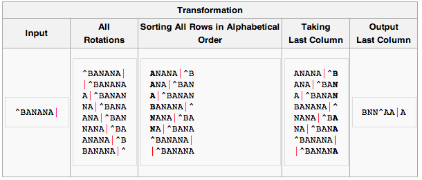
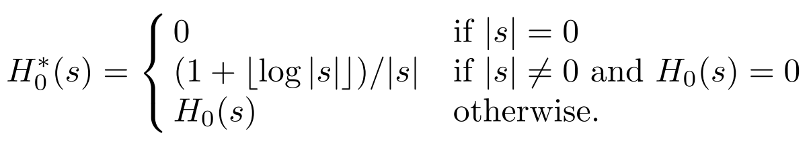
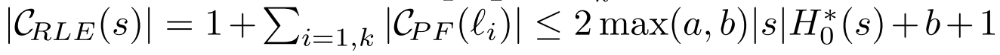
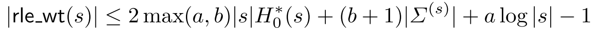
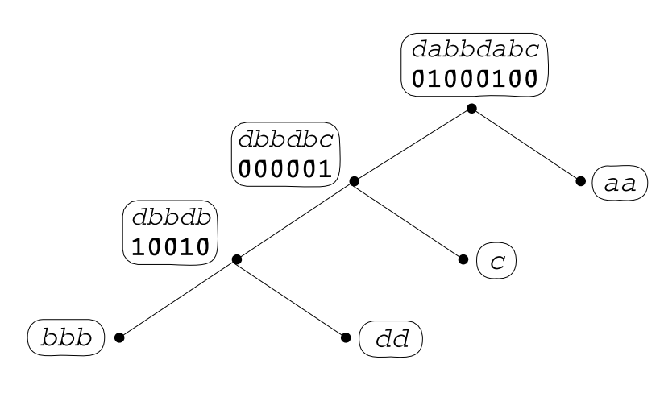
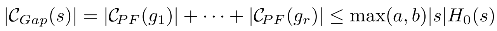
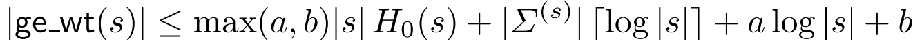

_\[This post is part of an ongoing challenge to understand 52 papers in 52 weeks. You can read previous entries, [here](http://swizec.com/blog/category/52-papers-in-52-weeks), or subscribe to be notified of new posts by [email](http://swiz.ec/52papers-list)]_

[The Myriad Virtues of Wavelet Trees](http://www.sciencedirect.com/science/article/pii/S0890540108001594) is a 2009 CS paper written by Ferragina, Giancarlo, and Manzini. The holiday cheer the past few days made this one hard to understand and write about ... something about focus.

It talks about using Wavelet Trees as a stand-alone [compression algorithm](http://en.wikipedia.org/wiki/Data_compression "Data compression") and as on top of some popular string encodings like run-length encoding, [move-to-front transform](http://en.wikipedia.org/wiki/Move-to-front_transform "Move-to-front transform") and the [Burrows-Wheeler transform](http://en.wikipedia.org/wiki/Burrows%E2%80%93Wheeler_transform "Burrows–Wheeler transform"). The results are pretty cool, but not revolutionary. The authors just improved some additive terms in lower and upper bounds of achievable compression.

## Background knowledge

Before we can get into the meat of this paper, you'll need to know about Wavelet Trees and run-length encoding and Burrows-Wheeler and stuff. On my first run-through I didn't pay attention in this section and spent the rest of the paper very confused.

**Wavelet Trees** recursively partition the source alphabet into pairs of subsets, then mark which branch of the tree a particular symbol goes into. To reconstruct elements at you just walk the tree until you find the leaf and voila, done.

\[caption id="" align="alignnone" width="626"] Wavelet tree for the string "abracadabra"\[/caption]

Phew, that was simple. Now we just need the transforms.

We can do to lower the [entropy](http://en.wikipedia.org/wiki/Entropy "Entropy") of a string to make it easier to compress. Entropy is a measure of how disorganised our string is. You can also think of it as information density.

The paper references two transforms whose aim is to turn a fuzzy string into a string with many runs of the same character: move to front and Burrows-Wheeler transform.

**Move to front transform** encodes strings into numbers with the help of an indexed alphabet. Every time you replace a character with its index, you move it to the front and re-index. Given a 25-letter English alphabet indexed from `0` to `25` the string `bananaaa` becomes `1,1,13,1,1,1,0,0`.

To reverse the encoding you just re-do the same algorithm again, except replacing indexes with characters.

The **Burrows-Wheeler transform** is a bit more complicated. This one uses sorted rotations of a string. Basically, take all permutations, sort them alphabetically, take the last column.

\[caption id="" align="alignnone" width="610"] BANANA Burrows-Wheeler transform\[/caption]

Reversing a transformed string is simple as well - take the transformed string and sort it. Now you have two columns. Take these pairs of characters and sort them to create more columns. Repeat until you have all the permutations of the original string and take the one where the end-of-file character is last. Voila.

After you have a string transformed into a form with less entropy there are a number of things you can do to compress it. For instance, **run-length encoding** where runs of successive characters are replaced with a count of repetitions and the character. It's not used much on its own anymore, but made a killing compressing simple black&white images back in the day.

## What we're looking to achieve

So how can wavelet trees help make all this better?

The authors analyse Wavelet Trees as stand-alone compressors and as compressors of run-length encoded strings - [RLE](http://en.wikipedia.org/wiki/Run-length_encoding "Run-length encoding") Wavelet Trees - and gap encoded string - GE Wavelet Trees. They also show a theoretical justification for Wavelet Trees being better in practice than move-to-front coding.

The meat of the article is using Wavelet Trees to compress the output of the Burrows-Wheeler transform and introducing the concept of Generalised Wavelet Trees, which can reach compression almost on the level of theoretical bound for optimal coding even for mixed strings.

Ultimately, we're going to beat the theoretical compression limit _H0 = -Σi=1h(ni/|s|) log (ni/|s|)_ for fixed codewords. Otherwise known as 0-th order entropy. This is the most we can compress a string by always replacing the same symbol with the same codeword.

For highly compressible strings this bound doesn't make much sense, so the authors found a better one, _H0_\*:

\[caption id="" align="alignnone" width="724"] 0-th order entropy for highly compressible strings\[/caption]

Our approach is going to beat this by having symbol codewords depend on _k_ preceding symbols, giving us k-th order entropy of _Hk_(s)\* - the maximum achievable compression by looking at _no more than k_ preceding symbols.

## Achieving 0-th order entropy

Let _CPF_ denote a prefix-free encoding with a logarithmic cost of _a log n + b_ for _n ≥ 1_. Codes where _a_ is higher than 2 wouldn't be very efficient for reasons the paper assumes we understand, so we're only looking at those where _a ≤ 2_. This means that _b ≥ 1_; for the rest of our discussion we can assume that _a ≤ 2b_ and _a ≤ b+1_.

To combine wavelet trees and run length encoding for a string we first define a compressor _CRLE(s) = a1CPF(l1)CPF(l2)..._. Which is a fancy way of saying we prefix-encode runs of symbols, but store the first symbol in full.

This has a lower bound with a glorious equation, essentially saying that the length of a _CRLE(s)_ string is the sum of its parts and is shorter than twice the length of _s_ multiplied by _H0_(s)\* and _b+1_.

\[caption id="" align="alignnone" width="794"] Length of CRLE\[/caption]

Now we can combine wavelet trees and run length encoding into 'rle_wt', or **RLE Wavelet Trees**, which first encodes the string with _CPF_ to make a [Wavelet Tree](http://en.wikipedia.org/wiki/Wavelet_Tree "Wavelet Tree"), then compresses its internal nodes with _CRLE_. This produces shorter strings than just _CRLE_ with a bound of:

\[caption id="" align="alignnone" width="800"] New bound\[/caption]

I'm not entirely certain I understand why this equation says the bound is lower than before, so let's just believe the authors. This produces better compressed strings.

For string 'dabbdabc' our algorithm would produce a skewed Wavelet Tree, with 'b' in the left-most leaf since it appears the most.

\[caption id="" align="alignnone" width="494"] Skewed Wavelet Tree\[/caption]

To get GE Wavelet Trees, 'ge_wt', we first define a gap encoding called _CGap_, which encodes binary strings by noting where 1's are located in the string. This creates a lower bound for compression of:

\[caption id="" align="alignnone" width="768"] CGap bound\[/caption]

As with _CRLE_ before, we make a Wavelet Tree from our string then use _CGap_ to encode the internal nodes. Because we're just encoding the number of occurrences of a substring between boundaries, we can compress strings very well.

\[caption id="" align="alignnone" width="793"] ge_wt bound\[/caption]

## RLE wavelet trees and bwt

It turns out that using RLE Wavelet Trees as a post-processor for the Burrows-Wheeler transform, we can achieve that mythical _Hk_\* compression. But it doesn't work at all with GE Wavelet Trees.

The key is to remember that 'bwt' is a tool for achieving _Hk_\* as long as we can achieve _H0_\* for every partition. But apparently if we slice the Wavelet Tree according to 'bwt' partitions we get something called a full Wavelet Tree, which doesn't actually improve compression.

Instead we have to use pruned Wavelet Trees, which the authors don't really explain. They give a proof that adding Wavelet Trees on top of 'bwt' is beneficial, which I won't try to reproduce here since a large part of it is skipped and put in "the full version".

Their final conclusion is that Wavelet Trees act as a sort of compression booster for the Burrows-Wheeler transform, but impose a run-time cost that is non-negligible.

Finally, they conclude that GE Wavelet Trees don't work together with 'bwt' because global choices need to be made about things like tree shape and the role of 1's and 0's in nodes. Bummer.

## Generalised wavelet trees

Three things affect a Wavelet Tree's cost: its binary shape, the assignment of alphabet symbols to leaves, and the possibility of using non-binary compressors for nodes. To address these issues, the authors introduce so called Generalised Wavelet Trees.

Let's use two compressors - _C01_ is specialised for binary strings (RLE for instance), and _CΣ_ is generic (Huffman coding for instance). We're going to assume they satisfy three properties:

a) _|C01(x)| ≤ α|x|H0_(x) + β\* bits for a binary _x_, where α and β are constants. b) _|CΣ(y)| ≤ |y|H0(y) + η|y| + µ_ bits for a generic _y_, where η and µ are constants. c) the running time of _C01_ and _CΣ_ is a convex function and their working space is non-decreasing

Basically we've defined the limit of the longest strings produced by our compressors and decided that we should be able to use them in practice.

Now we define a leaf cover, _L_, as a subset of nodes in a tree _Wp(s)_, if every leaf has a unique ancestor in _L_. Then _WpL(s)_ is the tree with all nodes in _L_ removed. We colour _WpL_ with red and black so that leaves are black and all remaining nodes are red.

Then we use the binary compressor for all binary strings in _WpL_ and red stuff, and the generic compressor for non-binary strings and black. As usual we ignore the leaves. Our new cost is the number of bits produced - _|C01(s01(u))|_ from red nodes and _|CΣ(s(u))|_ for black nodes.

According to the authors, coming up with a way to decode this encoding is trivial, and the whole thing is somehow "better". I don't quite _get_ why it's better, but I'm probably missing something.

There are, however, two optimisation problems with this approach: finding the minimal leaf cover that minimizes the cost function _C_(WpL(s))\*, and finding the optimal combination of Wavelet Tree shape and and assignment of binary and generic compressors to nodes to produce the shortest string possible.

They've provided a sketch of the algorithm to solve these, but ultimately a sketch does not a solution make.

## Fin

So there you have it, Wavelet Trees used for compressing strings after applying the Burrows-Wheeler transform to make it easier. I'm not sure whether this is used anywhere in the real world, but it looks interesting.

