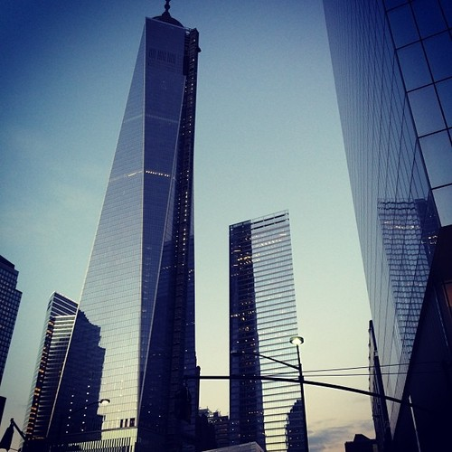
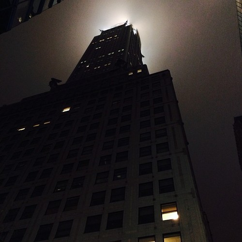
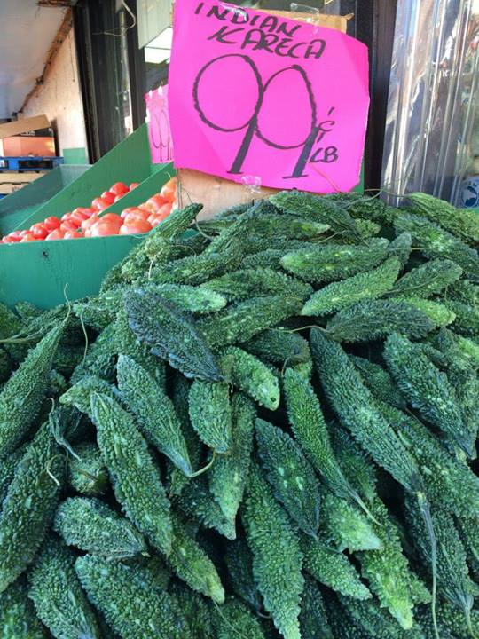
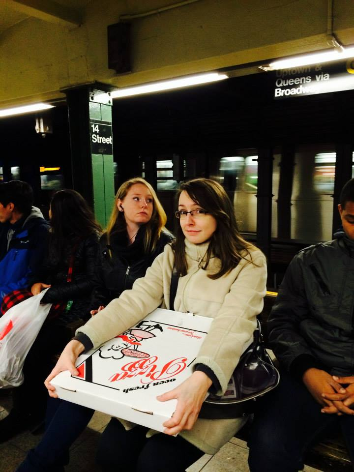
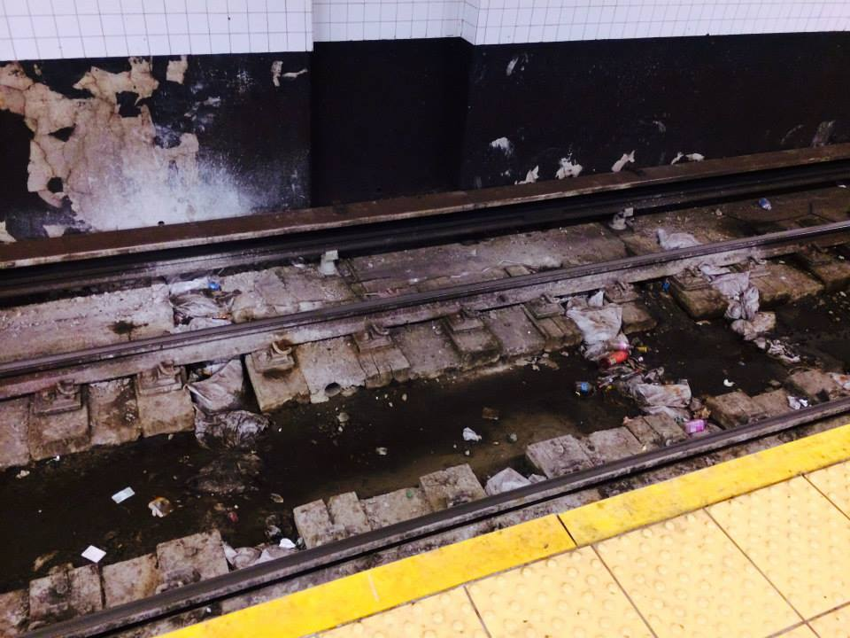
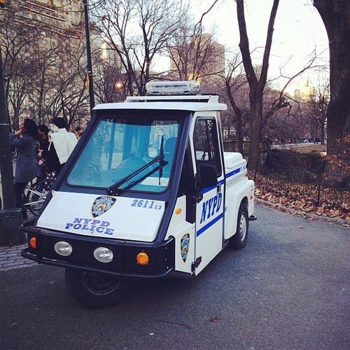
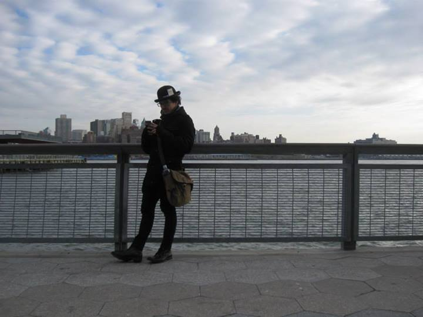

\[caption id="" align="alignnone" width="500"] 2D skyscraper next to [Freedom Tower](<http://maps.google.com/maps?ll=40.713,-74.0135&spn=0.01,0.01&q=40.713,-74.0135 (One%20World%20Trade%20Center)&t=h> "One World Trade Center")\[/caption]

As promised in _[You, take a break](http://swizec.com/blog/you-take-a-break/swizec/6464 "You, take a break")_, I took my own advice and spent a week in [New York](<http://maps.google.com/maps?ll=40.6641666667,-73.9386111111&spn=0.1,0.1&q=40.6641666667,-73.9386111111 (New%20York%20City)&t=h> "New York City") with my ex. Turns out you totally _can_ stay great friends with an ex after a life getting in the way breakups. But that's a story for bar night, today we talk about an epic week in a concrete jungle with surprisingly many trees.

Not just in [Central Park](<http://maps.google.com/maps?ll=40.7833333333,-73.9666666667&spn=0.1,0.1&q=40.7833333333,-73.9666666667 (Central%20Park)&t=h> "Central Park") either! Trees are everywhere in New York, the higher up Manhattan you go, the more there are. It's amazing how they manage to fit them all in.

\[caption id="" align="alignnone" width="500"] Ominous [Chrysler Building](<http://maps.google.com/maps?ll=40.7517,-73.9753&spn=0.01,0.01&q=40.7517,-73.9753 (Chrysler%20Building)&t=h> "Chrysler Building")\[/caption]

New York itself is just ... a lot. A lot doesn't even begin to explain how much there is. Visiting this city feels more like visiting a country. Hell, with everything changing every couple of blocks you might well have visited a continent.

Little Italy is across the street from China Town. A few minute's walk away you're in [SoHo](<http://maps.google.com/maps?ll=43.0,-75.0&spn=3.0,3.0&q=43.0,-75.0 (New%20York)&t=h> "New York") where you might well see [Alec Baldwin](http://en.wikipedia.org/wiki/Alec_Baldwin "Alec Baldwin") buying a six pack from a beat down grocery store that looks so sketchy you wouldn't dare step inside in Europe. Yes we did run into Alec Baldwin. No we didn't dare say hello. He sometimes punches annoying people in the face and he's a big dude.

We did our best to look nonchalant. Inside we were giggling.

\[caption id="" align="alignnone" width="500"] The funny hats helped\[/caption]

The neighbourhood we were staying in in Queens was essentially India. People just casually talking "Indian" (I don't know which Indian) in the streets. Grocery stores full of food we had no hope of recognising, and absolutely no easily consumed meats anywhere. The best we found was a halal butchery, but we didn't want to cook.

There were also these fuzzy cucumbers. Very confusing.

\[caption id="" align="alignnone" width="540"] Fuzzy cucumbers\[/caption]

We decided to survive the week on copious amounts of Starbucks - just 200kcal per drink, if you're careful - and burgers and pizza and some sweets here and there. I even ate chocolate!

My sweet tooth has not returned.

The pizza in New York is incredible. Almost as good as back home, definitely better than here in the [Bay Area](<http://maps.google.com/maps?ll=37.75,-122.283333333&spn=0.1,0.1&q=37.75,-122.283333333 (San%20Francisco%20Bay%20Area)&t=h> "San Francisco Bay Area"). Super cheap too!

We went to a hole-in-the-wall place in, well I don't know where it was, but it was called Artichoke Pizza, and got a whole pie for $30. Because that's normal, right? One large pizza per two persons. One person if very hungry.

Nope, the pizza lasted three days. A slice made you nice and full, two made you disgusted with yourself.

\[caption id="" align="alignnone" width="432"] Big pizza is big\[/caption]

I wasn't very impressed with the burger places and diners, though. Something was missing, but I'm not sure what. And nobody had sweet potato fries. Disappointing.

But hey food is food and food is what you need when you're walking ten kilometers a day.

Thank god for step counters! We'd feel ten times less tired, if we didn't know exactly how much we walked every day. Funny how the comfiest and awesomest shoes in the world are your biggest enemy after six days pounding the pavement.

\[caption id="" align="alignnone" width="500"] Empire State Building\[/caption]

On our first day, having a random walk around [the Financial District](<http://maps.google.com/maps?ll=40.707499,-74.011153&spn=0.01,0.01&q=40.707499,-74.011153 (Financial%20District%2C%20Manhattan)&t=h> "Financial District, Manhattan"), we were rockets. On our last day, doing two circles around the same blocks in [East Village](<http://maps.google.com/maps?ll=40.7275,-73.9858333333&spn=0.1,0.1&q=40.7275,-73.9858333333 (East%20Village%2C%20Manhattan)&t=h> "East Village, Manhattan") because we were too tired to notice, we were sloths. You want to go faster, but nothing happens.

Took two days for my feet to recover, but totally worth it!

We saw so many pretty buildings and interesting street corners and crowds of tourists on [Times Square](<http://maps.google.com/maps?ll=40.75773,-73.985708&spn=1.0,1.0&q=40.75773,-73.985708 (Times%20Square)&t=h> "Times Square") and places just like in all the movies and trash and cars and famous buildings and Central Park and trash and then some more trash.

Trash is everywhere. New York is the dirtiest grimiest city I have ever visited. Like, holy fuck man, do you ever clean that subway? I don't think they do ...

\[caption id="" align="alignnone" width="576"] Subway after a rainy day\[/caption]

Easily the shittiest subway system I've ever ridden too. Stations are poorly marked, multiple different trains running on the same track, announcers that might well be speaking an alien language, and trains only sporadically having the dynamic current-next-upcoming station displays inside.

But it works, I guess. Not everyone can have a subway as good as [London's](<http://maps.google.com/maps?ll=51.5072222222,-0.1275&spn=0.1,0.1&q=51.5072222222,-0.1275 (London)&t=h> "London") Tube even if they are roughly the same city size ...

\[caption id="" align="alignnone" width="500"] Central Park Police\[/caption]

It's impossible to pick a favourite thing we saw or did because everything was just amazeballs, but if I had to choose I'd pick the awesome New Year's kiss under the Central Park fireworks. She might disagree, but I liked it.

Happy New Year.

\[caption id="" align="alignnone" width="576"] xoxo\[/caption]

PS: it is nearly impossible to buy postcards in New York

