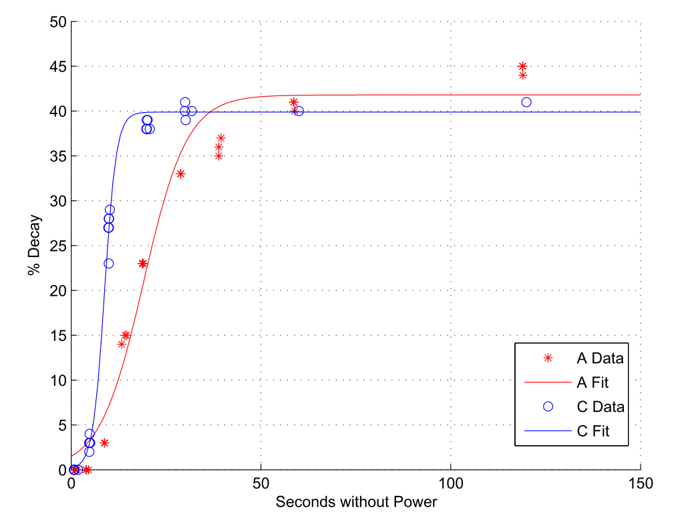
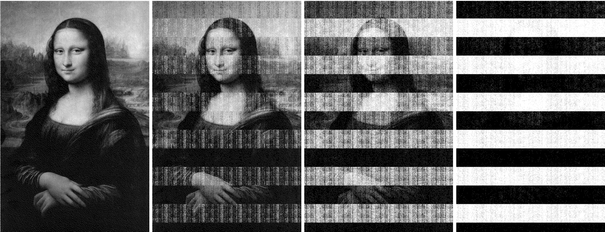

_\[This post is part of an ongoing challenge to understand 52 papers in 52 weeks. You can read previous entries, [here](http://swizec.com/blog/category/52-papers-in-52-weeks), or subscribe to be notified of new posts by [email](http://swiz.ec/52papers-list)]_

\[caption id="" align="alignnone" width="448"] xkcd, cryptonerds\[/caption]

Did you know there was a whole class of attacks that can easily get into your fancy whole-disk-encrypted, pass-phrase protected laptop? Cold boot attacks. Scariest security stuff I've ever read about.

Well, almost as scary as that attack where they can listen to the [USB cord](http://en.wikipedia.org/wiki/Universal_Serial_Bus "Universal Serial Bus") of your keyboard from a distance and sniff out your password ...

But I've always assumed my laptop was safe. Hard drive is encrypted. Passcode turns on quickly. Passcode is long. Passcode is hard to type when you're drunk.

Safe!

## Cold boot attacks

Except not safe at all. [Lest we remember](https://citp.princeton.edu/research/memory/), by Halderman et al. tells us that all an attacker needs to do to get into my fancy FileVaulted laptop is steal it when it's still turned on. Or in sleep. Or maybe even in hibernate.

A [cold boot attack](http://en.wikipedia.org/wiki/Cold_boot_attack "Cold boot attack") works in three stages:

- gain physical access to machine
- power-cycle the machine to a special kernel
- read and abuse memory

Despite what most people believe, [DRAM](http://en.wikipedia.org/wiki/Dynamic_random-access_memory "Dynamic random-access memory") doesn't lose its contents as soon as you turn it off. It holds memory for a couple of seconds even at room temperature. With sufficient cooling (liquid nitrogen) researchers have observed a decay of just 0.17% after 60 minutes out of a computer!

60 minutes is a long time. Crypto nerd inside you trembling yet?

The authors even created algorithms that find and restore keys for popular [encryption algorithms](http://en.wikipedia.org/wiki/Encryption "Encryption") from partially decayed memory. They were further able to devise a fully automated system that gains read access to a hard drive protected with one of the popular disk encryption systems in under an hour.

Essentially plug in a USB, reboot the machine, wait, read anything you want.

If that doesn't make you rethink leaving your laptop on that coffee shop table when you go to the bathroom, I don't know what will. I do it all the time.

## Remanence effects

DRAM cells are essentially capacitors. To encode a value they either hold (1) or don't hold (0) a charge on one of the conductors, while the other is hard-wired to either power or ground. With time the charge leaks out of the capacitor and the value resets to this ground state.

For high reliability DRAM has a refresh rate on the order of milliseconds. But failing to refresh for even a relatively long time, has only a minuscule chance of destroying cell contents. The longer cells can hold data without refreshing, the less power a DRAM chip uses.

In a series of experiments at various temperatures and chip ages ranging from 9 years to 6 months, the authors discovered that DRAM cells can hold data anywhere from a few seconds to hours depending on conditions. In general colder and older means longer retention.

A pattern of bits was written to memory and read at various times after the cells were cut from power. Since the pattern contained roughly equal amounts of 1's and 0's fully decayed memory would exhibit a 50% error rate.

At **normal operating temperatures** (25C to 44C) decay took between 2.5 and 35 seconds. Despite this variability, all curves exhibited a similar shape - slow decay, followed by very rapid decay, followed by slow decay again.

\[caption id="" align="alignnone" width="618"] Decay at operating temperatures\[/caption]

At **reduced temperatures** retention was greatly improved. Using canned air, the authors reduced surface temperatures to -50C. This allowed them to read most of the memory modules with 99.9% accuracy after as long as 60 seconds.

Using liquid nitrogen they could achieve 99.83% read accuracy after as long as an hour! Submerging memory in liquid nitrogen might not be the most practical of attacks though.

The authors also found that **decay patterns** were surprisingly predictable. Most cells decayed to their ground state, with some 0.05% of the cells decaying to the opposite value. This happens gradually.

With enough runs of the test on the same set of cells you could find an overall order in how the cells degrade. Direction, shape of decay, things like that. The effect is so prominent that when you read an image from decaying memory, you can see pixels aren't randomly jumping around and there is a clear decay pattern. Likely related to manufacturing processes and chip architecture.

\[caption id="" align="alignnone" width="734"] Decaying image at 5s, 30s, 60s, 5min\[/caption]

## Imaging residual memory

You don't need any special tools to read memory after a boot. As soon as the computer powers back up, the system begins refreshing DRAM state, decay stops.

Then you can use any of the tools at your disposal to read memory. Just make sure you aren't overwriting what you're interested in.

As such, the authors developed specialised programs with a small memory footprint that read the memory and stream its contents to an external medium where. These tools are essentially tiny operating systems, which also ensures that the host computer's OS won't wipe memory on boot.

The authors have successfully built such programs for **PXE network boot**, which streams memory data via a network, **[USB drives](http://en.wikipedia.org/wiki/USB_flash_drive "USB flash drive")** that boot and dump memory data onto themselves, **EFI netboot\* memory dumper applications, and even memory dump apps for \*\*iPods** that don't impact their usefulness as music players. Easier to mask an attack in the wild.

An attacker could use any of these tools to perform an imaging attack.

The simplest would be a [warm boot](http://en.wikipedia.org/wiki/Reboot_%28computing%29 "Reboot (computing)") attack where they just restart the machine using the operating system's restart function. This ensures memory doesn't have a chance to decay, but gives software the opportunity to wipe things.

Cutting and restoring power briefly, deprives software of the chance to wipe memory and is usually quick enough for even the quickest decaying memory to survive without too many errors.

If an attacker can't force your system to boot from one of these tools, there's still the option of removing memory and running it in a different system. This only becomes practical when you cool the memory.

As long as you make sure the memory is cold before cutting power and kept cold until booting in the new system, you're good. As per the previous tests, you have anywhere of up to a minute of time. Plenty, if you've had some practice swapping memory around.

## Key reconstruction

Once you've got the memory contents with a few bit errors, you have to get the encryption keys. An encryption key that's in use will necessarily have to be in memory. But they are specifically designed so even a tiny corruption will render the key useless.

A 256-bit key with 10% corruption has a [Hamming distance](http://en.wikipedia.org/wiki/Hamming_distance "Hamming distance") of just 12 from the actual key. But brute forcing this still means 256 combinations. Too many.

Luckily, most encryption programs want to be fast. Especially \\important when they are live-encrypting data between hard drive and memory as is often the case on modern laptops. To achieve higher speeds most encryption programs store precomputed data in memory - key schedules for block ciphers, extended forms of the private key for RSA.

By using this data, the authors have been able to break encryption in practical time. It could've been even faster had they also taken account of predictable decay patterns, but it wasn't necessary and would complicate things too much.

To **reconstruct DES keys** they used the 16 subkeys produced by the DES scheduling algorithm. This means that every bit from the original key is repeated about 14 to 16 times.

You can treat this as a repetition code where the message is a single bit and codeword is a sequence of _n_ copies. This means that even with a 50% error rate, the probability that the key can be correctly reconstructed without resorting to brute force is 98%.

**AES keys** are more complicated, but you can search keys in increasing distances from the recovered key and output anything with a similar enough schedule. The authors were able to search 109 candidates in about 20 minutes to correct a key with 7 errors. It would take 10 days to correct 11 errors.

A better approach is taking advantage of the AES schedule structure. Instead of correcting the whole key at once, you can look at it as a sequence of chunks. Each chunk is small enough to brute force efficiently, yet large enough to contribute to the whole key.

Once you have a set of candidates, you can put them together and check against the recovered schedule.

The authors used similar methods to break **tweak codes** that are used in common disk encryption systems. Except they mention a bunch of XORing and shifting blocks to the left and whatnot. I'm sure this section makes a lot more sense if you know how _LRW_, _XEX_, and _XTS_ work.

Mostly they seem to take a block cipher and augment it in some way by XORing blocks together with something that I'm assuming is a salt.

Either way, the authors were able to break disk encryption in a practical amount of time.

They even managed to **break RSA**. RSA is essentially a polynomial equation that uses primary numbers _p_ and _q_ as its basis. The authors were able to deduce these factors by iteratively reconstructing them from least significant bits.

Brute force guided by reasonable heuristics. They were able to reconstruct 2048-bit keys with a 4% error rate at a median time of just 4.5 seconds. For higher error rates they could use this algorithm to reconstruct the first quarter of the key, then get the rest using Coppersmith's lattice technique.

And you thought RSA was safe!

## Finding keys in memory

Now that we can retrieve memory images and reconstruct partially corrupted keys, we still have to find them. 1GB of memory is a lot of room to hide a few bits.

A naive approach could be going through the whole image, trying different regions, and seeing if they decrypt something. But this assumes the image is perfect, and is generally slow.

Lucky for us, encryption keys have a predictable look. The authors were able to create fully automated systems to find keys in memory based on combinatorial properties of key schedules alone. This enabled them to recover keys even from closed-source encryption programs without reverse engineering.

For instance, to **find AES keys** they would iterate through memory in ~240bit blocks, check if they work as potential key schedules, and output them if the Hamming distance is sufficiently small. The only assumption being made is that the whole AES schedule will be in a contiguous memory region.

To **find RSA keys** they used two different approaches. Both relied on the idea that the most common format for storing RSA keys is the PKCS#1. They were able to retrieve keys both by anticipating the _contents_ of the fields (public key modulus for instance) and by anticipating the _structure_ of the format.

## Attacking encrypted disks

Since whole drive encryption is increasingly common on all three popular operating systems, this seemed like a good venue to explore.

According to the authors, the most time consuming part of this experiment was setting up the encrypted disks and creating system-specific attacks. The attacks themselves were trivial and took between 20 and 60 minutes. (fully automated)

This part of the paper describes how they attacked each system specifically, but the gist of the matter is that they managed to break every each one. BitLocker from Windows Vista, FileVault from OSX, and dm-crypt and Loop-AES for Linux. All broken.

Each had a particular set of challenges on top of having to break the encryption key from before, but at the end it didn't matter. Even Loop-AES's specific idea of cycling the key in memory to prevent burn-in effects was ineffective against a cold boot attack.

## Countermeasures

There are many ways a system could safeguard against attacks like these, but at the end of the day, a key that is in use will have to be stored _somewhere_.

You could scrub the memory clean on shutdown, but an attacker can always hard shutdown a machine. You could have your BIOS set up to perform a destructive memory operation on boot or prevent booting from removable media, but the attacker can disable these or simply remove the memory and put it in a different computer.

Another approach is to avoid precomputation so an attacker has less data to work with, but then the user's computer will be slower. Users don't like that so there's a tradeoff to be done.

From there on, any safeguard will have to be physical. There could be a region of memory that is soldered onto the motherboard and isn't readily removable. If you ensure this region always gets wiped, encryption programs have a safe place to store data.

Another suggestion was to add active sensors that wipe memory when the case is opened or temperature drops significantly.

But all of these require cooperation from manufacturers. Until they become standard, your only option is to always shutdown your machine and wait a minute or so before leaving it alone.

Bothersome.

## Fin

The internet has always told me that when an attacker has physical access, your machine is no longer yours. Now I understand why ... I had no idea!

But reading this paper has explained a lot of the more annoying features of my one-year-old laptop. All the memory is soldered on, which I thought was stupid when buying the laptop, but apparently it's a good idea. And you can't even open the case unless you have a torx screw ... possibly another safeguard against quick physical access.

Most annoyingly of all, my computer simply shuts down if I leave it alone for more than 5 minutes. A source of great frustration, but I'm going to remind myself of this paper every time I feel like cursing Apple for their "stupid" decisions from now on.

