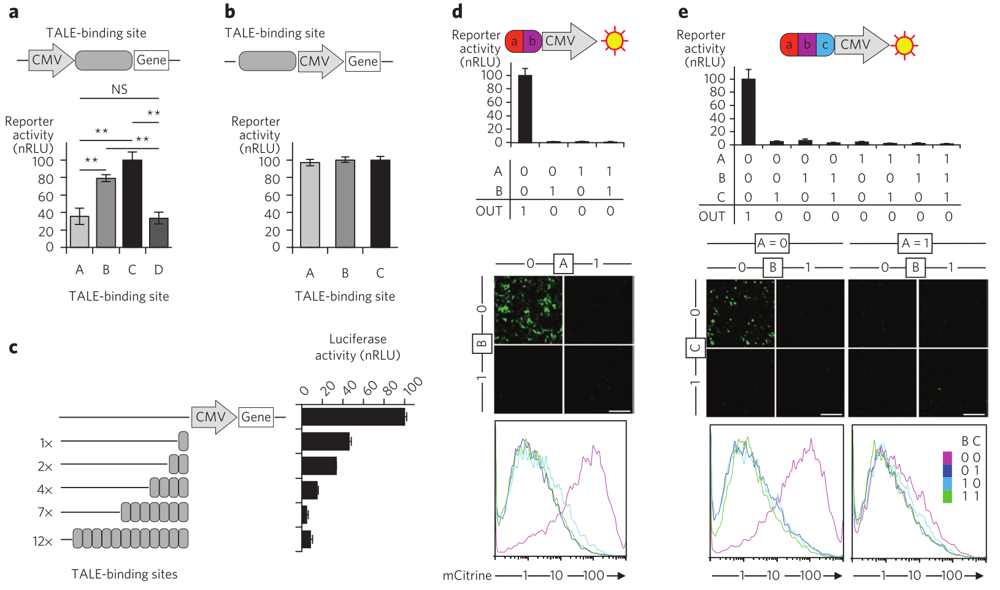
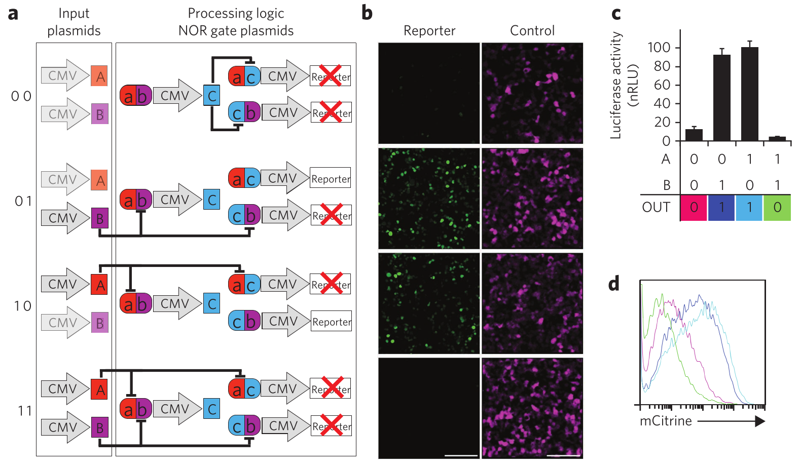
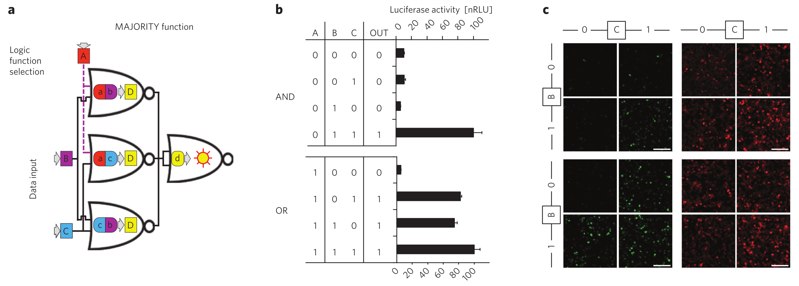

_\[This post is part of an ongoing challenge to understand 52 papers in 52 weeks. You can read previous entries, [here](http://swizec.com/blog/category/52-papers-in-52-weeks), or subscribe to be notified of new posts by [email](http://swiz.ec/52papers-list)]_

One of my friends is doing a PhD on implementing logic circuits in mammalian cells. Just thinking about it tickles my nerdy innards!

After _months_ of begging, she let me read her latest paper after it was published in Nature last week. _[Designable DNA-binding domains enable construction of logic circuits in mammalian cells](http://www.nature.com/nchembio/journal/vaop/ncurrent/full/nchembio.1433.html)_ by Tina Lebar and some other people nobody cares about. One of them was my information theory professor. Small world ...

I chewed my way through through this five-page paper like an excited puppy goes through a slipper and just like a puppy I was confused out of my mind most of the time. Synthetic biology is _not_ my thing.

## Introduction

I asked my friend about her research a few months ago and she explained that programmable cells can be very useful. You could for instance program a cell to deliver medicine only to specific points in the body. Or to attack only certain types of other cells and so on.

This, apparently, has far reaching implications in medicine. Personally, I'm just waiting until we can build cylons.

What I don't understand, and this paper doesn't explain, is _how_ all this works. The paper talks about designing different types of logic gates, assembling them into circuits, but I don't understand the basic principles. It's electron quantum tunneling through layers of silicone for normal computers, but for biological circuits it's ... magic?

The paper uses this magic to build different logic gates. NOR and NAND in particular because they are functionally complete and can be used to implement anything. You could build a whole computer just by combining NOR or [NAND gates](http://en.wikipedia.org/wiki/NAND_gate "NAND gate").

Computers used to be built like this in the 1960's (Apollo computer was just a combination of triple-input NOR gates). These days we instead try to lower the number of elements to save power because the gates themselves have become so cheap to make.

But biologic chips are in their infancy and using easily replicable elements is more \\important. As far as I understand, this paper is the first to implement a circuit out of multiple gates.

One of the problems they solved is the free diffusion in cells. They built orthogonal gates that behave correctly even when activation sequences act funny.

## Orthogonal NOR gates

\[caption id="" align="alignnone" width="782"] Design of single-layer genetic NOR gates\[/caption]

To build layered circuits inputs have to be the same type as outputs. The authors used TALEs (transcriptor activator-like effects) as information mediators and designable DNA-binding domains as the logic circuits themselves.

The first step towards a complex circuit was implementing a single [NOR gate](http://en.wikipedia.org/wiki/NOR_gate "NOR gate") as an OR-[NOT gate](http://en.wikipedia.org/wiki/Inverter_%28logic_gate%29 "Inverter (logic gate)") with three layers - two layers for OR and an extra inverter to make a NOR.

Free diffusion in cells is the biggest problem here. How do you ensure a gate works regardless of activation order of binding sites?

They solved this by positioning TALE binding sites upstream of something called a constitutive mammalian promoter (CMV), which leads to equal promoter activation regardless of binding sequence variability.

To make a simple [OR gate](http://en.wikipedia.org/wiki/OR_gate "OR gate") they place two binding sites for different TALE repressors before the [constitutive promoter](http://en.wikipedia.org/wiki/Promoter_%28genetics%29 "Promoter (genetics)") followed by an expressor gene. To turn it into a NOR gate, they added another binding site next to the other two.

Results were checked using luminometry and as you can see in the picture above, cells only light up when neither TALE repressor is expressed in the cell. Shiny.

To demonstrate the generality of this design they implemented several different NOR gates that used different TALE repressors in various combinations. They took the experiments even further by implementing parallel NOR gates acting on different expressors within the same cell.

All of this means the gate design is orthogonal and canin fact be used to implement more complex circuits.

## Two-input logic gates

The real test of orthogonality comes when you want to implement a multi-layered [logic circuit](http://en.wikipedia.org/wiki/Logic_gate "Logic gate") - an [XOR gate](http://en.wikipedia.org/wiki/XOR_gate "XOR gate").

The idea is to use the expression of a TALE repressor in one NOR gate as an input to the next. This way you can implement any logic function you can think of just by layering NOR gates in specific configurations.

All 16 two-input functions were implemented both in separate cell colonies and within the same cell, and a new experiment was performed for each combination of inputs. According to flow cytometry and microscopy, all biologic functions produced high and low outputs in accordance with their truth tables. But it did sometimes take a while for circuits to equilibrize before reaching correct output.

\[caption id="" align="alignnone" width="606"] An XOR gate\[/caption]

To minimize the number of layers and required transcription factors, genetic algorithm optimization was applied, and it is now possible to implement all 16 two-input logic gates with just two layers. A layer less than the previous three. Which is cool.

If I understand the implications correctly, that means you can put more logic into a cell and it's easier to make the whole thing.

## Function selecting circuit

For circuits to be really effective, you also need the ability to select which logic function within the same circuit will be performed solely based on inputs.

To demonstrate this ability, the authors implemented a simple circuit that takes three inputs and decides whether an AND or an OR function will be performed on two of the inputs, based on the third. A truthy value means OR and a falsy value means AND - essentially the _majority_ function.

\[caption id="" align="alignnone" width="820"] Majority function\[/caption]

You can test the design out by hand, but the basic idea is that A chooses whether the first layer of NOR gates will act as an OR or an AND, and the final NOR gate activates only if the previous layer returns only low values.

Once again, fluorescence reporters observed under a microscope over a few different experiments show everything works as you'd expect.

## Discussion

With this new design, synthetic biologists can improve the predictability, reliability, and standardization of biological information processing systems. With the recent advance in producing hundreds of different TALEs this makes the design much better than previous approaches.

Zinc fingers and CRISPR were mentioned here, but I only vaguely understood the zinc fingers paper when I read it a year ago and I don't know what CRISPR might be. I'm guessing it's something a bit like a TALE, but different.

Either way, the authors report that using their optimizations 94% of two-input logic gates can be implemented with just two layers, whereas only 50% can be implemented in two layers with traditional wired circuits. A pretty sweet result if you ask me.

They also mention something about distributed systems spanning multiple cells and a bunch of other things that read almost like wishful thinking. Maybe I'd believe them if I spent the time reading referenced papers.

But this has been enough synthetic biology for now. I'm always amazed by how mind-blowing this field can be.

