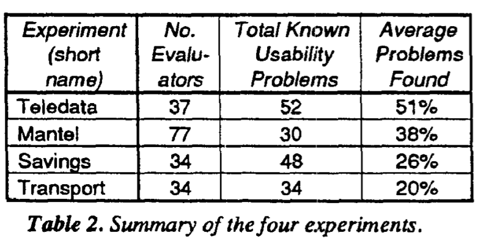
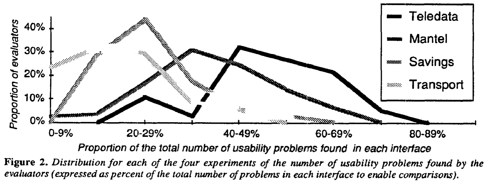
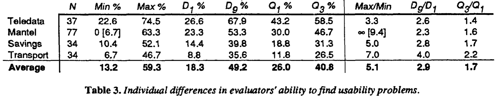
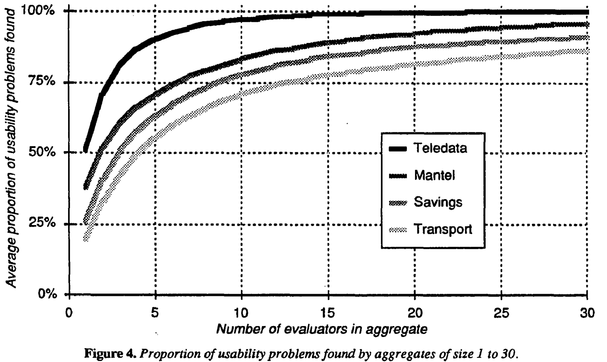

_\[This post is part of an ongoing challenge to understand 52 papers in 52 weeks. You can read previous entries, [here](http://swizec.com/blog/category/52-papers-in-52-weeks), or subscribe to be notified of new posts by [email](http://swiz.ec/52papers-list)]_ [User interfaces](http://en.wikipedia.org/wiki/User_interface "User interface") are hard. So hard in fact that a friend of mine recently spent 45 minutes on hold with the IRS only to be told _"Sorry, we're too busy. Call back later."_. He never even spoke to a real person. We've all had to suffer through crappy user interfaces. If only there was a way for people building these things to discover potential issues _before_ they hit users in the face. There are, in fact, many. But in 1990 [Jakob Nielsen](http://en.wikipedia.org/wiki/Jakob_Nielsen_%28usability_consultant%29 "Jakob Nielsen (usability consultant)") and Rolf Molich published a paper called [_Heuristic Evaluation of User Interfaces_](https://docs.google.com/viewer?url=http%3A%2F%2Fmestrado-watinha.googlecode.com%2Fsvn%2Ftrunk%2Fhci%2Fmonografia%2FartigosUtilizados%2Frevisao%2Fp249-nielsenAvaHeu.pdf) that describes a cheap way of accurately finding most if not all [usability](http://en.wikipedia.org/wiki/Usability "Usability") problems in your interface.

## Heuristic evaluation

Heuristic evaluation is essentially looking at the interface and forming an opinion about what's good or bad. Ideally you'd use a set of guidelines, but there are thousands of those, so people usually rely on experience and their own intuitions. The authors have come up with a simplified list of nine heuristics:

- simple and natural dialogue
- speak the user's language
- minimize user memory load
- be consistent
- provide feedback
- provide clearly marked exits
- provide shortcuts
- good error messages
- prevent errors

The list came about through years of teaching and consulting on user interfaces and is particularly useful because it can be taught in a single lecture.

## Empirical test of heuristic evaluation

Four experiments were performed to test the applicability of heuristic evaluation in a real world scenario. All of them follow the pattern of pick an interface, define X known problems, give the design to a bunch of people to assess, see how many problems they find. Interestingly, there were times where the researchers had to add to their list of known problems because a test subject would find something they didn't think of. This indicates that no matter your experience, it is near impossible for a single person to bump into all usability problems. \[caption id="" align="alignnone" width="475"] Summary of experiments\[/caption] The first experiment included ten screen dumps from a Danish videotext system, **teledata**, and was evaluated by 37 computer science students looking for a total of 52 known usability problems. For the second test they designed **Mantel**. It was a design for a small information system working as a phone number directory accessible with a modem. Evaluators were readers of the Danish Computerworld magazine and only had access to a written specification. They were looking for 30 usability issues. The third and fourth experiments used live systems instead of just designs. Once more the evaluators were students and their job was to look for problems in the voice response systems for **Savings** and **Transport**. Call with a phone, use a 12-key keypad to send tones at key moments. Easy. While there was no overlap between subjects in the first two tests, they used the same evaluators with a similar background in usability (taking the authors' course) for both the third and fourth experiment. This allowed them to perform a comparison of evaluators. Not sure if this was intentional, but the authors picked the worst type of systems. When I was a kid I _hated_ the videotext system on our telly, extremely difficult to navigate, but the closest thing we had to the internet. And I still hate the whole _"Press 1 to fuck off. Press 2 for information, maybe."_ Why do we still have those?

## The usability problems

Some of the usability problems found include inconsistencies in how commands work with the dial-in systems. One used an end-of-command key, the other used that same key for "return to main menu". Weird considering they both use the same equipment. 95% of the subjects also found it problematic that Mantel overwrites a user's phone-number instantly and 62% found it odd that the Transport system goes from main-menus to submenus without much indication this happened. The exact problems don't matter as much as deciding whether they are actually valid. Is this something that a normal user would notice and struggle with? It seems that given enough evaluators, especially if some of them are not trained, you should be able to mostly find problems that affect real people. The same problem discovered by multiple people is likely far more serious than something that only bugs a single person. But you should keep in mind that it is impossible to find all problems for all occasions. Real users might use a system for different purposes and will hit different problems depending on what they're trying to achieve. There is also a subset of users that will always struggle with your interface no matter what you do or how easy you make it. Just as there is a subset who will figure everything out as if by magic. You can often notice this when a computer savvy person helps when something doesn't work. They touch the computer and everything acts exactly like it's supposed to, despite protestations that the exact same thing has been tried multiple times and never worked. But let's not get into the whole _"Friends don't let friends do tech support"_

## Evaluation results

\[caption id="" align="alignnone" width="732"] Proportion of problems discovered\[/caption] The main result is that heuristic evaluation is hard. Even in the best case, evaluators barely found more than half of the problems. But that's not too bad. Finding _some_ problems is better than _no_ problems, and you have to keep in mind not all evaluators will find the same set of problems. Group problem discovery rates might actually be higher. If you look at a table of individual differences in evaluator's ability to find problems, you'll see that variability is very high. The worst evaluator of Mantel found no problems, while the best found 63%, and the best evaluator over all found 74% of the problems in Teledata. \[caption id="" align="alignnone" width="757"] Individual differences in ability\[/caption] The table also shows that some systems might be easier to evaluate heuristically than others, but you can always augment heuristics with more rigorous engineering methods.

## Aggregated evaluations

Looking at these results, it makes sense to aggregate evaluation results. This eliminates most false positives - usually found by a single person - and will take into account that even bad evaluators sometimes find hard problems missed by a better evaluator. One issue with finding usability problems is that once pointed out, they become obvious to everyone. Discovering them first is the hard part. The researchers created multiple aggregate evaluations for each experiment by choosing a number of people at random. They discovered a rapid increase of discovered problems up to about 5 evaluators and diminishing returns after more than 10. \[caption id="" align="alignnone" width="700"] Proportion of usability problems found\[/caption] This suggests that your best bet for finding _most_ usability problems is getting a group of seven or so people and asking them to look for problems. Much more than and you're wasting time and money. Less than five and you're missing a lot. You are also likely to find more problems if evaluators conduct their evaluation in private lest they influence each other.

## Fin

The authors conclude their study by saying that heuristic evaluation is hard, but presents a cheap way of finding problems. Especially when you can get multiple evaluators and aggregate their results. Major advantages are: - cheap - intuitive and easy to motivate people to do - no advance planning needed - can be used early in the process Really it seems the only disadvantage might be that sometimes problems are found without any suggestions for a fix. But that's what your UX guy is for ;)

