_\[This post is part of an ongoing challenge to understand 52 papers in 52 weeks. You can read previous entries, [here](http://swizec.com/blog/category/52-papers-in-52-weeks), or subscribe to be notified of new posts by [email](http://swiz.ec/52papers-list)]_


Fold or foldr is a recursion operator with magical properties commonly used in functional programming. Sometimes known as _reduce_, _inject_, or _compress_ it turns a list of values into a single value according to a combining function.


Graham Hutton's 1999 [_A tutorial on the expressivenes nad universality of fold_](https://docs.google.com/viewer?url=http%3A%2F%2Fwww.cs.nott.ac.uk%2F%7Egmh%2Ffold.pdf) does a great job of explaining just how magical it is. In a language with first-order tuples and functions any function can be expressed as a _fold_, it lets you prove programs without using induction, and you can even generalise it to work on datatypes other than lists.


Great magic indeed. But with great power comes great responsibility. Take heed of the lesser programmer and remember that many functions you rewrite as a _fold_, you will not be able to read in six months.

## The fold operator

Fold as a central concept in a programming language dates from [APL](http://en.wikipedia.org/wiki/APL_%28programming_language%29 "APL (programming language)")'s reduction operator in 1962 and later [FP](http://en.wikipedia.org/wiki/Functional_programming "Functional programming")'s insertion operator in 1978. In [Haskell](http://haskell.org "Haskell (programming language)") it's defined like this:


\[caption id="" align="alignnone" width="707"]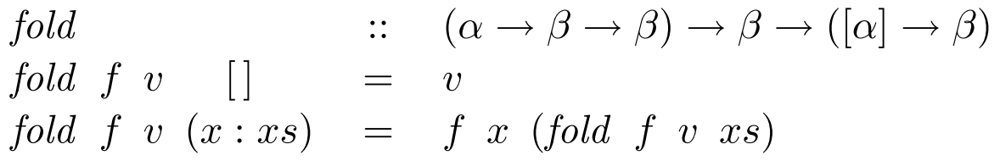 Fold in Haskell\[/caption]


The paper uses Haskell for all its examples so I'm going to stick to that as well.


This code tells us that _fold_ takes a function `f` of type α → β → β, a value `v` of type β, and processes a list of type \[α] to return a value of type β. It does this by replacing the nil constructor \[] with `v`. And every cons operator `:` with the function `f`.


Just think of lists as long chains of cons followed by a nil. You can think of a list `[1,2,3]` as prepending each value to an existing list - `1:2:3:[]`.


When you apply a 'fold (+) 0' it becomes '1+2+3+0', which just so happens to be the sum function. But that's essentially all that fold does - it replaces the cons in lists with a supplied function and the nil constructor with a base value.


There's also a [right fold](http://en.wikipedia.org/wiki/Fold_%28higher-order_function%29 "Fold (higher-order function)"), _foldr_, which does the same, but right-to-left. Using foldl vs. foldr changes the associativity of the supplied function:

```
Prelude> foldl (-) 0 [1,2,3] # 0-1-2-3
-6
Prelude> foldr (-) 0 [1,2,3] # 1-(2-(3-0))
2
```

We can implement all the standard functions using fold using more complex functions. Actually we can implement anything, but we'll get to that. Here's a _length_ example that tells us the length of a list.


\[caption id="" align="alignnone" width="496"]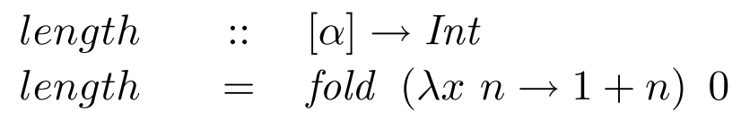 Length implemented using fold\[/caption]


You see, instead of transforming the string, that lambda function just counts.

## The [universal property](http://en.wikipedia.org/wiki/Universal_property "Universal property") of fold

In 1990 Malcolm was the first to systematically use the universal property of fold in his generalisation of lists to arbitrary datatypes. For finite lists it can be stated as an equivalence between two definitions of `g`.


\[caption id="" align="alignnone" width="708"]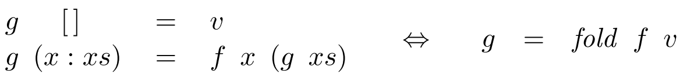 Universal property\[/caption]


Looking left-to-right, substituting `g` with `g = fold f v` gives you the recursive definition of _fold_, and right-to-left the two equations for `g` are exactly the assumptions to inductively prove that _g_ equals _fold f v_.


The universal property is particularly useful as a **proof principle** because it encapsulates a common pattern of [inductive proof](http://en.wikipedia.org/wiki/Mathematical_induction "Mathematical induction"). Rather than mess about with induction, you can just appeal to the universal property.


Let's prove a simple equivalence:

```
(+1) . sum = fold (+) 1
```

The left function is a composition of `+1` and `sum`, which sums a list then increments the result. The right function replaces every cons in a list with a `+` and the empty list with a `1`.


We want to prove they will always give the same result when applied to the same list.


The equation matches the right-hand side of the universal property of fold, `g = fold f v`, with `g = (+1) . sum`, `f = (+)`, and `v = 1`. With some simplification, the equation is equivalent to these:

```
sum   []   + 1 = 1
sum (x:xs) + 1 = x + (sum xs + 1)
```

Which can be verified by simple calculation:


\[caption id="" align="alignnone" width="919"]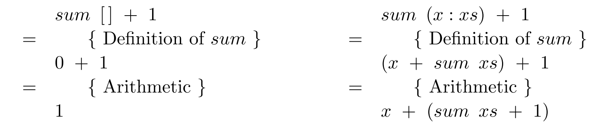 Proof of sum = fold\[/caption]


This concludes the proof. Much simpler than explicitly performing induction!


For a less haskelly example, here's what happened:

```
var inc = function (x) { return x+1; }
var sum = function (x, xs) {
 return xs.length > 0 ? x + sum(xs[0], xs.slice(1)) : x;
}

var plus = function (a, b) { return a+b; }

// we try to prove this equivalence, this is NOT something you execute :)
function (xs) { return inc(sum(0, xs)); } == function (xs) { return xs.reduce(plus, 1); }

// and then the same proof applies
```

The **fusion property of fold** allows us to fuse the composition of an arbitrary function and _fold_ into a single _fold_. This isn't true in general, so we use the universal property to calculate the conditions.

```
h . fold g w = fold f v
```

Using the same process as above, we expand this equation into two equations.

```
h (fold g w   [])   = v
h (fold g w (x:xs)) = f x (h (fold g w xs))
```

Which we simplify with two calculations:


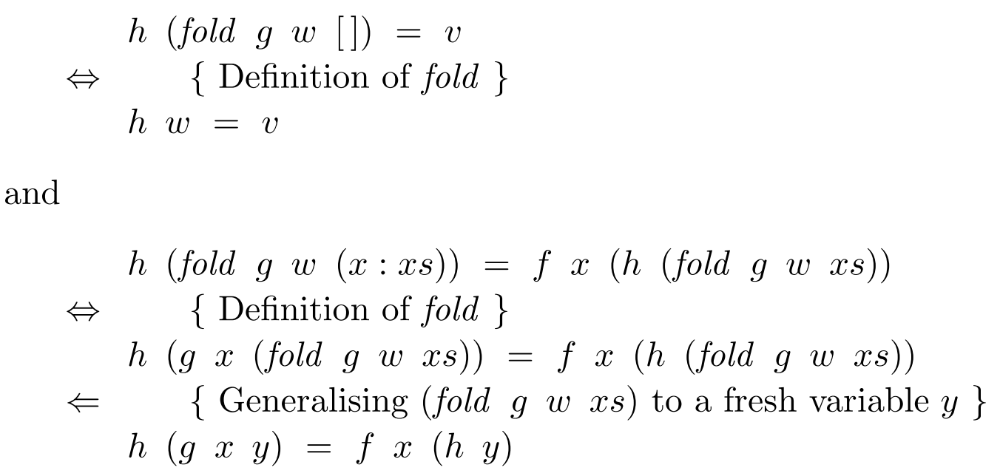


To get:


\[caption id="" align="alignnone" width="875"]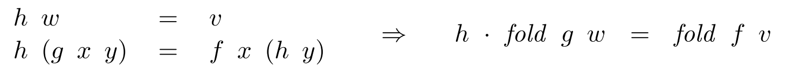 Conditions for equivalence\[/caption]


Which basically says that, if the conditions on the left are met, then our composition of an arbitrary function and fold behaves exactly as a fold would.


Now we can greatly simplify our proof of the sum equation:

```
(+1) . sum = fold (+) 1 
=>
(+1) . fold (+) 0 = fold (+) 1
```

Which matches the fusion property and we're done. Simple :)


We can also use universality as a **definition principle** to help us transform explicit recursion into folds.


Let's take a recursively defined sum:


\[caption id="" align="alignnone" width="443"]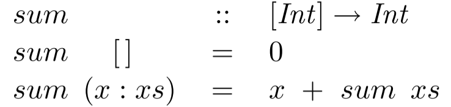 Recursively defined sum\[/caption]


We want to rewrite this into a _fold_. That is, we're going to solve the equation `sum = fold f v` for function `f` and value `v`. Because it matches the right-hand side of the universal property, we turn it into two equations:


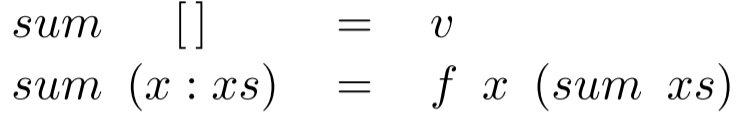


We can see from the first equation that `v = 0`. From the second equation we calculate a definition for `f`.


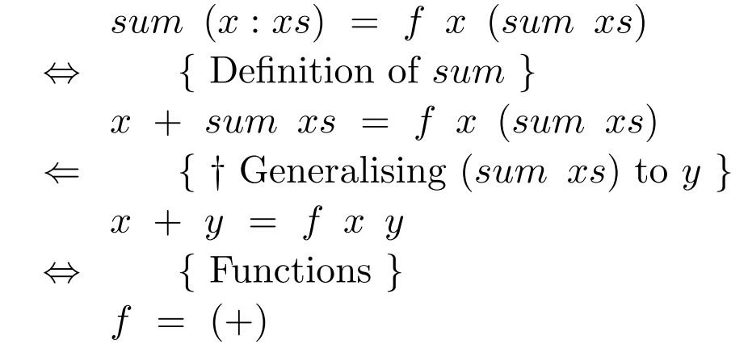


We calculated that `f = (+)` and `sum = fold (+) 0`, which is a contrived example because the definition using fold is obvious, but does a good job of showing the idea behind what we're doing.


The key step (†) above is the generalisation of `sum xs` to a fresh variable `y`. This step will feature in most such calculations and isn't specific to _sum_.


Using this process, you can even write _map_ as a _fold_:

```
map f = fold (λx ys → f x : ys) []
```

## Increasing the power of fold with tuples

We can make _fold_ even more powerful by using it to generate tuples. Say you want a sumlength function that returns a list's length as well as its sum:

```
sumlength   :: [Int] → (Int, Int)
sumlength xs = (sum xs, length xs)
```

Turning this function into a single _fold_ is more efficient because it only makes a single pass over the list.

```
sumlength = fold (λn (x, y) → (n+x, 1+y)) (0, 0)
```

In fact, any pair of applications of fold to the same list can be rewritten as a single fold. Even a function such as _dropWhile_, which drops elements from a list as long as a predicate holds true.


First we need a sister function, _dropWhile'_, that pairs the argument list together with the result:


\[caption id="" align="alignnone" width="719"]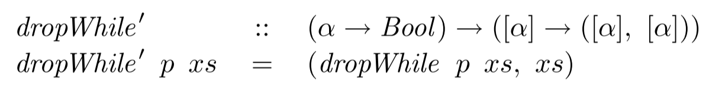 dropWhile'\[/caption]


Which, as usual, we decide is equivalent to these two equations according to the universal property:


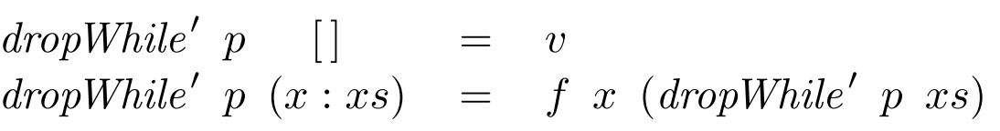


It's obvious from the first equation that `v = ([], [])`. We get the definition for `f` from a calculation like this:


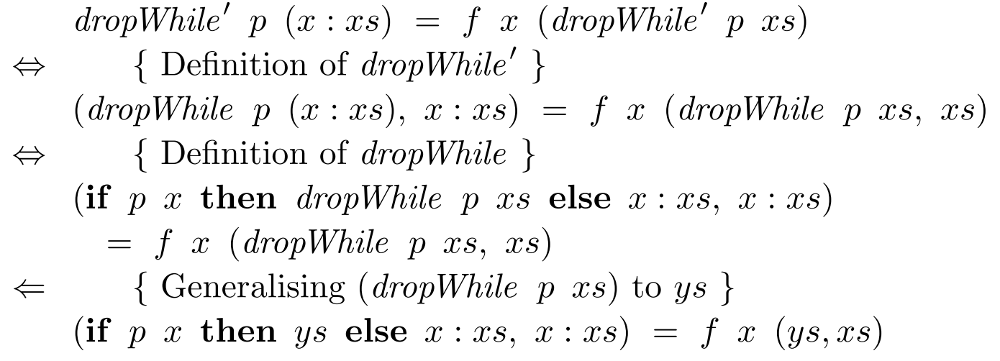


And finally our `dropWhile'` function looks like this:


\[caption id="" align="alignnone" width="749"]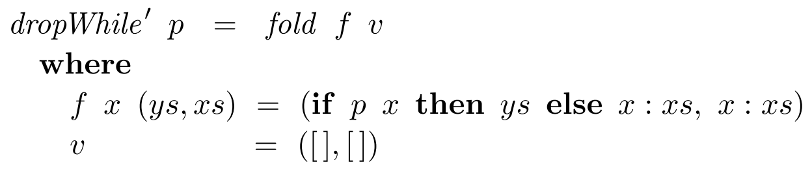 Definition of dropWhile'\[/caption]


Composing this with `fst` gives us the normal _dropWhile_ because the changed list ends up in the first part of the resulting tuple. `dropWhile p = fst . dropWhile' p`


This tupling technique is so powerful, we can redefine any **primitive recursion** function in terms of fold. The approach is usually to make a sister function that tuples the result together with the original list and work on that.


As far as I understand it, the idea is to essentially carry an extra argument into the fold so things are easier to work with. Which makes me wonder whether there's a monadic solution to this that produces cleaner code.


The paper says that if you have a function like this:


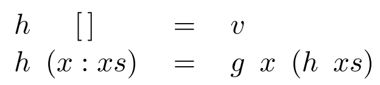


You can _fold_ this, by first introducing an extra argument, `y`, that is processed by a new function `f` in the base case, but generally passed through without change. Then you redefine `h y` with fold and introduce `xs` as an extra argument to `g`.


\[caption id="" align="alignnone" width="508"]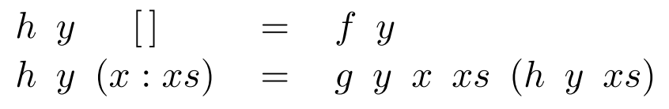 Primitive recursion\[/caption]


This gives you primitive recursion, which isn't foldable unless you use the tupling technique.


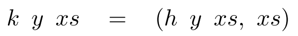


And after the same sort of shenanigans as before, our function turns into a fold:


\[caption id="" align="alignnone" width="652"]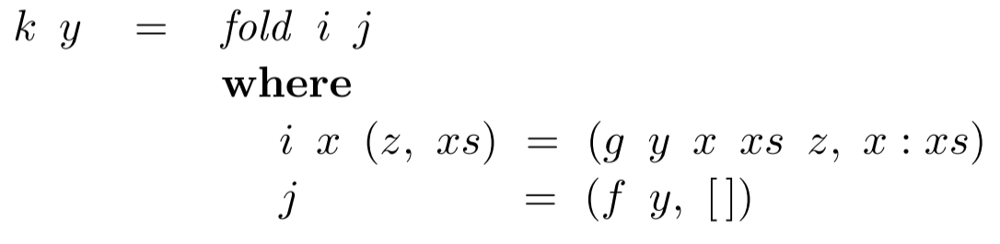 Folded recursion\[/caption]


Which lets us say that `h y = fst . k y`, which is supposedly better than the definition we had before. I guess it is because we wanted to use _fold_ and now we are.

## Using fold to generate functions

Using a language with first-order functions lets us take the power of fold further still - we can generate functions. Similar to how you'd normally replace conses with functions, you can replace them with compositions.


\[caption id="" align="alignnone" width="452"]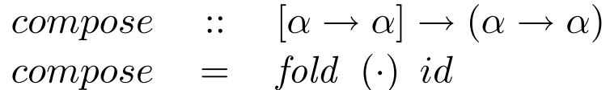 Compose as a fold\[/caption]


But that's not very interesting. I'm going to skip over the paper's definitions of various _suml_ and _foldl_ and such functions and go straight to the interesting example - Ackermann's function.


Ackermann's function is the first known example of a function that is computable, but isn't primitively recursive.


\[caption id="" align="alignnone" width="672"]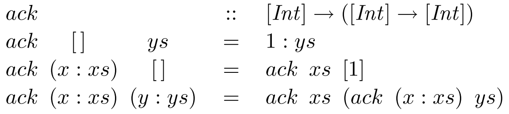 Ackermann's function\[/caption]


It's been converted to operate on lists rather than natural numbers so that _n_ is represented as a list of _n_ elements. The only reason we can do this, is that we're working with a higher order language.


By appealing to the universal property, we find that `ack = fold f v` is equivalent to these two equations:


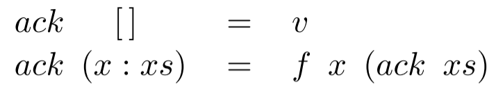


A simple calculation tells us that `v = (1:)`, but we can't use the second equation the same way as before. We must first tackle `ack (x:xs)` on the left-hand side.


\[caption id="" align="alignnone" width="625"]") ack (x:xs)\[/caption]


Now the first equation tells us that `w = ack xs` and we normally apply the universal property on the second equation to get this:


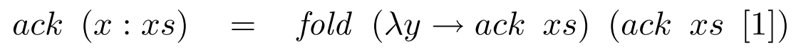


We can now calculate the definition of `f`, which gives us the final folded ackerman's function:


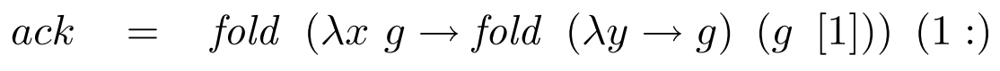


It took using the universal property _twice_, but we did it. We defined ackerman's function as a fold.

## Fin

The paper finishes with a survey of references for even more magical things you can do with folds. Using them for datatypes other than lists, performing monadic folds, redefining fold on relations, and how helpful fold can be in automatic program transformation.


But all of that are topics for another day, today let's just agree that _fold_ is awesome and we should all be using it much more.

[](http://www.zemanta.com/?px "Enhanced by Zemanta")