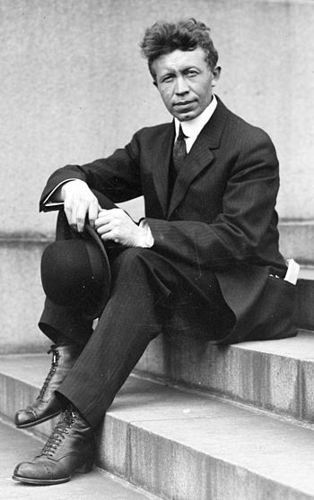

_\[This post is part of an ongoing challenge to understand 52 papers in 52 weeks. You can read previous entries, [here](http://swizec.com/blog/category/52-papers-in-52-weeks), or subscribe to be notified of new posts by [email](http://swiz.ec/52papers-list)]_

Short answer: nothing much.

\[caption id="" align="alignright" width="350"] Canadian explorer Vilhjalmur Stefansson (1879–1962) (Photo credit: Wikipedia)\[/caption]

In 1928 two men - [Vilhjalmur Stefansson](http://en.wikipedia.org/wiki/Vilhjalmur_Stefansson) and K. Andersen, both arctic explorers, ate only meat for an entire year under careful-ish supervision from McClellan and Du Bois, who then published a paper called [_"Prolonged Meat Diets With a Study of Kidney Function and Ketosis"_](http://www.jbc.org/content/87/3/651.full.pdf+html) in February 1930 to report their findings.

## The plan

The plan is rather simple - have two men eat nothing but meat for a year, measure a bunch of things, write a bunch of related papers. I've only read this one, but you can find others in the bibliography section.

Meat was defined as anything that comes directly from an animal's body. [Lean muscle](http://en.wikipedia.org/wiki/Muscle "Muscle"), fat, brain, bone marrow, offal, everything. Both men would eat as much or as little as they felt, and could make their own decisions about proportions.

Both subjects started the year with 90 days in the [Bellevue Hospital](<http://maps.google.com/maps?ll=40.7393,-73.9753&spn=0.01,0.01&q=40.7393,-73.9753 (Bellevue%20Hospital%20Center)&t=h> "Bellevue Hospital Center") metabolism ward where they ate under supervision and were carefully monitored, but spent nights at home. After this period they would go about their normal lives in New York and finish the study with a few weeks at the ward, again under careful supervision.

The authors wrote that both men were of fine enough character not to cheat on the diet.

## The men

**V. Stefansson** was a single 48 year old arctic explorer from Canada. He'd spent 11 years exploring the arctic, 9 of which almost purely on a meat diet.

Generally in [good health](http://en.wikipedia.org/wiki/Health "Health"), had had measles and the mumps, survived typhoid fever and other than occasional constipation and colds, hadn't been sick in the past ten years. Physically a well developed man, but with soft and flabby muscles. Heart, lungs, and abdomen normal. Teeth with many fillings and a mild gingivitis.

During the study he suffered from diarrhea in the first few days when the study's authors requested he eat only lean meat. This was fixed promptly by adding more fat. During the summer he once ate infected meat and had digestive disturbances for 36 hours, and had two attacks of laryngitis, which both subsided without complications.

**K. Anderson** was a single 38 year old fruit grower from Denmark. He'd spent 5 years in arctic exploration.

Generally in good health, had his appendix removed 15 years prior, and missing a few teeth. The teeth that remained showed much repair, but there was no gingivitis. Physically thin and well developed, with strikingly tanned skin and almost bald. Presented a cardiorespiratory murmur at mid-inspiration.

During the study he had two mild attacks of pharyngitis and suffered a lobar pneumonia during the final stages of the study when he was already back at the ward. During the pneumonia his diet was rich in carbohydrate and fluids.

## The diet

As mentioned before, all parts of the animal were used and the types of animals included beef, lamb, veal, pork, and chicken. Other than during special observation periods, the men were free to eat as much as they liked and proportion fat to lean meat as they pleased. The only carbs they ate came from glycogen stores in the meat itself.

During their time at the ward Stefansson ate on average 0.81kg of meat per day and Anderson ate about 0.79kg. Caloric intake was between 2000 and 3100 calories per day, of which 15 to 25 percent came from protein (100-140g), 75 to 85 percent from fat (200-300g), and just 1 to 2 percent from carbs (7-12g).

Both men preferred cooked meat to fried, so broiled steaks and chops were a staple. They ate between three to four meals a day and often preferred to eat "from the bone", which made weighing it more difficult.

The diet contained about 25% of the calcium found in a mixed diet, while phosphorous and sulfur were present in larger amounts than usual.

They also consumed between 1 and 2 liters of liquids per day - coffee, black tea, meat broths, and water. Except for Anderson during his pneumonia when he took 2.5 to 3.5 liters per day.

## The effect

The **general** effect was that there was none. At the end of the experiment both men were in good physical condition, their teeth showed no sign of deterioration, gingivitis was gone. Bowel elimination was good and undisturbed, except for the smaller stool.

As far as **nutrition** goes, both subjects lost weight during the first week while their body adjusted to the new diet. Stefansson lost 2kg and Anderson 1.1kg. Eventually they both regained part of the lost weight, but mostly stayed constant, except for Anderson who lost a lot of weight during his pneumonia.

Overall, no evidence that the meat diet was detrimental to nutrition.

Despite the popular view that eating too much meat causes elevated \*\*blood pressure\*\*, neither man showed an increase. There were no significant variations in blood pressure throughout the year.

Both men also ate with relish and showed **no mental aversion** to the diet when proportions were correct. Perhaps because they had previously been used to eating like this on arctic expeditions.

The men were leading somewhat sedentary lifestyles during this year, but reported no loss of **activity** or increased fatigue. Their physical responses to exercise were tested three times during the early period and no variation was noted.

No additional discomfort was noted during the summer months.

As far as **intestinal function** goes, neither man reported any problems. The diet was smaller in bulk than a normal mixed diet and well absorbed so their stool was smaller than usual.

There were no clinical signs of **vitamin deficiency** either. You might expect them, but nope.

## Fin

The paper then goes on to describe in great detail how nothing happened to the urine other than it becoming a bit more acidic, and how the kidneys were perfectly fine, and blood constituents showed no significant change.

Everything was simply peachy keen and both men were just as healthy after the diet as they were before the diet. Eating nothing but meat turns out to be pretty healthy.

Question is, how deadly were their farts? Whenever I eat too much [animal fat](http://en.wikipedia.org/wiki/Animal_fat "Animal fat") I have farts that could kill a horse. Alas, there's no mention of that in the paper.

