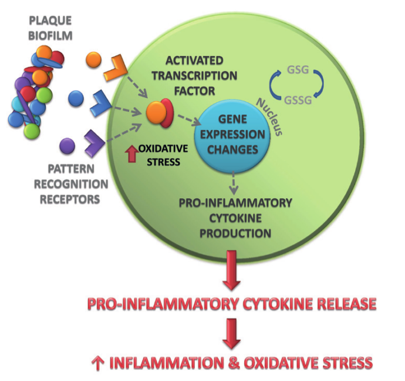
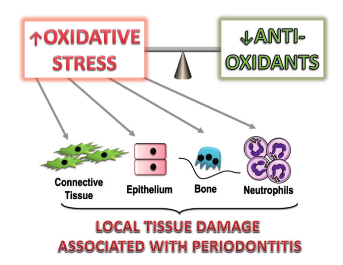
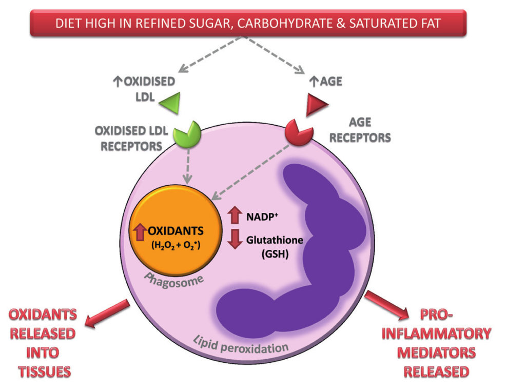

_\[This post is part of an ongoing challenge to understand 52 papers in 52 weeks. You can read previous entries, [here](http://swizec.com/blog/category/52-papers-in-52-weeks), or subscribe to be notified of new posts by [email](http://swiz.ec/52papers-list)]_ [Periodontitis](http://en.wikipedia.org/wiki/Periodontitis "Periodontitis") is a terrible disease that causes gums to detach from teeth, the bones holding your teeth to melt away, and can cause your teeth to fall out. You likely have it _right now_! About 43% of all adults in the UK have some form of periodontitis. 85% of those older than 65. Yikes! In their 2013 paper, [The Role of Diet in Periodontal Disease](http://www.bsdht.org.uk/res/DH%20May%20p18-21.pdf), MR Milward and ILC Chapple wrote about what sort of diet makes you more susceptible to periodontitis and how. The gist of it is: avoid refined carbs, antioxidants are good.

## Periodontitis

Periodontitis is a set of [inflammatory diseases](http://en.wikipedia.org/wiki/Inflammation "Inflammation") that affect the tissues holding your teeth in place - the periodontium. This includes both the soft (gums, periodontal ligament) and hard (cementum, alveoral bone) tissues. The root cause are microorganisms that build up on your teeth, if you don't floss and brush as much as your dentist would like you to. I don't think anyone does ... dentists are hard to please. \[caption id="" align="alignnone" width="414"] How microorganisms cause inflamation\[/caption] Your immune system wages war against these microorganism with inflammation. Acute inflammation helps, but chronic inflammation leads to all sorts of bad things. It starts with bleeding gums when brushing teeth or when your dentist pokes you with that sharp metal poker. If left untreated this leads to periodontitis. Gums become detached from teeth, which causes pockets to form. These pockets fill up with more and more microorganisms and when they are deeper than 3mm, you can no longer clean them yourself. Without regular professional cleanings, this is the point where things spiral out of control. With time \[and no treatment], the inflammation starts attacking bone, your teeth become loose and fall out. You don't want that.

## Nutritional mechanisms of inflammation

\[caption id="" align="alignnone" width="416"] [Oxidative stress](http://en.wikipedia.org/wiki/Oxidative_stress "Oxidative stress") causes inflammation\[/caption] Oxidative stress is a key driver of chronic inflammation. Recently defined as _"an imbalance between oxidants & antioxidants in favour of the oxidants, leading to a disruption of redox signalling & control and/or molecular damage"_, it causes all sorts of terrible things. This imbalance can cause direct tissue damage by altering molecules (lipids, proteins, DNA) or by activating redox-sensitive transcription factors, which leads to production of pro-inflammatory molecules called cytokines. In susceptible patients this creates a vicious cycle that ensures gun inflammation never gets resolved. Oxidative stress comes from a combination of [cellular metabolism](http://en.wikipedia.org/wiki/Metabolism "Metabolism") via mitochondrial electron leakage, and the host response to periodontal bacteria triggered by pattern recognition receptors on the cell surface. Essentially, it's like your periodontal tissues are slowly burning whenever they are inflamed. Fighting this are local antioxidants that come in the form of various vitamins and other chemicals, most \\important of which is glutathione. Glutathione comes in either an [oxidised](http://en.wikipedia.org/wiki/Redox "Redox") or a reduced form, which hunts for free radicals so it can turn into the oxidised form.

## Effect of diet on oxidative stress

Since oxidative stress comes partially from normal cell metabolism, it can be affected by diet. Sugars, processed carbohydrates, and [saturated fats](http://en.wikipedia.org/wiki/Saturated_fat "Saturated fat") in particular. I'm not sure I fully understand the mechanism because my molecular biology is rather poor, but the paper mentions two mechanisms. Cells performing [ATP synthesis](http://en.wikipedia.org/wiki/ATP_synthase "ATP synthase") to generate energy for themselves, produce mitochondrial superoxide radicals as a side-effect. The more simple food, the more radicals. Possibly related to the fact that simple carbs start digestion in the mouth. Another mechanism is receptor binding of neutrophils, which are a type of white blood cell. Something about glucose binding to proteins and activating oxidation enzymes. And saturated fats doing something similar, but with cholesterol. The result is _"meal induced inflammation"_. A result of increased glucose and lipid levels in the blood stream. But diet can also reduce oxidative stress. Avoiding simple carbohydrates and saturated fats is obviously going to reduce their effect. More \\importantly, with the right kind of antioxidants, you can help restore the balance between oxidants and antioxidants. But this only works reliably as part of whole foods like spinach, red beans, berries, and fancy dark chocolate (70%+ cocoa). Turns out there is a large body of research showing that [antioxidant supplements](http://en.wikipedia.org/wiki/Antioxidant "Antioxidant") do not work. A healthy [balanced diet](http://en.wikipedia.org/wiki/Human_nutrition "Human nutrition") is where it's at, so flush those vitamin pills, they're just making your pee expensive.

## Diet and periodontitis

\[caption id="" align="alignnone" width="592"] Bad diet → inflamation\[/caption] The paper says that current research on the connection between diet and periodontitis is still inconclusive, but that might be just because of how difficult it is to assess nutritional status. The best approach is measuring serum levels of various micronutrients, which removes the risk of bad self-reporting and issues surrounding supplement absorption. That said, a growing body of literature correlates periodontitis with reduced serum levels of key micronutrients. The research group has also had some luck reducing pocket depth with a powder of mixed fruits and vegetables. They don't specify how it was administered, but it was a double-blind study so I believe them.

## Conclusion

In conclusion, periodontitis is very prevalent, current ways of treating it haven't changed in 50 years, and we have early indication that dietary supplements could be a viable way of treating the disease at least to an extent. For the best chance of avoiding periodontitis and to help treatment if you do have it - brush your teeth regularly, avoid crappy food and don't smoke. Smoking makes it worse. Other than that there isn't much you can do. If you are prone to periodontitis due to any of a number of factors, it is more than likely to develop _eventually_.

