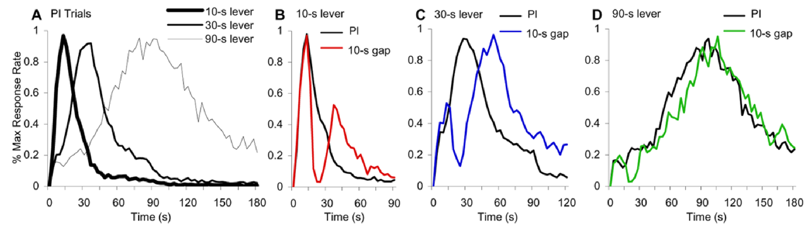

_\[This post is part of an ongoing challenge to understand 52 papers in 52 weeks. You can read previous entries, [here](http://swizec.com/blog/category/52-papers-in-52-weeks), or subscribe to be notified of new posts by [email](http://swiz.ec/52papers-list)]_

> "When a man sits with a pretty girl for an hour, it seems like a minute. But let him sit on a hot stove for a minute and it's longer than any hour." ~ Albert Einstein

Time sometimes flies by, sometimes drags along shuffling its feet. But how does that work? How come context affects the way we perceive time? Neurobiological evidence has been found that people use different areas of their brain to time different lengths of time, but the traditional view of psychological time is still that there is a timer, a counter, and simple arithmetic. In [_Relativity Theory and Time Perception: Single or Multiple Clocks?_](http://www.plosone.org/article/info%3Adoi%2F10.1371%2Fjournal.pone.0006268) Buhusi and Meck use rats to see whether their brain uses independent clocks or not.

## The experiment

They used a tri-lever set up to train rats to recognise three different time intervals - 10s, 30s and 90s - using something called a tri-peak procedure. The paper treats this as common understanding in psychology research, so it's never explained in great detail. From what I can tell, a light in rats' cages acted as a signal. When it turned on, the experiment started. When it either turned off or flashed again after X seconds, I'm not sure, it counted as a signal or a gap. If the rat pulled the correct lever, it was given a food pellet. Now I'm not sure whether the light was still used for anything other than starting the trial after the rats had learned how to time correctly, but the variable we're looking at is by how much they miss the target time. The fun part is inserting gaps into the timing. First a small gap, then a larger and larger gap. When this happens rats can do one of three things with their [internal clock](http://en.wikipedia.org/wiki/Clock "Clock"):

- _run_, timer ignores the gap
- _stop_, timer is paused for the duration of the gap, then continues
- _reset_, timer starts from scratch after the gap

I'm not sure how researches communicated the gap to their rats, but if the same effect happens for all three intervals, rats are using a simple clock+accumulator setup. If the actions happen independently for each timer, then they are using several parallel clocks. Put simply, if you miss the first lever by 10s and still hit the third lever perfectly, then you have independent clocks. If you miss the first lever by the same amount as the last lever, then you aren't.

## Effect of gaps on response rates

\[caption id="" align="alignnone" width="836"] Response rates during probe trials and with 10s gap\[/caption] In baseline tests response rates were just around the target times, which means rats successfully learned how to time the three intervals. But when researchers inserted a fixed gap at the 15 second mark, the three timing functions behaved differently. The effect of a gap seems to increase with the relative duration of a gap to the timed interval. A 10s gap delayed the 10s timer by 30s (reset rule), by 20s the 30s clock (intermediate between stop and reset), and by 10s the 90s clock (stop rule). This suggests the clocks are operated independently. To see if this affects only responses, or actual timers, researchers tried progressively expanding the gap. A 1s gap had no effect on timing. A 3s gap reset the 10s clock, but did not affect the other two. A 10s gap reset the 10s and 30s clocks, and a 30s gap reset all clocks. One way to model this effect is to think of gaps as spending resources in the brain. This is essentially memory decay rate, which is proportional to the relative gap to criterion duration - _-salience\*g/Tk_, where _g_ is the gap and _Tk_ is each clock's criterion. If the criterion is short, _g/Tk_ is large and memory decays quickly (the reset rule), if it's long then the ratio is smaller and memory decays slower (run or stop rule). Using this we can simulate what happens in experiments - clocks resetting in a hierarchical manner as the gap increases.

## Psychological models of interval timing

Several models have been proposed to explain data from past interval-timing experiments, but they fail to predict the multiple parallel clocks behaviour. A _switch_ model, which assumes that a switch stops accumulation of time in [working memory](http://en.wikipedia.org/wiki/Working_memory "Working memory"), would predict that all three clocks should use the _stop_ rule when a gap occurs. But present data clearly indicates that rats flexibly change behaviour of each clock independently. Another model says that _instructional-ambiguity_ would reset clocks based on how similar the gap is to the timed signal. If it's similar, the clock stops, if not, it resets. But in this experiment the signal and gap were identical and rats still used different rules for different clocks. The _passive memory-decay_ model proposed by Cabeza de Vaca is a step in the right direction, but predicts clock behaviour should depend solely on gap duration. This experiment shows it depends on criterion duration as well. The _resource allocation_ model suggested by the authors, assumes that during a gap resources are diverted from timing, which means working memory can't maintain its current time. The gap's effect is primarily a function of the contrast between the gap and timed interval. Memory decays with a ratio of _g/Tk_. Better still, this model can be used to model any type of distractor, not just timing intervals.

## Conclusion

The authors found that multiple independent clocks are likely always running in our brain, timing separate events depending on the relative context they occur in. Their findings also have direct support from neurobiological studies showing that physically separate neurons handle the different clocks. I'm not sure what all this entails, but it's definitely interesting. And I guess practical for multitasking.

