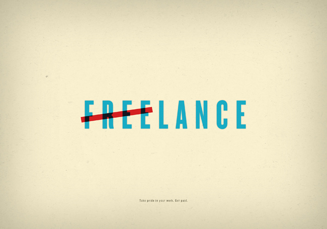

\[caption id="" align="alignnone" width="650"] Photo borrowed without permission from Marc Kodis because I can't find contact info\[/caption] I've been working for a single client since June. They're awesome! Pay well, pay on time, easy to talk to, the work is interesting. Everything you'd want in a client. But three months ago their business changed and their need for a web generalist dwindled. Our relationship calmed down to just two days a week. _"Great!"_, I thought, _"I'll take it easy for a while! Plenty of money in the bank, and I could use a break. Been working pretty hard the past few months"_. Went back to Slovenia for two months. Took it easy. Spent a lot of time with friends. Spent even more time recovering from hangovers. Did a butt-tonne of sports. Life was grand. Did a few tiny writing gigs next to the two days a week of Real Work (tm) because, hey, people asked and I had free time. But I wasn't serious about looking for clients. The Client will surely need me for a more reasonable number of days in two months. We've loosely agreed to it! There was even a handshake! Wait ... no, there was no handshake. A week before going back to on-site I was informed that our arrangement would continue at two days a week. There simply isn't enough web development work to go around. Well, fuck. But hey, coffers are still pretty full. No biggie. I'll just find other clients when I'm in the US. How hard can it be? And then April happened. Known to grown ups unlike myself as Taxes Month. Slovenia wanted just over €5000 for my sins of saving rather than spending money. Next to my regular monthly sacrifice to the Slovenian social system, of course. After paying rent and buying a plane ticket, my bank account only had some €4000 left. Fuck ... The astute reader will notice this was almost €2000 short of what I would have to pay by mid-month. Essentially I've made 15k this year, and in April 10k went \*poof\*. Did I mention I hadn't been grooming my work pipeline since early last year because I was really busy and very happy with my clients? How do people get new work again? Panic mode. I can delay paying the government by a few days or weeks because they're a huge bureaucracy and won't even notice, but my bank made me sign a few scary-looking blank checks in return for that credit card. Brown underpants time! Sent an email everyone I could find on HN's monthly freelancer thread. Pinged every one in my network I could think of. Nothing. A week went by. I had a few calls with potential clients, nothing solid. Another week passed. An old client of mine remembered me. We quickly made a deal and I collected the customary 50% in advance. It's now been 3 weeks and I finally got the full specs for the job. Will probably get the other 50% at the end of May, or later. Turns out that while Silicon Valley is absolutely brimming with opportunity and everyone is looking for programmers, actually getting work is insanely hard. It's not that I wasn't good enough. Or that I didn't jibe with most of the potential clients. It's that everyone wants you to work full-time. Even when they're okay with contracting, they want it to be full-time. Five days a week. What do you mean you only have three days of time? Suddenly that awesome client of mine that I really love working with turned into a huge liability. I imagine it's a bit like dating with a huge wart over half of your face. An unnecessary handicap. Somebody even said _"We want to marry you. It doesn't have to be right away, but eventually you have to be ours. Completely and utterly. Ours."_ Yup. But on Friday everything coalesced. My standards had been beaten low enough. My will was broken. I would take pretty much anything I could get. I had three meetings with potential clients. Loved the first one, but their process looked long-ish and I was pressed for time. Signed an unfavourable deal with the second one. Third one told me it's a shame I signed not an hour ago because they wanted to give me a better deal. Alas. But hey, I am back to being fully booked. It's not ideal, it's on a trial basis (my trial of them), but it extends my runway by a month and I can look for better clients in peace. No more worrying about pesky little things like staying alive and not having my kneecaps broken by goons. Naturally, The Client asked if I have more than two days of time this week ...

