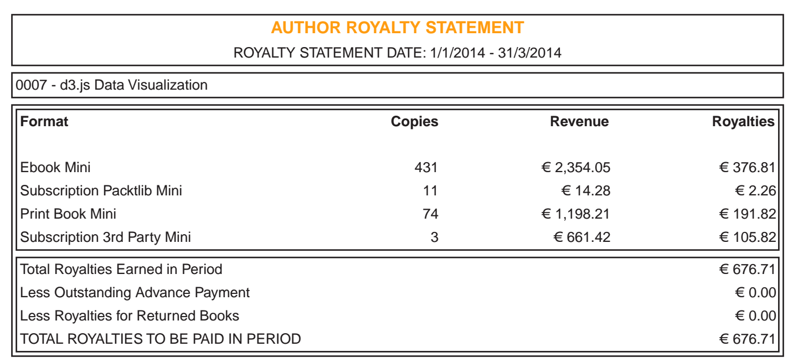

\[caption id="" align="alignnone" width="601"] Royalty statement\[/caption] Another three months, another royalty statement from [Packt](http://www.packtpub.com "Packt"). Three months post facto. Of course. 676 euro. About a month's worth of post-tax [minimum pay](http://en.wikipedia.org/wiki/Minimum_wage "Minimum wage") in [Slovenia](<http://maps.google.com/maps?ll=46.05,14.5&spn=10.0,10.0&q=46.05,14.5 (Slovenia)&t=h> "Slovenia") for nothing but sitting on my arse doing other things. Except it's pre-tax. Still, could be worse. My effective hourly rate for [Data Visualization with d3.js](http://www.packtpub.com/data-visualization-with-d3js/book) is now €5.1/hour. Up from the €3 it was last time. And that's the beauty of writing books. After the initial blood and sweat and tears, I don't have to do anything. As long as it keeps selling, money keeps hitting my bank account. Were I to do some active promotion and build a newsletter or some manner of business around the books, sales would be even better. Similar to what's happening with my other book - [Why programmers work at night](http://nightowlsbook.com). I keep poking at it and doing minor things here and there when I have time, and it keeps selling. It's still not finished, but it makes just enough sales a month to cover my Uber expenses. Which begs the question, why the hell am I still busting my arse freelancing? Well the money's infinitely better, that's true. And I don't make enough from books to cover anything even close to my living expenses. But book revenue is additive. Freelancing revenue is linear. You see, no matter how much better I get at programming and getting clients, my revenue can only scale linearly. It's bound by time and no matter how high my daily or weekly rate can go, there is only so much time. And I'm hitting a ceiling with my rate. And when I break this ceiling, a new one will be waiting just around the corner. With books ... writing four to five a year would give me hockey stick growth. The d3.js book took me 332 hours. With a full-time writing schedule I can fit 6 of those into a year with no days off. With weekends and such I could easily write 5 technical books a year. On topics I don't even know yet. It's a magnificent way to learn, writing a book. That's how the d3.js book happened. I had _no_ clue about d3.js beforehand. But what about money? Well in its first quarter the book made €1019 of royalties. Second quarter, €676. Assuming a logarithmic fall towards a minimum, next quarter is going to be around 500, then 400 and so on. Eventually sales will reach an asymptotic limit and I'm going to get some €100 a quarter. Or €400 a year. By then it will have made me some €5000 or €6000, spread over some two years. Were I to write five books with similar sales every year I'd be making some €30,000 a year. Just enough to live like a normal person in Slovenia, or barely scrape by in a swanky place like [San Francisco](<http://maps.google.com/maps?ll=37.7833333333,-122.416666667&spn=0.1,0.1&q=37.7833333333,-122.416666667 (San%20Francisco)&t=h> "San Francisco"). But! This is where the hockey stick comes in. Because book revenue never falls to total zero, my yearly income would grow. Slowly at first, but by the time I was 50 I could live comfortably having done nothing but writing from now until then. If I started writing full-time _right now_, I could be making a living off writing in just two or three years. Maybe this is my next in the [11 lives you get](http://www.smbc-comics.com/?id=2722)? After 17 years I'm getting kind of tired of programming anyway ... anyone want to invest 90k in me becoming a full-time author?