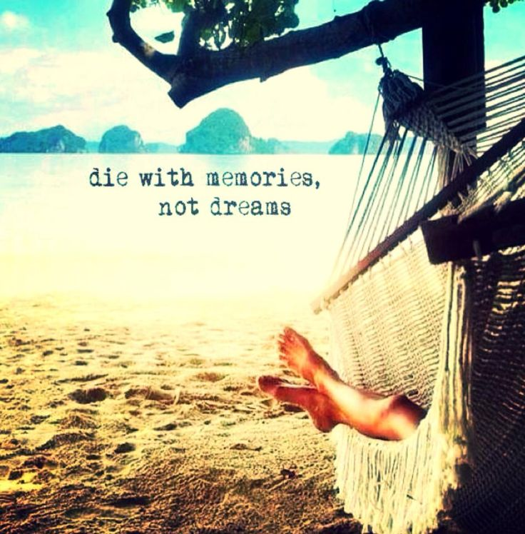

\[caption id="" align="alignnone" width="515"] Die with memories, not dreams\[/caption] This isn't an inspirational story like Carrey's [Yes man](http://www.amazon.com/Yes-Man-Blu-ray-Jim-Carrey/dp/B001FB55M6%3FSubscriptionId%3D0G81C5DAZ03ZR9WH9X82%26tag%3Dageewitahat-20%26linkCode%3Dxm2%26camp%3D2025%26creative%3D165953%26creativeASIN%3DB001FB55M6 "Yes Man \[Blu-ray]"). It's not much of a story even. It's something that occurred to me while running yesterday morning. I have stopped saying "No." I used to be a giant diva. If something wasn't part of my plan for the day -> No. Lunch with friends? Nope. Dinner with the girlfriend? No way. Call during my morning writing time? Negative. Do something fun on the weekend? Lol, nope. Every each nope was followed by a "Got work to do". Or in case of potential clients, "Too busy, sorry." My day followed strict rules - writing from 10am to 12am, then lunch, then work for one or _at most_ two clients. Each day belonged to a particular client. Weekends belonged to writing. And it worked. I got _shitloads_ done. Except most of my friends forgot I existed, my girlfriend got to see me a few hours a week, and my family thought I was a parasitic alien. But then, a panic over high rent and living in a new city. I _had_ to make rent. I _had_ to make friends. And bam! I stopped being a diva. I stopped saying No. I went to every social event I could. I accepted every project. And the result is horrifying. Two main projects get their proper days. A quick project has been feature creeping for four months, I have a side-project on a tight deadline, and I'm working on a d3.js video course for a publisher. Somehow I've even got a new girlfriend. That part is great. But all this amounts to being five weeks behind on deadlines for my publisher, not having written a blogpost in over a month despite ideas coming and going daily, a bimonthly email newsletter that I haven't updated in three months, a woefully neglected half-finished self-published book that people are still buying in hopes I one day manage to finish, and clients that started asking what the hell is going on. And I haven't gone longboarding in months. I can't remember what it's like to not be tired. My days go from groggy to hopped up on caffeine to falling asleep with laptop open and hands on keyboard. That's a lie. My girlfriend forced me to take last week off. On Monday I felt deeply energetic for the first time in _months_. I got a bunch of writing done for video scripts and closed a week's worth of tickets for the Monday client. Magic. But a week off also means work piled up; deadlines are tighter, clients are panickier, and most of my writing looks deader than ever. If I ever want to sleep again I have to start saying No. No to random trips to the beach, No to long dinners, No to just hanging out, No to concerts, No to music festivals, No to projects I don't have time for. It's the only way to stay sane. Last night I volunteered for DjangoGirls ...