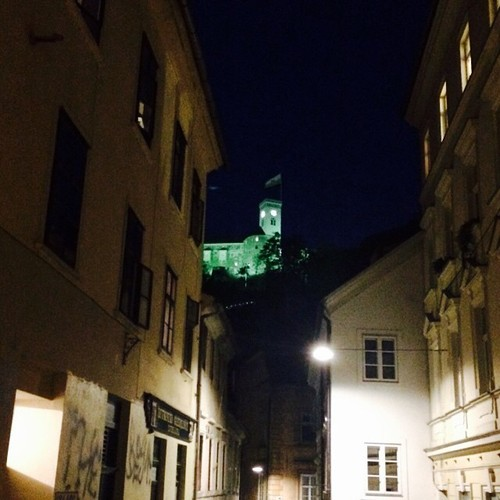
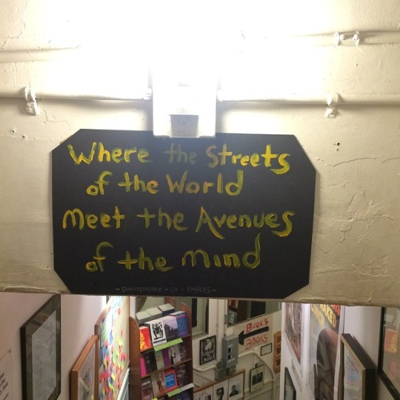
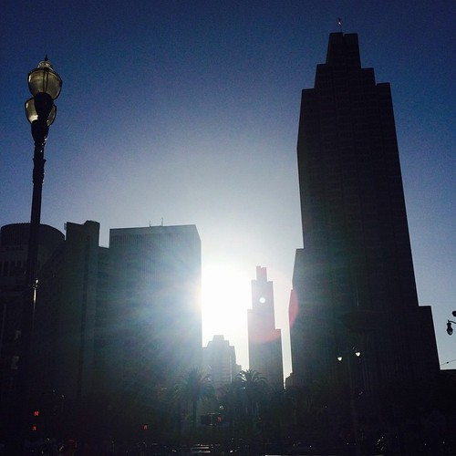
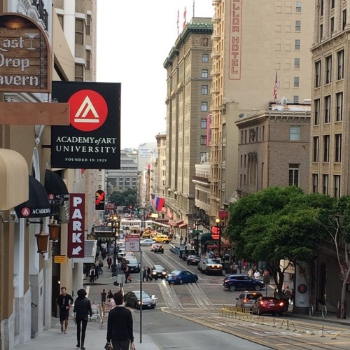

\[caption id="" align="alignnone" width="500"] [Ljubljana Castle](<http://maps.google.com/maps?ll=46.0488888889,14.5083333333&spn=0.01,0.01&q=46.0488888889,14.5083333333 (Ljubljana%20Castle)&t=h> "Ljubljana Castle") at night\[/caption]

Today marks two weeks since I got back from a 6 month trip to [the US](<http://maps.google.com/maps?ll=38.8833333333,-77.0166666667&spn=10.0,10.0&q=38.8833333333,-77.0166666667 (United%20States)&t=h> "United States"). Strangely I'm still jetlagged, every morning feels like I got hit by a freight train.

Last time I wrote about reverse culture shock was in February when [I returned to Slovenia after 3 months and was culturally shocked](http://swizec.com/blog/i-returned-to-slovenia-after-3-months-and-i-am-culturally-shocked/swizec/6530)

My observations are different now. In six months I had time to settle down in [San Francisco](<http://maps.google.com/maps?ll=37.7833333333,-122.416666667&spn=0.1,0.1&q=37.7833333333,-122.416666667 (San%20Francisco)&t=h> "San Francisco"), establish some decent friendships, meet more of interesting people. Things.

## People are pretty much the same

\[caption id="" align="alignnone" width="500"] [City Lights Bookstore](<http://maps.google.com/maps?ll=37.797628,-122.406575&spn=0.01,0.01&q=37.797628,-122.406575 (City%20Lights%20Bookstore)&t=h> "City Lights Bookstore")\[/caption]

Some people are great. Some are a bag of dicks. It's got nothing to do with where they're from.

Yes, Americans are generally more open to conversations with strangers and on the outside they are polite to the point of nausea. But they are also backstabby, will never tell you what they _actually_ think, and will only express bad things behind your back.

But people in Slovenia are like that with acquaintances as well. The difference is that I've lived here for 27 years and there for a few months so more people are open with me here than there.

Makes sense.

And the overwhelming feeling of everyone being _extremely_ impolite the last time I came back? That's city vs. suburbia.

People in San Francisco are just as untalkative, brisk, and terse as they are in [Ljubljana](<http://maps.google.com/maps?ll=46.0555555556,14.5083333333&spn=0.1,0.1&q=46.0555555556,14.5083333333 (Ljubljana)&t=h> "Ljubljana"). Wham bam you're done. No time for pleasantries, you're holding up the line!

And don't think people in San Francisco will smile at you when they walk past, or give you a nod when you're both jogging. They won't even notice you exist.

## Slovenia complains about being expensive, but is kinda cheap

Comparing the cost of living is funny. I never have a good answer for this one.

The first time I rented a room in San Francisco my butt clenched and I didn't stop panicking until I got back. Yikes.

Prices for room sublets range from $1400 to $1800+. I found a happy medium for $1600.

That's $1600 for a room in an apartment with three other flatmates, sharing a single bathroom, everyone cooking in the same kitchen, rattling windows and everything looking kind of grimey. But the flatmates were nice because as a stranger in a strange town they're the first choice for someone to chat and make friends with.

But my posh fairly sizeable downtown studio here in Ljubljana only costs $700 a month, $800 with utilities. Nice apartment for half the price of a kind of crummy room ...

Yeah.

\[caption id="" align="alignnone" width="500"] A brunch\[/caption]

At the same time going to restaurants costs about the same here as it does there. A lunch menu will be around 10 euro. It's around $15 in SF - a euro or so pricier.

But then comes the tip. Since you're not a dick, you give 20%. It adds up and suddenly you're spending $30 per person on brunch.

Yikes.

Ok services (people, really) are cheaper in Ljubljana than they are in San Francisco. In restaurants the biggest difference comes from the tip, but everywhere else you get a better service for the price you're paying. Haircuts come to mind.

As far as groceries go ... I'm not sure. I eat like a beast so 4 or 5 days of groceries costs me 60 euro here, and a week's worth of groceries cost me $80 there. Technically I spend \[a lot] more on groceries here than there.

But meat, for example, is much cheaper here than there. Maybe I'm just not a very smart shopper.

## The infrastructure in SF sucks

\[caption id="" align="alignnone" width="500"] In front of [Ferry Building](<http://maps.google.com/maps?ll=37.7955555556,-122.392222222&spn=0.01,0.01&q=37.7955555556,-122.392222222 (San%20Francisco%20Ferry%20Building)&t=h> "San Francisco Ferry Building")\[/caption]

You know something's wrong when every company bigger than 10,000 starts running their own bus service. Something is broken. The city is _hurting_.

Muni is a cool enough system, nice and cheap. You pay $2 and you get a ride anywhere. Less than 50 cent more expensive than in Ljubljana!

But it only saves you 10 minutes compared to a brisk walk. A 2.5 mile ride from [Nob Hill](<http://maps.google.com/maps?ll=37.79323,-122.41448&spn=0.1,0.1&q=37.79323,-122.41448 (Nob%20Hill%2C%20San%20Francisco)&t=h> "Nob Hill, San Francisco") to The Mission takes between 32 and 48 minutes, a walk takes 53min, and a car ride is 10 minutes. (according to Google Maps)

Obviously you're going to Uber.

A comparative 3.5 mile ride from downtown Ljubljana to the big shopping mall takes 25min by bus, 55min to walk, and again just 10 minutes by car.

Obviously you're going to bus.

On top of being faster, our buses are also more predictable, run more regularly, and feel cleaner and more integrated into society. In SF it almost feels like you've lost at life if you ride the bus.

But maybe that's just prejudice because I didn't do it enough.

## Slovenia is missing half of the service industry

To get a cab, I have to make a _phone call_ to a dispatch center. Then I have to wait like a lost soul on a street corner. No feedback about how long it's going to take; sometimes it's a minute, sometimes it's ten. Sometimes you have to call again.

And you need cash to pay for a cab. No credit cards, no phone payments, just cash.

But it's looking up. Some companies have apps now, but you still have to pay cash.

When you want to get groceries ... well you'd better get off your arse and walk to a store. Only one chain offers delivery and the one time I tried it, you could tell it wasn't the core of their business. I'll try them again soon.

Alas, there's no Google Shopping Express here. I loved that thing. Oh you ran out of energy drinks and suck at planning, we'll bring you some by tonight. For cheaper than buying at a store.

In San Francisco there is even a service for cleaners (handy.

You sign up online, cleaners show up, cleaners keep coming regularly for as long as you want. Payment is invisible by credit card - no awkward moments.

When I asked on Twitter what my options were in Ljubljana, 14 people retweeted, 4 asked to be told when I find out, 1 told me I'm lazy, 1 sent me a sketchy phone number, and mum sent an email saying she'll do it.

No mum, I'm not paying you to clean my apartment.

Food delivery - in SF, app, in LJ, phone call.

Healthy food delivery - in SF, app, in LJ, nope.

Courier person for one thing - in SF, app, in LJ, nope.

Pay back friend for lunch - in SF, app, in LJ, cash.

Ship a few random items - in SF, app, in LJ, walk to post office and figure it out.

And let's not even get started on splitting the bill. Biggest killer feature of the US!

When many people dine, everyone throws their credit card on the table, each gets their own bill split exactly to the correct fraction.

We tried that in Ljubljana with a friend and surprisingly the server was up to it. But the approach he took was solving the knapsack problem by hand and making two separate bills with unique items in such a way that we both paid similar amounts.

Sigh.

## Life in general

\[caption id="" align="alignnone" width="500"] Powell Street\[/caption]

Life in San Francisco is more care free. Whatever you want to get done, somebody is working on an app to solve your problem.

In Ljubljana a lot, if not most, things are manual. Ugh.

And you have to pay attention to opening hours too. The only time you ever care about what day it is in San Francisco is when you're dealing with banks or the post office. Everything else works all the time.

Want to do your groceries at 3am on your way home from the bars? Sure thing, Safeway. Or you've just run out of alcohols at a party and need more? Mosey along to the nearest corner store and they will sell you some.

In Slovenia you can't buy alcohol in a store after 9pm, but you can buy it at a bar at 5am and you can't buy it past 2am in San Francisco. Weird.

And Sundays still matter in Ljubljana. _Nothing_ is open. The city is dead. Good luck figuring out where to have lunch on a Sunday afternoon in downtown Ljubljana.

But I do love our coffee shop culture. It seems no matter the season, time of day, or the weather, coffee shops are full of people sitting down, relaxing, sipping their coffee and chatting. It's amazing.

Coffee culture in the US ... ugh, how about now? They always rush and never sit down. If they do sit down it's with a laptop to get some work done. It's not social at all.

How they ever do any business in such an environment I don't know. Actually I do, brunch.

Brunch in San Francisco is an institution. You _will_ wait up to an hour in line to sit down and you _will_ go out to lunch practically every weekend.

Whether it's with a girlfriend or a friend or even a potential business partner, brunch is the only truly social meal of the week in San Francisco. The only real time you can sit down and relax with a fellow person.

Dinner is doable, but it's always at least a bit rushed. Gotta get home, see the fam or whatev.

## The size

\[caption id="" align="alignnone" width="500"] Selfie from Twin Peaks\[/caption]

I guess most of the difference comes down to size.

Even though Ljubljana and San Francisco proper are roughly the same size - 7 miles across - SF _feels_ bigger. It's got 800,000 people packed into the same area Ljubljana's only got 300,000.

As a result, everything in SF takes foooreeeveeeer. Go out to eat? 30 minutes to get there, 20 minutes to wait in line.

And because it's so packed there are multiple "downtowns". It's not uncommon for a walk from one bar to the next to take 20 minutes because good bars are everywhere. Anywhere you go in San Francisco, there is something of interest. Something you're going to want to do and see.

In Ljubljana, even though it's nominally the same size, everything of interest lies in the small downtown area. You never have to walk more than 10 minutes to go anywhere. Twenty minutes tops.

Further out and you're essentially in suburbia. It's still the city, but it's more like San Francisco's Menlo Park in relevance and layout.

## The verdict?

I don't know.

Life in San Francisco feels easier, but it's a butt clenching exercise in making ends meet.

Life in Ljubljana is more relaxed, but you spend ungodly amounts of time running support systems.

The step counter is definitely chirpier in Ljubljana though.

_shrug_