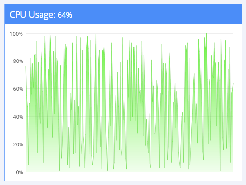
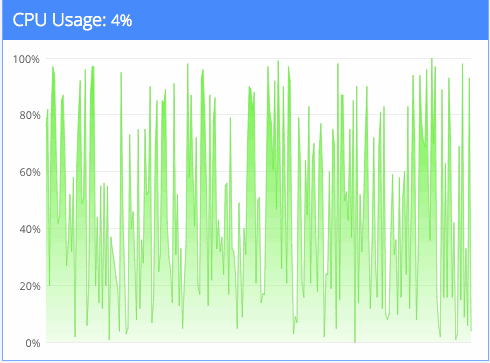
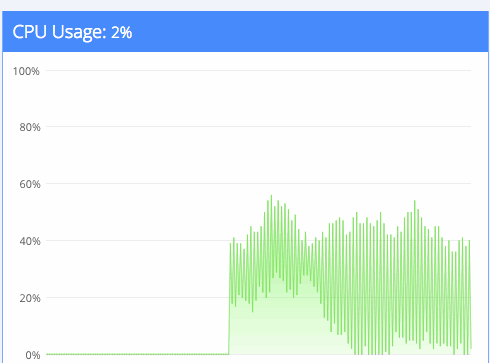
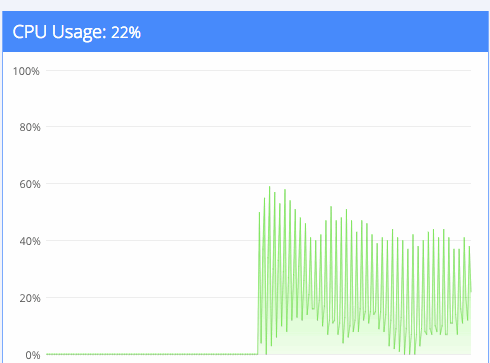
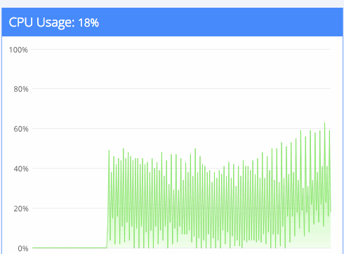
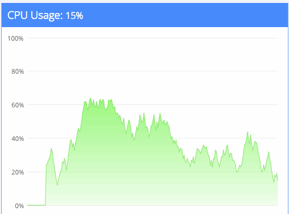

Making fake demo graphs is always fun. Here you are, making a graph without data, generating random datapoints, trying to make it as realistic as possible. Two days ago I was failing at the same. It sounds simple, right? To produce a random graph, you generate random data. Something like this:

```
var data = _.range(250).map(function () {
    return Math.round(Math.random()*100);
});
```

And your graph will look like this: \[caption id="" align="alignnone" width="504"] Completely random graph\[/caption] Well, that doesn't look realistic at all. Crazy spikes, deep valleys ... if a real-world system behaved like this you would be very concerned for its wellbeing. This won't do for a demo. And besides, you wanted a live graph anyway. So you move data generation into the backend and hook it up with [socket.io](http://socket.io/ "Socket.io"). Then you make a function that generates one datapoint every `250ms`. Data generation looks like this:

```
io.on('connection', function (socket) {
    setInterval(function () {
        socket.emit('cpu', update());
    }, 250);

    function update() {
        return Math.round(Math.random()*100);
    }
});
```

Your graph now looks like this: \[caption id="" align="alignnone" width="490"] Moving random graph\[/caption] Yay! It moves! But still too random to look realistic. A [CPU](http://en.wikipedia.org/wiki/Central_processing_unit "Central processing unit") that behaves like that is in serious trouble! What if instead of producing random values, we produced random changes to existing values? That could work. Remember the previous state, make a tiny random change. Data generation now looks like this:

```
io.on('connection', function (socket) {
    var previous = 0;

    setInterval(function () {
        previous = update(previous);
        socket.emit('cpu', previous);
    }, 250);

    function (previous) {
        previous += Math.random()*10-5;
        if (previous > 100) previous = 100;
        if (previous < 0) previous = 0;

        return Math.round(previous);
    }
});
```

And the graph looks like this: \[caption id="" align="alignnone" width="490"] Fixed random graph, 1\[/caption] Or like this: \[caption id="" align="alignnone" width="490"] Fixed random graph, 2\[/caption] Or even like this: \[caption id="" align="alignnone" width="490"] Fixed random graph, 3\[/caption] Wait ... what? That's even worse than before! How is this possible, the value changes on each step are _tiny_? And I wrecked my brain and wrecked my brain and then wrecked my brain some more. Refreshed the page many times. Rewrote the data generating function many times. Nothing I tried worked. The graph looked more sporadic than ever. Can you spot the error? The clue lies in those graphs moving faster and faster with each refresh. Something fucky is going on - the uncleared setInterval. You see, that backend node.js process is persistent. The 250 millisecond interval doesn't just go away when you refresh the page. Oh no, it's still there, waiting for you, stalking its prey, hunting. And because socket.io does evertyhing in its power to be more reliable than not, it will reconnect old sockets because hey, you probably just have spotty wi-fi. But we also started a new `setInterval` on every `connection` event. Yeah. That's not a single random function acting funny, that's a whole bunch of them! If we fix the backend code to look like this:

```
io.on('connection', function (socket) {
    var previous = 0;

    var interval = setInterval(function () {
        previous = update(previous);
        socket.emit('cpu', previous);
    }, 250);

    function (previous) {
        previous += Math.random()*10-5;
        if (previous > 100) previous = 100;
        if (previous < 0) previous = 0;

        return Math.round(previous);
    }

    socket.on('disconnect', function () {
        clearInterval(interval);
    });
});
```

The graph looks like this: \[caption id="" align="alignnone" width="490"] Moving graph, good\[/caption] And all is right in the world. You're happy, your boss is happy, your graph looks like it could be real but isn't. Acting.