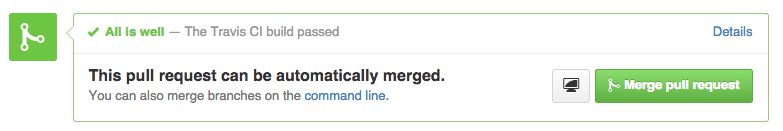
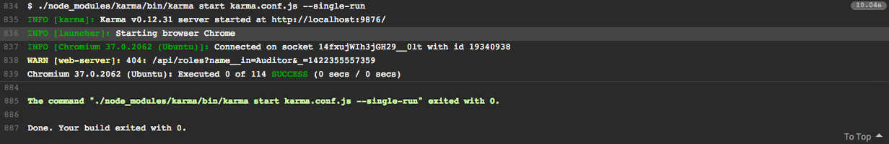

\[caption id="" align="alignnone" width="626"] Pull request feedbackAll is well\[/caption]


You test your frontend code, right? And you've got a continuous integration system running, right? _Right?_


Well you should.


Code review is _a lot_ easier when you have a magical system to say All Is Well. At least in principle. There are limits to testing, but that's a whole different bag of worms.


Today I want to share a little nugget that took hours of interneting to find. Thanks to everyone in [this](http://stackoverflow.com/questions/19255976/how-to-make-travis-execute-angular-tests-on-chrome-please-set-env-variable-chr) and other Stack Overflow threads for originally figuring it out.

## The moving parts

First you will need [karma-runner](http://karma-runner.github.io/0.12/index.html). It is the single best JavaScript test runner I have ever used.


Runs in the background when you're working, re-runs tests on file change, and doesn't care whether you're using Jasmine, Mocha, or something else.


And it's so very very fast.


Next you will need [Travis](https://travis-ci.org/).


Any continuous integration service will do really - I've had great success with Circle CI. But this post is about Travis in particular.


You want something that replicates your environment on a server, runs the tests every time you push to a branch, and shows you the result where it matters most. In the pull request.

## The problem

When you're working Karma runs in the terminal. That's where you see the output. But the tests themselves run in a browser or two.


You point a browser at `http://localhost:9678` and Karma handles the rest.


All fine and good. But you can't do that on Travis. Not directly at least.


People usually resort to PhantomJS. A headless browser that's happy without a GUI. But sometimes your JavaScript doesn't run well in PhantomJS.


I'm currently using CanJS, for instance. It uses a thing that doesn't work in current versions of PhantomJS. It's going to work in the future when PhantomJS catches up. But it doesn't yet.


[Chrome](http://en.wikipedia.org/wiki/Google_Chrome "Google Chrome") is the only option.

## The solution

Luckily, Travis boxes come with Chrome pre-installed. We just have to tweak our configuration to use it.


First we have to use `.travis.yml` to convince the shell we've got a screen after all.

```
before_install:
  - export CHROME_BIN=chromium-browser
  - export DISPLAY=:99.0
  - sh -e /etc/init.d/xvfb start
```

We did three things:

- set `CHROME_BIN` as chromium-browser, because that's what's installed
- set up a fake `DISPLAY`
- ran `xvfb`, which is a sort of GUI environment faker thingy. I'm not certain how it works, but it always shows up in these kinds of things.

Then we uuse `karma.conf.js` to let Karma know, we need a special browser for Travis.

```
var configuration = {
    // other things

    customLaunchers: {
        Chrome_travis_ci: {
            base: 'Chrome',
            flags: ['--no-sandbox']
        }
    },
};

if (process.env.TRAVIS) {
    configuration.browsers = ['Chrome_travis_ci'];
}

config.set(configuration);
```

We created a custom browser launcher that runs Chrome with the `--no-sandbox` option. And we only use it if the tests are running in Travis.


Simple.


Our tests run both locally and on Travis. Rejoice!


\[caption id="" align="alignnone" width="961"] Karma success\[/caption]