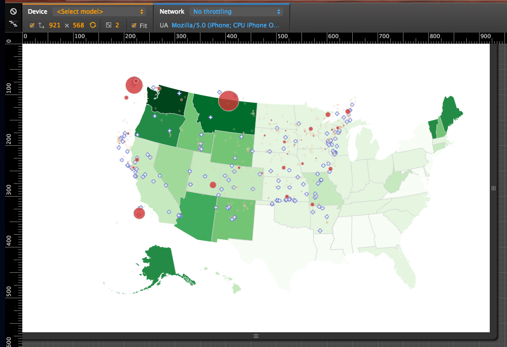

\[caption id="" align="alignnone" width="699"] A responsive map\[/caption]

Last year my Write the Docs talk in [Budapest](<http://maps.google.com/maps?ll=47.4719444444,19.0502777778&spn=0.1,0.1&q=47.4719444444,19.0502777778 (Budapest)&t=h> "Budapest") concluded that publishers are the worst. I said they lure suckers in with chump change, then make large profits off their endless toil.

But just a few weeks later I started a new project with my publisher, [Packt](http://www.packtpub.com "Packt"). It wasn't a book this time, it was a d3.js video course.

Why?

Because why not. I've never made a video course before, but have strong opinions on why they suck. And trying out new media is fun.

If I can make a course that doesn't need skimming and doesn't make you watch at 1.5x speed, I've won. I basically want to make a course that _I would want to watch_.

Well, here we are. Ten months later and the scripts portion is done. Deadlines have long since whooshed by, my editors have given up on keeping a schedule, and I think that officially we are 6 months behind the original estimate.

They wanted to publish the course in October. It's February and I haven't started recording.

Oops.

Maybe I did dawdle. Just over 310 hours have gone into the writing of the scripts. An average of just an hour and a bit a day.

Such lazy.

Writing my d3.js book, [Data Visualization with d3.js](https://www.packtpub.com/web-development/data-visualization-d3js), the overall average ended up the same. But disregard the months of downtime between revisions, I invested three times as much daily effort into the book.

I mean, let's be real here. Writing this video course I was so lazy and in such creative despair, that one time a higher up editor sent me an email saying _"So err, dude, we haven't heard from you in like two months. Are you alive?"_

Yeah. That bad.

But I got it the fuck done! The scripts are finished. They are 32,000 words long, and they are good. I think.

As much time has gone just into writing the scripts as it did into the book start to publish. I'll be damned if I get another stinging review like this one:

> the content is weak and looks more like a me too, rushed approach.

Seriously, screw you guy. That hurt. It was my first book and I slaved over that stupid thing for a year. Cut me some slack here!

As for the scripts, my editor is encouraging:

> There isn't much feedback, the reviewers like the scripts as is(Can't say that I am surprised, your scripts were brilliant!)

But there is an estimated 220 minutes of material there. Three and a half hours. They asked for two hours ... oops.

Now I just hope my video recording and editing skills will be up to snuff. If this comes out as good as it looks in my head, it's going to be awesome.