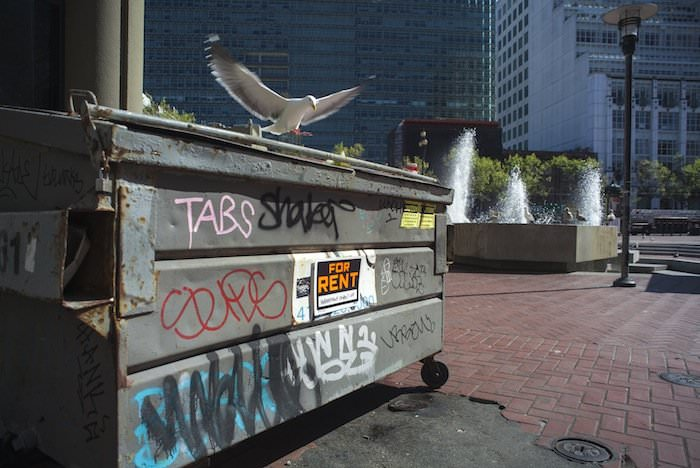
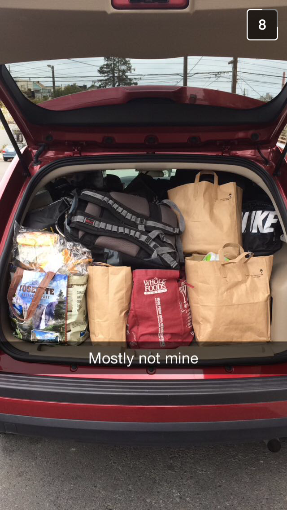
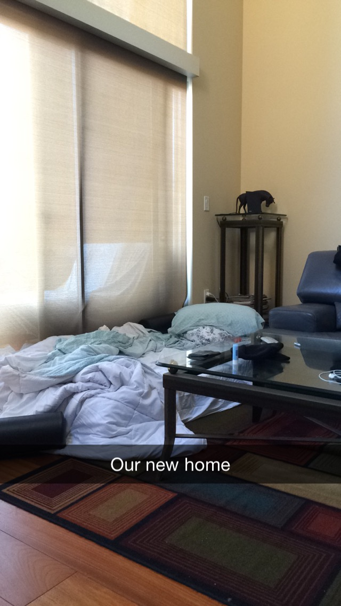

\[caption id="" align="alignnone" width="700"] Waterfront condo - $5000\[/caption]

The alarm rang at 8am. Time to get up and start packing.

We had been staying at that [sublet](http://en.wikipedia.org/wiki/Lease "Lease") on [Potrero Hill](<http://maps.google.com/maps?ll=37.75716,-122.39986&spn=0.1,0.1&q=37.75716,-122.39986 (Potrero%20Hill%2C%20San%20Francisco)&t=h> "Potrero Hill, San Francisco") for a week and a half and the girl whose room Morgane took over was coming back. A sublet is what happens when somebody in [San Francisco](<http://maps.google.com/maps?ll=37.7833333333,-122.416666667&spn=0.1,0.1&q=37.7833333333,-122.416666667 (San%20Francisco)&t=h> "San Francisco") leaves their overpriced room for more than a week.

Rents are so high nobody wants to pay for an empty room. So they put up an ad on Craigslist, get somebody to pay through the nose, and leave all their crap for the schmuck to deal with. It's the sharing economy!

When my girlfriend's long-term sublet lease was up two months ago, she didn't try looking for a new one. I was coming soon and it would make more sense to find something together. Cheaper too. Rents are upwards of $1400 for a room in a shared apartment.

A long-term sublet happens when somebody rents a four bedroom apartment, then signs sublet leases with tenants for each individual room. This exists because San Francisco was built for families and small apartments and studios practically don't exist.

And nobody can afford them anyway. A 1-bedroom will cost you upwards of $3000. For a single person that's tough even on a modern engineering salary.

Compared to short-term sublets, the long-term version is legal and done through contracts. The _"I just need a room for a month or two"_ version is done without contracts and always shady. What most people forget is that if you stay somewhere for over a month, you're legally protected as a proper tenant.

Thank you San Francisco tenant laws.

And so we packed. I had just flown in from Europe so all of my stuff fit in two suitcases. Her stuff occupied two large suitcases, a duffel bag, and about a thousand large paper bags. The kind you get when buying groceries.

_Our_ stuff, which was actually her stuff, but because it's kitchen stuff, it's our stuff, took up a box and a bag.

By 1:30pm everything was packed into a shared Zipcar. It may have been beyond full and unsafe to drive, but we got it all in there. And we were only moving three blocks anyway. Down towards [Dogpatch](http://en.wikipedia.org/wiki/Dogpatch "Dogpatch").

\[caption id="" align="alignnone" width="512"] Our stuff\[/caption]

Then we had to clean.

Because we were the runt of the apartment, we had to clean the whole thing. We vacuumed the floor, washed all the dishes, cleaned the kitchen, broke the vacuum. The whole shebang.

I don't think I'd ever seen that apartment as spotless. You always want to leave a good impression. San Francisco is small. And it's the right thing to do.

After four hours of hard work and two hours of faffing about, we were ready to leave. Morgane's home of two months, my crash of two weeks.

We left our keys on the kitchen counter and closed the self-locking door behind us. Sure hope we didn't leave anything behind.

Five minutes later.

_"FUCK, we left half of the nutribullet thing in the dishwasher! Damn it"_

But it was two late. That was a problem for another day.

Two minutes later I parked the car on a steep hill in front of the new apartment. Somewhere on the border of Dogpatch and Potrero Hill.

Parallel parking on a hill so steep the handbrake doesn't function well is weird. But I did it. And a few minutes later the car was empty.

All our stuff first on the curb, then just behind the door of the apartment complex. This is a modern building. No keys, just keypads.

It took us the better part of a half hour to unload the car and bring everything into the apartment. We filled most of the spacious living room. The dining table was covered in bags. Navigating from kitchen to couch required planning a careful route between suitcases and duffel bags.

Our room was upstairs. Up a flight of steep narrow steps. Metal. Loud.

We took a breather and went up to inspect the room.

And it's a nice room. A very nice room for just $1400 or $1500 a month. I don't even know how much we're paying. But everyone in the apartment is French because the guy whose name is on the lease is some manner of entrepreneur from France.

Well okay, the nicest guy is Canadian. From a francophone part of the Canada.

The room has its own bathroom with a spacious bath and glorious shower. Same size as the room, if not bigger. There's a cavernous walk-in closet as well.

And it's also got an unmade bed. And food on the floor. And a bunch of open suitcases strewn about. And dirty clothes. And shoes.

Wait did this guy even move out?

No ... no he did not.

There was a miscommunication between the people of the apartment. We were talking to the guy whose got the lease. Somebody else was talking to the guy whose room we're getting.

We got the room from the 21st onwards. He got the room until the 27th. That's a six day overlap.

\[caption id="" align="alignnone" width="640"] Home for five days\[/caption]

And just like that, we were homeless. For five days. Bam.

It was five in the afternoon and we had no idea where we were going to sleep that night. And we had all our stuff with us too.

Morgane started calling around. I stared at the wall. I was hungry, under-caffeinated and just so very done with San Francisco's crazy housing.

The only [AirBnB](http://www.airbnb.com/ "Airbnb") with the instant book option costed $400 per night and was far away. There were no pictures of the actual room on the listing.

Every AirBnB sort of within our budget would cost us between $1000 and $1500 for the five days. But you have to allow at least a day before they reply.

AirBnB is not there for you when you need a place in a hurry.

Every hotel in our budget was sold out or didn't exist. Yes, there are shady hotels found on every booking site out there, but who don't have a website of their own. And when you call the booking site they claim the hotel doesn't exist.

I wonder what would happen if we just booked without getting suspicious ...

The hotels were sold out because this is San Francisco in the middle of conference season. A friend told me of at least two bigger ones happening right now.

Hotels that weren't sold out cost _$800 per night_. That's insane. That's, like, I can't even begin to express how far out of my "throw money at problems" budget that goes.

Even those hotels had only one or two rooms available.

Lucky for us, the apartment that contains our room, also contains an extra mattress. If no better solution appears, we were going to set up camp on the living room floor and share a tiny mattress together.

Good thing we like snuggles.

At this point I realized there was nothing else for me to do. And that wall I had been staring at was getting boring. So I went boxing.

There's nothing an hour of punching things cannot solve. A guy even asked me to spar. I don't think he was too happy with his decision.

But punching the shit out of him was oh so very relaxing. Not his fault he picked the wrong day. But hey, he got a good practice out of it.

And so here we are. Camping on the living room floor of a swanky apartment for the next five days before we can move into our room that's almost a studio.

The magic of San Francisco. Also why you should always overlap your leases.

At this point, I want to thank Prasanna, [Brad](https://twitter.com/air_hadoken), and [Smotko](https://twitter.com/Smotko) for offering their help and giving suggestions over the internet last night when the shit hit the fan. You guys are great.