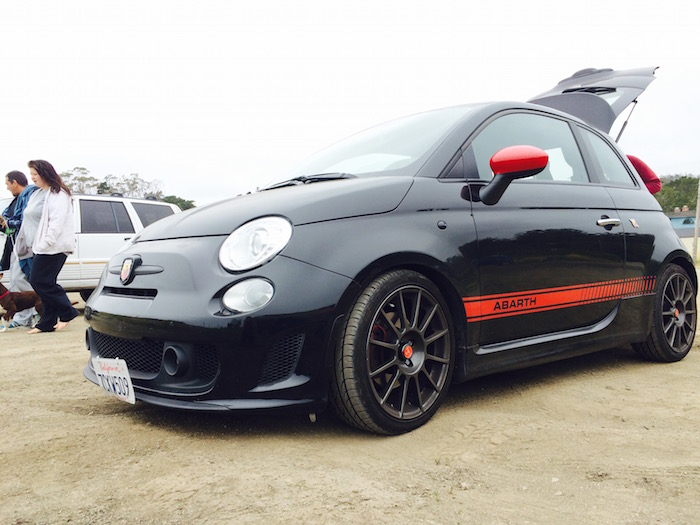
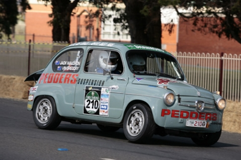

\[caption id="" align="alignnone" width="700"] FIAT 500 Abarth\[/caption]

You should've seen the grin on my face when I sat in that thing. I looked like an idiot. There are no pictures. Girlfriend was too worried about how I'm going to drive to take any.

Puhlease, what could I possibly do with a 160 horse power turbo charged car with manual transmission and sexy leather interior with red stitching? Sure, they call it the poor man's Ferrari, but it's really kind of fat for its engine.

I don't know how they packed so much into a car that's small enough even I can reach from steering wheel to headlamp, but they did. I would assume it's for safety.

In a [recent comparison with other hot hatches](http://www.caranddriver.com/comparisons/2014-ford-fiesta-st-vs-2014-fiat-500-abarth-2014-mini-cooper-s-hardtop-final-scoring-performance-data-and-complete-specs-page-5), the FIAT 500 Abarth took 7.0 seconds to 60MPH and a whopping 39.3 seconds to reach 120MPH (193km/h).

The Abarth tops out at just 129MPH (207km/h).

I mean, how can you possibly have fun in a car that takes almost a whole minute to reach 200 kilometers an hour? Seriously ... why even bother.

Hell, the thing takes _two seconds_ to reach top city speeds of 30MPH (48km/h). TWO SECONDS before you're breaking speed limits in the city.

Useless.

Boy was my girlfriend in for a fun ride. When that turbo kicks in ... hnnnnnngh. Fssssck, whooosh. Gearshift. Wroooom. Fssssck, whooosh. Gearshift.

The sound was like something out of Colin Mcrae Rally. I don't even know how to describe it. If you've never driven a car with a real turbo before, you are missing out. No, the modern turbocharged diesels will not do. They don't make the sexy noise.

And the acceleration curve is out of this world. You stomp the accelerator, the car whizzes off the line. Just as it's supposed to start letting go, the turbo gets full pressure and you fly out of this world.

You're sitting there and the car is purring. You press the gas and it goes wroooOOOO\*_OOOMMMMMMM_\*. It's like you pressed a second accelerator or something.

Then you change gear and the turbo exhales and it's the most satisfying sound in the world. Sometimes it makes a purring sound next to the whoosh.

And I'm not sure if I'm just such an epic driver, or the car has amazing stability control (which it does), but I could not make it misbehave in a corner. It's front-wheel drive, so you're not going to be doing tailwhips. But I couldn't even get it to understeer.

Although I did manage a small go-kart style skid thing on one particular freeway ramp. That was fun.

\[caption id="" align="alignnone" width="479"] The original Abarth with an uncloseable engine compartment\[/caption]

The new FIAT 500 Abarth may not be as bonkers as the old version where the engine would overheat, if you closed the bonnet. But it is _the_ perfect car.

It costs only $22,000, is way too stiff for San Francisco's crappy roads, and I want one. I want one now.

The only thing that bothered me was the stupid armrest attached to the driver seat. You can't reach the handbrake when it's down - you need it a lot on these here hills - and my elbow kept bumping into it when I was shifting gears even when it was up. Go away armrest, this car is too tiny for you!

The car is also too tiny for two Starbucks cups. They overlap in the cup holder and getting one out without knocking over the other is a struggle.

But who cares. It's a fun car. It's a cheap car. It gets great mileage. It's got a sport button. It goes whoosh. It blinks a light when it thinks you should shift up, but it's usually wrong. And I have got to rent it again and drive it somewhere that isn't just boring freeways.

Where else can you get a whole day of stupid-grin-on-face fun for just $30 in gas?

Nowhere.