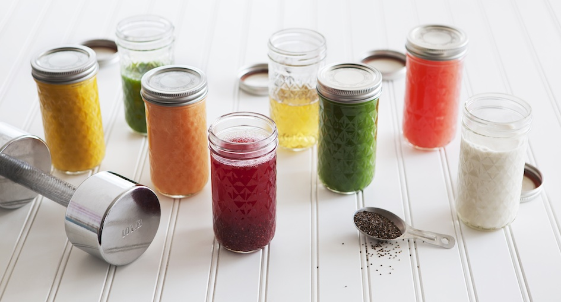

 A juice cleanse is easy, you just drink juice for three days and feel like crap. I tried writing this post last night, on the eve of day 3. After staring at the blank screen for an hour I gave up. It's impossible to write on an empty stomach. It's hard even to think. After three days of nothing but juices your mind feels like it does when you'd had just four hours of sleep. Except you aren't tired. You're just slow of mind. Erdös once said about amphetamines that _"\[on amphetamines], when I looked at a piece of blank paper my mind was filled with ideas. \[Without amphetamines] all I see is a blank piece of paper."_ Starving for three days has about the same effect.

## Day 1

61.5kg (135.6lbs) The first day I was fine. Hungry. Annoyed. Irritable. But fine. The more the day progressed, the less hungry I felt. I made sure to drink every juice over the course of an hour and I had plenty of water. Although I was still dehydrated all the time, which was surprising. Who would've thought they'd be dehydrated when switching to a liquid diet with copious helpings of water? But it makes sense. A small portion of chicken (100g) contains almost half a glass of water. Chicken is 65% water [\[1\]](http://www.fsis.usda.gov/wps/wcm/connect/42a903e2-451d-40ea-897a-22dc74ef6e1c/Water_in_Meats.pdf?MOD=AJPERES). The story is similar for other foods. Dry rice is 14% water, cooked rice is 70% water, dry pasta is 22% water etc. Generally speaking, if you look at a food label and sum up the values, what's left is water. One of my normal meals contains over a cup (~240ml) of water in the food itself. When you switch to 8 cups of juice per day, all that water needs to come from somewhere else. That means drinking water all day erryday to the point it becomes a logistics problem between refilling your water bottle and getting work done. But I'm sure a big part of the problem is also that there's no food holding the water in your belly so it passes through quicker. While I don't think I peed much more often than usual, my pee was definitely clearer.

## Day 1 - workout

Here's where I went off track for the cleanse. I bought a [Can Can power cleanse](http://cancancleanse.com/), which is meant for people with higher caloric needs. It gives you 1300 calories per day to work with. Can Can says this is enough for light workouts, but doing a normal hour and a half of boxing practice is anything but light. It burns some 800 calories. Doing my normal workout routine was stupid, but I wanted to see what happens. I didn't care about the cleansing properties of my cleanse, I wanted to see what a pre-fight or a pre-photoshoot cut feels like. Boxers go through a rigorous cutting regime before a fight where they drink minimum water, eat minimum foods, and try to drop a [weight class](http://en.wikipedia.org/wiki/Weight_class_%28boxing%29 "Weight class (boxing)") or two. Then after weigh-in they try to gain as much of it back as possible. Of course they keep training through all of this because that makes it more effective. Although it does make your training less effective. On Day 1 my workout felt ... okay. I wasn't in the best of shapes, but I wasn't in the worst of shapes either. I did just fine. But I _was_ more sore than usual. And after practice I nearly died when my body started eating itself demanding dinner. I persevered. Evening weight: 61kg (134.4lbs) Caloric deficit: ~1500kcal

## Day 2

60.5kg (133.4lbs) Day two was smashing. Some of the euphoria from Day 1 was gone, but I was doing great. There was no more hunger. Juices seemed to last forever and I could do whatever I wanted. By now I had figured out an adjusted schedule to the cleanse that better fit my day and I was flying. To my surprise I discovered that caffeine from tea and calorie-free monsters kicks in much harder and faster on an empty stomach. Woo \\o/

## Day 2 - workout

But working out was hell. Like ... hell. Once more I did my normal hour and a half of boxing but it was a waste of time. I felt weak, I couldn't throw hard punches, I couldn't throw fast punches, I couldn't keep my arms up. I couldn't even work up a proper sweat. My t-shirt would be as drenched as if I had fallen into a swimming after a normal training session, this time it was barely moist. My trainer laughed at me and wondered why I can't work the same as usual. A guy scoffed and said that only girls do cleanses when I refused to spar with him. He would've destroyed me. Hell, a double-end bag almost destroyed me when it flew into my face because I was too slow. That night I slept. A lot. Evening weight: 61.5kg (135.6lbs) Caloric deficit: ~1300kcal

## Day 3

59.5kg (131.2lbs) On the morning of day 3 I couldn't for the life of me get out of bed. My alarm rang at 7:30am. When I took a shower at 8:30am the alarm was off. I assume I turned it off the second it rang. I don't remember doing it. After my shower I sat down on the bed and fell asleep. It was 9:30am before I was alive again. Time to go to work. No way in hell I was doing my Wednesday morning 8km run. Nope. Couldn't even stand very well. The longboard ride to work is a blur. Work is a blur. Everything is a blur. I think I pushed some things forward at work, I think I closed some pull requests, I may have made sure some people do their part, but mostly I just sat there staring at the screen. Staring at my code, trying to see the solution that so easily pops out on a normal day. But my code was a blur. An ocean of numbers and letters that mean nothing. I felt faint all day and if somebody confronted me about something, I probably would have broken down crying. It's bizarre feeling like that. When you're not hungry, not tired, not irritable, not annoyed, not anything in particular. Just ... weak. Sometimes I switch my Wednesday morning run for an evening run. This Wednesday I didn't go for a run after work, I just lay on my bed for four hours before I mustered the power to go deal with my email inbox for the day. Evening weight: 61.2kg (134.9lbs) Caloric deficit: ~700kcal

## Day 4 - fin

59.0kg (130lbs) This morning I ate the most delicious bagel I have ever eaten. A cheap Thomas whole wheat bagel from Safeway. It's too sweet for bread, too fluffy for a bagel, but it was the tastiest thing I have ever tasted. I had it with some cottage cheese. The cottage cheese tasted the same it always does - bland and nutritious. Now my stomach hurts. That was too much food to start with after a cleanse. Evening weight: 61kg, probably Caloric deficit: none, hopefully

## What I learned

So what did I learn about juice cleanses? I didn't go into my cleanse with the belief that my digestive tract needs a reset or that there's such a thing as a body detox. Hell, even if there was such a thing as a body detox, I kept drinking caffeine and calorie-free energy drinks. I would have died without those. And I didn't do much to cleanse my mind, which is supposed to be part of a cleanse. But what I learned is that:

-   the pre-fight/pre-photo-op cut is real, it works
-   it's not too hard to lose 2.5kg of water-weight in 3 days
-   cleansing is unhealthy, most def
-   cleansing does make you look more defined
-   juice cleanses have more sugar than my normal diet
-   food cravings are less of a problem than I thought, didn't happen to me
-   real hunger is a big problem, feeling hungry doesn't happen much
-   having all food prepared in advance by someone else saves a shitload of time

I don't think this has had any lasting impact on my body shape, or on my weight, or on my dietary habits. But I know I can do it and if I ever start boxing competitively, I know for a fact that I too can drop a whole weight class in just a few days. Perfect.
