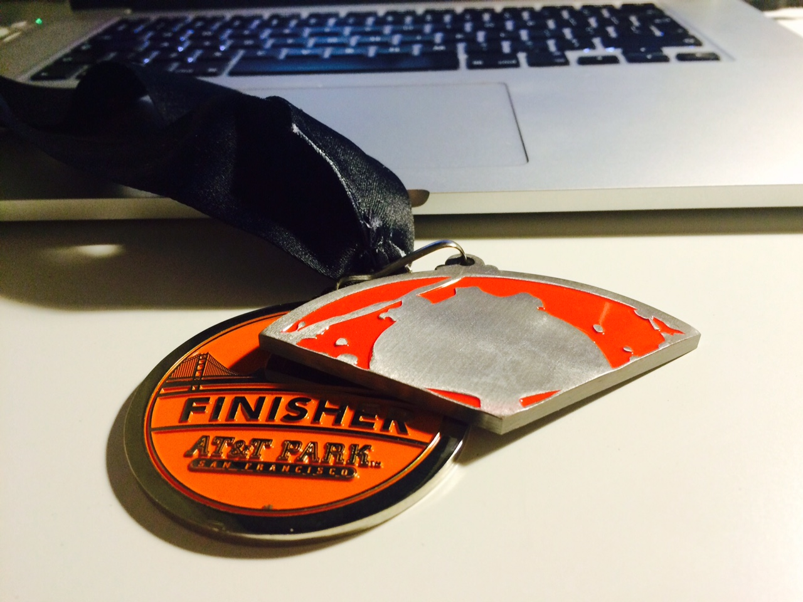
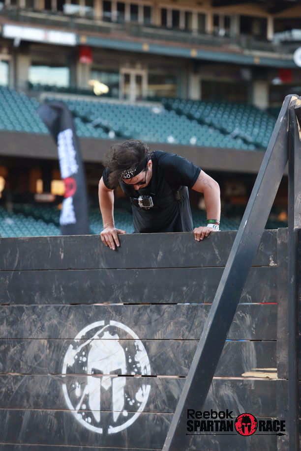

And I'm still sore.

Well ... I was still sore on Monday evening when I started writing. Turning the video I took into a bunch of gifs takes time.

Either way, I'm no longer sore, and I am itching for the great Spartan upsell - getting the other two pieces of the whole medal. The Super and the Beast.

Last week I signed up for the Spartan Sprint at AT&T stadium in [San Francisco](<http://maps.google.com/maps?ll=37.7833333333,-122.416666667&spn=0.1,0.1&q=37.7833333333,-122.416666667 (San%20Francisco)&t=h> "San Francisco"). An easy 3 mile (5km) run with some crossfit-like obstacles.

I mean, how hard can it be? You go for a 3 mile run when you're too tired or too lazy for a proper run.

Boy was I wrong ...

First, they made us run on stairs. Lots of stairs. Like, the whole track was up and down stairs. Bleachers upon bleachers full of stairs.

But at least the view was nice. I've never been inside a baseball stadium and this blew my mind.

Then we had to grab a flimsy bag full of heavy and carry it up and down more stairs. We were supposed to run. I couldn't run.

After we ditched the stupid bag, they wanted us to [jump rope](http://en.wikipedia.org/wiki/Skipping_rope "Skipping rope"). Not just any rope, oh no, that would be too easy. We had to jump a freakin' steamliner mooring rope.

I thought it would be easy because I jump rope at boxing practice every day. Ho boy ...

And then ... more stairs. From the bottom of the stadium to the top of the stadium in one exhausting go.

We reached the top butts burning. Then we had to climb a stupid wall.

I'd laugh at how many tries it took me to climb that thing, but I was too busy breathing hard.

But hey, all those stairs afforded some great butt views.

And then, because Spartans had medicine balls, we had to pick up a 20lbs (9kg) medicine ball and drop it. Pick it up. Drop it. Pick it up. Drop it. Twenty times.

And as much as the [Spartan race](http://en.wikipedia.org/wiki/Spartan_race "Spartan race") is about competition, it's also about community. When a wall is too high, a complete stranger will lend you a boost. If you're lucky.

_"Thank you stranger"_, I screamed as I wheezed over the top. Without the stranger part, just the thank you part.

After the wall and more stairs, we had to do an atlas carry. Except the atlas was a cylinder made of cement.

For safety and practicality, I'm sure.

The stone was ... heavy. I don't know how heavy, but I almost pooped my pants carrying it those 20ft, then doing 10 [burpees](http://en.wikipedia.org/wiki/Burpee_%28exercise%29 "Burpee (exercise)"), then bringing it back.

The spear throw was a lot easier. You pick up a stick. You throw the stick at target.

But you only get one attempt and if your stick does not stick, you have to do thirty burpees. Pewp.

By the way, it's thirty burpees every time you fail an obstacle. Some just have a larger burpee area than others.

Oh and there were stairs. An endless amount of stairs. My butt hates me to this day.

Then we had to carry another heavy thing. A bag of sand. Not a fancy gym kind of sandbag. Oh no. Plain old sand. That shit's heavy.

Up and down a flight of stairs. Of course.

When we dropped the heavy bag of sand on the same pile we got it from, we had to do box jumps. Hop like a bunny. Up on the box. Down from the box. Up on the box. Down from the box. Twenty times.

Have I mentioned that my butt hates me?

The race wasn't all about making you miserable and sweaty. They gave you some water too. Three times in the whole race. Yummi.

And because we hadn't gotten enough back exercise with all the stairs and the heavy things, we had to lift a heavy thing to the top of a metal thing.

A simple setup - one pulley, one strong rope, one 120lbs weight. My 130lbs self needed some help, but I got that fucker all the way to the top. Hardest thing I've ever done.

After that, life calmed down. We had to run some more stairs and climb a flimsy rope ladder wall thing.

But by now my body hated me and everything seemed like the hardest thing ever.

Especially the monkey bars. Fuck the monkey bars. Never in my life have I been able to do them.

Then I did thirty penalty burpees.

After the monkey bars, we had to climb a rope. It's like something out of middle school. Something out of middle school that I've never been able to do.

Imagine my surprise when I rang the cowbell on top despite the worst rope climbing technique the world has ever seen. I literally let go with my legs every time I pulled up. LoL.

For the coup d'etat, we had to scale a monster wall. A wall so tall that when I hung off it by the ends of my fingers, I still had over a foot to go before I reached the ground.

I shamelessly used every support I could find to scale that thing. That got me a lot of angry looks from the wall's chaperone.

To reach the finish line, we had to run through some udders. I'm not sure what running through a bunch of udders is supposed to feel like, but running through those udders felt confusing.

And then the finish line. After an hour of abuse - 31 minutes for the fastest nutter, almost three hours for the slowest Spartan - we got our stupid medals.

Before we could even catch our breaths, someone unceremoniously handed us the same copypaste medal that they handed to all the other seven thousand seven hundred and six Brave Spartans (tm) who finished the race.

So special!

And because I hate myself, I'm already thinking of doing the 13 mile (21km) Beast in October and the 8 mile (12km) Super in November. Those have mud and barbed wire and hills and no stairs.

(honestly though, that was a lot of fun and the only thing I could do afterwards was lay in my chair and read for hours)