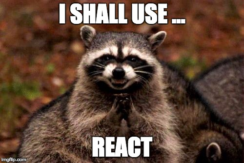

Did you know, you can use React without rewriting your whole app? A client recently asked me for a shiny graph. They had an [API](http://en.wikipedia.org/wiki/Application_programming_interface "Application programming interface") that spits out a lot of data, and they wanted an interactive visualization that would help users make decisions. Deadline was tight, technology restrictions were _"As long as it works"_, and specs were loose. _"A-ha!"_, I thought, _"This is a job for [React+d3.js](http://swizec.com/reactd3js)!"_. Small, well-contained, perfect. The best kind of project for testing new technologies.  But their web app was built in Joomla or Wordpress or something. And their front-end stack was [jQuery](http://en.wikipedia.org/wiki/JQuery "JQuery"). When I asked the engineer about integration, he talked about framework plugins that create views in PHP and load [JavaScript](http://en.wikipedia.org/wiki/JavaScript "JavaScript") files and stuff. It sounded a lot like gems for [Ruby on Rails](http://en.wikipedia.org/wiki/Ruby_on_Rails "Ruby on Rails"). Tiny packages that work as self-contained apps designed to be integrated into larger projects. They'd been at it for over a year already. The whole thing built out of these framework plugin component things that put most of the hard work on the server, and use JavaScript sparingly. A team of engineers isn't going to rewrite their whole project into React, just so you can make a small component. I wasn't going to ask, and they wouldn't have done it. _I_ would have to accommodate _them_. But how?

## The solution

Well, at the end of the day it's still just a website. There's a modern browser, [HTML](http://en.wikipedia.org/wiki/HTML "HTML"), [the DOM](http://en.wikipedia.org/wiki/Document_Object_Model "Document Object Model") model, CSS, all the basics. But there's no ES6, no fancy build system, no JavaScript module management. None of the fancy pants future stuff. And you don't need any of that stuff anyway. Not on the deploy side. Not on the user side. You only need that stuff when you're developing. Once [Webpack](http://webpack.github.io/) is done compiling your code, you've got run of the mill present-day ES5 that runs in any mostly modern browser. I'll tell you more about Webpack later, keep reading. I made my client happy by exporting the whole visualization component into a global function that they could call anywhere. It only took a a bit of forethought:

    const React = require('react'),
               Chart = require('./chart');

    function RenderChart(options) {
        React.render(
            ,
            document.querySelectorAll(options.selector)[0]
        );
    }

    window.RenderChart = RenderChart;

Now my client could integrate the React component by just:

-   loading React
-   loading the compiled JS file
-   calling a function with some parameters

Yes, there's some overhead with loading the whole React library for just one component. But it's only 38KB after minifying and compressing. jQuery is 29KB and nobody bats an eye. Besides, if you're using a public [CDN](https://en.wikipedia.org/wiki/Content_delivery_network), many users well have React cached already. That makes it a 400 byte download to confirm you've got a good version. Not bad at all. But I don't think global functions are the best way to go about integrating a React component. They mess with the global namespace, and they can only do one-way one-time communication. Once you invoke a component, it's left to do own thing, and you have no insight. We can do better.

## React components as jQuery plugins, proof-of-concept

We can package React components as jQuery plugins. Yes, we could make Backbone views, yes, we could make Angular components, yes this is an affront to sensible architecture. And it's perfect anyway. Name one website or web app built in the last 10 odd years that doesn't have jQuery? Name one web developer who can't help themselves with a jQuery plugin? Exactly. Here's a proof of concept I prepared earlier:  You're looking at a component that tells you how many times you've clicked on The Button. That's it. Nothing fancy. The rest is a normal old school web app. There's some jQuery to render the component, and two jQuery buttons to interact with the component once it's rendered. The jQuery-driven white buttons can both read and write the component's internal state. They need no React to do so. To whomever implements them, they just look like jQuery code.

### Using the component/plugin

The _"render my component here"_ code looks like this:

    $(".container .counter").clickCounter();

Nice and easy - select element, call jQuery plugin. Bam. The plugin exposes its internal state via a `val()` function. I'll show you what the function looks like later. Using it looks like this:

    // src/integrate.js
    $(".btn-10x").click(function () {
        var counter = $(".container .counter")
                .clickCounter()[0];

        counter.val(counter.val()+10);
    });

    $(".btn-get").click(function () {
        var val = $(".container .counter")
                .clickCounter()[0]
                .val();

        alert("Current counter value is: "+val);
    });

We select an element, get its instance of the plugin, and call `val()` with or without an argument. Depending on what we need. We're doing `.clickCounter()[0]` because I didn't know how to properly turn the plugin into a per-element singleton. Getting the reference was easy enough, but jQuery selectors can return arrays and that means I have to return an array as well. But then the `.val()` function gets confused, which is why we have to access a single element of the returned array. Good enough for now. Anyone who knows how to use jQuery can use our React component. And they don't even need React. Winning.

### Packing React components into jQuery plugins

To turn our React component into a jQuery plugin, we'll have to take care of two things: making the plugin, and compiling our code for the real world. We'll take care of the plugin first. I like to put this code in a `src/main.jsx` file. It serves as an entry point for the component and exports everything the outside world needs. When somebody wants to use my component from React, they can `require` the component directly. We load React, the component, and make a render function:

    // src/main.jsx
    const React = require('react'),
          Counter = require('./Counter');

    function RenderCounter(selector) {
        React.render(
            ,
            document.querySelectorAll(selector)[0]
        );
    }

This will allow us to both export the function, and set it as a global. Like this:

    module.exports = RenderCounter;
    window.RenderCounter = RenderCounter;

Anyone who's got a dependency loader, but isn't using React, can `require` our component, then call a function to render it inside a particular element. Anyone without a dependency loader, can use the global function. The base for our jQuery plugin comes straight off the [jQuery boilerplate](http://jqueryboilerplate.com/) project.

    // src/main.jsx
    if (typeof jQuery !== 'undefined') {
        (function ($) {
            var pluginName = "clickCounter",
                defaults = {
                    value: 0
                };

            function Plugin(element, options) {
                this.element = element;
                this.settings = $.extend({}, defaults, options);
                this._defaults = defaults;
                this._name = pluginName;
                this.init();
            }

            $.extend(Plugin.prototype, {
                init: function () {
                    this.component = React.render(
                        ,
                        this.element
                    );
                    return this;
                },

                val: function (val) {
                    if (!arguments.length) {
                        return this.component.state.counter;
                    }else{
                        this.settings.value = val;
                        this.init();
                    }
                }
            });
        })(jQuery);
    }

Whew, that's a lot of code. We're only making a plugin if jQuery is available, and we're wrapping its definition in a closure so that we can share the `pluginName` and `defaults` variables. Then we're defining a constructor function called `Plugin`, which stores some basic properties in the newly constructed object, and calls `init`. Inside `init`, we render our React component. We didn't have to use `document.querySelectorAll`, because `this.element` already refers to the target DOM element. And we defined a `val` function, which we can use to access our component's internal state. If there's an argument, we change the value, and re-render the component. React is smart enough to say _"Hold up there, that's the same component, but with different properties! I'll just update it"_ If `val` doesn't get an argument, it will return the component's current state. Also notice that React was nice enough to let us access our component's internal state with `this.component.state.counter`. No React incantation required, just some knowledge of where components store state. Okay, we've got the plugin function. We'll need 5 more lines of code to add the plugin to jQuery:

    // src/main.jsx
            $.fn[pluginName] = function (options) {
                return this.map(function () {
                    if (!$.data(this, 'plugin_'+pluginName)) {
                        $.data(this, 'plugin_'+pluginName, new Plugin(this, options));
                    }
                    return $.data(this, 'plugin_'+pluginName);
                });
            };
        })(jQuery);

This will let us call `$(...).clickCounter()`. And because it saves each instance of the plugin in each element's `$.data` collection, we can make sure to treat each instance as a per-element singleton. Every time somebody calls `clickCounter` on an element, they will get the same object. Which is neat when you want to mess around with components' internal values.

### Using Webpack to compile React for the real world

Great, we've got the plugin. All we need now is to make a JavaScript file that people in the real world can use. We're going to use Webpack because it's really nice to use. It works primarily as a JavaScript dependency manager much like [RequireJS](http://requirejs.org/) or [Browserify](http://browserify.org/). Webpack analyzes your `require()` statements to build a dependency tree of your code, and outputs a single JavaScript file that includes everything your code needs. It can potentially split your code into multiple modules, load stylesheets, various JavaScript templating files, and even images. We'll stick to the basics - use React to transform ES6/JSX code into normal present-day JavaScript, and compile a single file for the end-user to load. It doesn't take much, just telling Webpack to treat React and jQuery as externals, and to put the compiled code in a `./build/counter.js` file. The config looks like this:

    // webpack.config.js
    module.exports = {
        entry: [
            './src/main.jsx'
        ],
        output: {
            filename: 'counter.js',
            path: path.join(__dirname, 'build'),
            publicPath: '/build/'
        },
        module: {
            loaders: [
                {
                    test: /\.jsx$/,
                    loaders: ['babel'],
                    include: path.join(__dirname, 'src')
                }
            ]
        },
        resolve: {
            extensions: ['', '.js', '.jsx']
        },
        externals: {
            "react": "React",
            "react/addons": "React",
            "jQuery": "jQuery"
        },
    };

With this, we tell Webpack that the entry point for our module is `./src/main.jsx`. That's where we put the plugin code. Then we told it where to put compiled code - `./build/counter.js`, and that it should use `babel-loader` for source files. This allows us to use React's JSX syntax for embedding HTML in JavaScript, as well as all the fancy new ES6 features. Using `externals`, we explained that both React and jQuery are external dependencies. This way Webpack won't try to bundle them into the compiled file. It might make sense in some cases to bundle both of those into the same file, but we lose the benefit of serving from CDNs and the users's browser cache.

## Sum up

There you go, a React component packaged as a jQuery plugin. For when you don't have the time or the budget to commit to a full rewrite. You write the component as you always would, make a thin jQuery wrapper, and make sure people outside the ecosystem can include your file. Bam. You can find the whole example code on Github, [here](https://github.com/Swizec/react-real-world). What have I done ...
