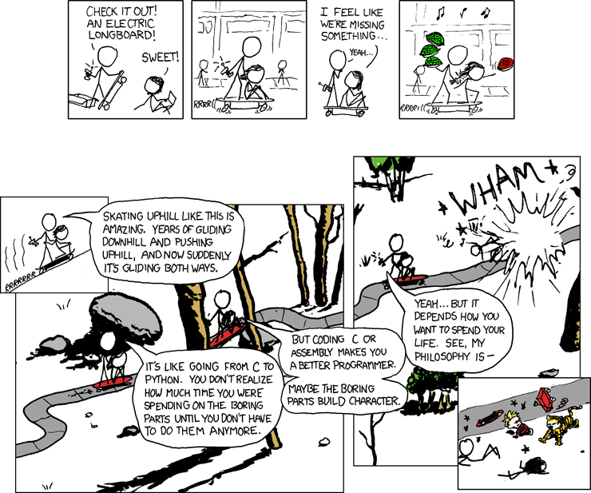
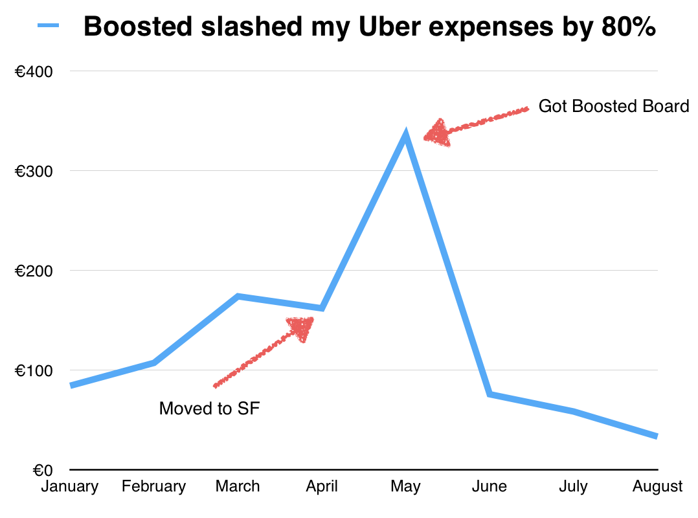

Last night I almost died. Three months ago I splurged $1600 on a Boosted Board to get around town. Coming to San Francisco and crashing in a sublet room in the [Dogpatch](http://en.wikipedia.org/wiki/Dogpatch "Dogpatch"), my Uber costs were through the roof. $10 to get there and $10 to get back every time I went out. Going to the movies? $20 roundtrip. Going to a nice restaurant? $20 roundtrip. Going to the office in SoMa? $30 roundtrip because surge pricing. Fuck surge pricing. Things exploded once I started going to the office every day. A potential $150 _per week_ just for Uber. Sure, I could use public transit, take the T down to AT&T park, then walk for ten minutes to the office and ugh ... no. Moving to SoMa helped, but the boxing gym I go to four times a week is still in the Dogpatch. $20 roundtrip. $80 per week. Ugh ... no. What I needed was an electric longboard just like those in [XKCD](http://en.wikipedia.org/wiki/Xkcd "Xkcd"). A Boosted Board.

XKCD electric skateboard

At a top speed of 22mph and a width of not very much, that thing slashes right through San Francisco's traffic. What Giants game? What traffic jam? Boosted Board don't care. You can pass a traffic jam two blocks long in the span of one stop light. It's phenomenal! And it's going to stay phenomenal until someone doors me. That will suck. Remember the mantra, ride like you are invisible. Once you get on an open road, that's when things get really crazy. Wind in your helmet, tears streaming down your face from the wind, right thumb smashing the controls to full throttle. It _feels_ slow because it's limited and stops accelerating, but when you look down. Ho boy. The road is a blur and all you can think of is that a few months ago you would have killed for a hill steep and long enough to ride a longboard this fast and with this much control. You're flying. And yes, an Uber is faster on an open road. But an Uber also costs money and a Boosted is a one-time sunk cost. The more you use it, the cheaper it gets! Hell, mine is already almost free.

Boosted vs. Uber graph

I knew it was going to be worth it when I bought the thing, but I still didn't expect such a sharp drop. Just look at that graph! Almost 400 euro in May, down to just 70 in June. Even down to 30 in August. These days I only pay for Uber because you can't Boosted to a date night. A Boosted Board is fun, is cheap, is awesome, is the best purchase I ever made. Right after my hat. But last night I almost died. Zooming down the bicycle lane on 4th street right after dusk. Wearing all black, going balls out fast, I was pretty much invisible. A giant [Cadillac SRX](http://en.wikipedia.org/wiki/Cadillac_SRX "Cadillac SRX") cut me off when it turned left on a green light. We didn't collide. I went from full throttle to full reverse in a fraction of a second and lost all traction on my back wheels. My board went into a slide, gripped the asphalt, and kicked me off. Just like every time I start learning how to stand-up slide on a classic longboard. I flew off, learned that I can't run at 22mph, and smashed into the ground. Sliding glove on my left hand stopped that palm from getting shredded, and some quick thinking saved my right hand. A roll saved the palm, but the top of my hand has some nasty looking scratches. Can't wear gloves on the right hand, need fine thumb control for the throttle. Bummer. At least the board is safe. That damn Cadillac parked right on top of it. Right on top. He even had to back up so I could dislodge the longboard from underneath his front wheel. Yup. The guy didn't even get out of his car when he saw me flying. Just rolled down his window and asked if I was okay. Shouting. Riled up. He seemed like he'd almost had a heart attack. Or maybe he just didn't like that there was this bloke getting off the floor, shaking his head in disbelief, and saying _"What the fuck man? Did you not see me?"_ in an angry tone. Whatever it was, I'm glad my lack of sports gave me all that practice falling off longboards. And that a Boosted Board can survive having a Cadillac SRX parked on top. Now excuse me while I go invest some of those Uber savings in a helmet light.
