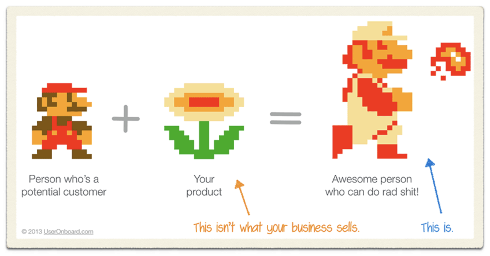

My approach to products is wrong. And so is yours.

That's what I learned from [Kathy Sierra's Badass: Making users awesome](http://www.amazon.com/gp/product/1491919019/ref=as_li_tl?ie=UTF8&camp=1789&creative=9325&creativeASIN=1491919019&linkCode=as2&tag=ageewitahat-20&linkId=U5VQCZWSLU2BUAW7). I blazed through the book on my flight to #dyfconf and it was just the best thing ever. Every turn of the page had me going _"Duh, shoulda known that. Yep, that too. Oh and that. Why hasn't anyone told me this!? It's so obvious now!"_

The core premise of Sierra's book comes straight out of Simon Sinek's TEDx talk about communicating from the inside out - [Start With Why, How great leaders inspire action](https://www.youtube.com/watch?v=u4ZoJKF_VuA). There is a bigger _why_ behind every product purchase.

Talk about specs and colors and what the product _does_ is superficial. Users talk about that, but they don't care about it. They come to you because they want to be _better_ at something.

People buy better versions of themselves

While Sinek talks about the communication aspect, which all marketing materials use these days, Sierra goes deeper. She says that you shouldn't just play to people's why in your marketing materials, they why should permeate your entire user experience. Everything from the manual, to the followup mailing list you subscribe users to.

You do have a followup email sequence don't you?

According to Sierra, you want to turn people into experts. Not necessarily the best of the best in the world, but expert enough that they can brag to their friends at a dinner party. If you sell cameras, you want to make photographers, if you sell snowboards, you want to make snowboarders, if you ...

Everybody loves it when people look at what they do and say _"Wow dude, I could never do something that awesome. How the hell did you do that?"_

And then your users are like _"Oh yeah I read that dude's book."_ or they say _"Pssht yeah, there's this new photo app with great filters"_ or they go _"Dude, that guy, he taught me all I know about snowboarding, it was fucking amazing!"_

The so called "word of awesome". It's when your users are so awesome, you don't even have to ask them to tell their friends. They tell their friends because you made their lives better and they want their friends' lives to be better too.

But how do you do that?

By staying with your users through the whole process.

Everybody starts using your product in The Zone of Suck. Whether it's a camera, a snowboard, or a new open source library. The first day sucks. You don't know the buttons, you fall down a lot, and you have no idea what all those functions are good for.

You have to tell them that it's okay. Everybody sucks the first day. It's supposed to be hard. Learning something new is _hard_.

Ever downloaded a new library that said it will solve all your problems, make you fart rainbows, turn your code into a thing of beauty, and make you twenty-five times more productive? Yeah, we all have.

Then you use it and you're like _"God damn it, this is a piece of shit just like everything else."_

Trust me, we've all been there. Over promise, under deliver.

Or does it just suck that first time and everyone is too afraid of their precious little marketing message to tell us? So rather than feel encouraged and pushing through The Zone of Suck, we feel bad, think we're stupid, and spill vitriol on twitter.

No bueno.

And even beyond The Zone of Suck, you should stand by your users and help them become better and better. Teach them how to become better at their bigger context (photographer, snowboarder, engineer, whatever) and they will remember you for forever. Maybe two forevers.

Even when they become so amazing that they've outgrown what you offer, somebody will come to them and ask _"Hey you, how did you get this good? How did you get to where you are? I bask in your glory and I want to learn from the best!"_

They will say _"That's awesome! I learned everything I know from those guys over there \*points\*"_

That's you. They're pointing at you. Because you made them awesome.