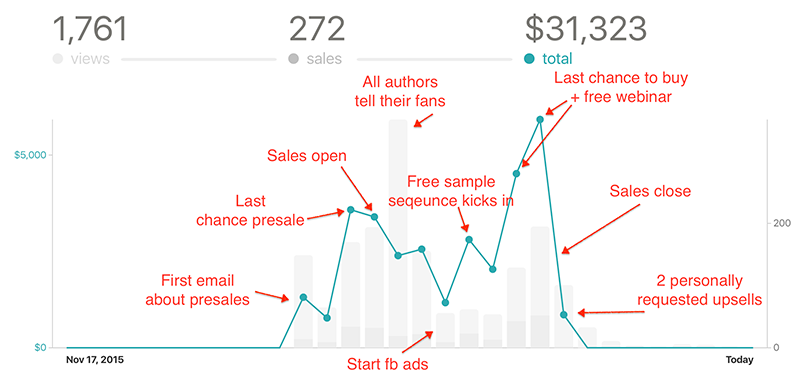
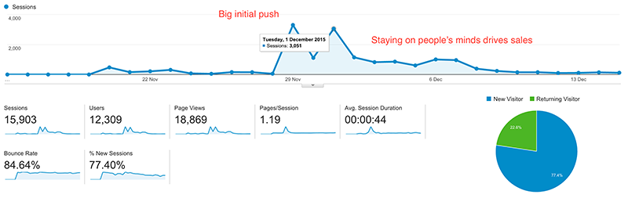
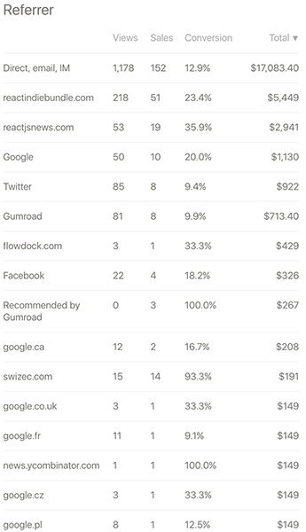
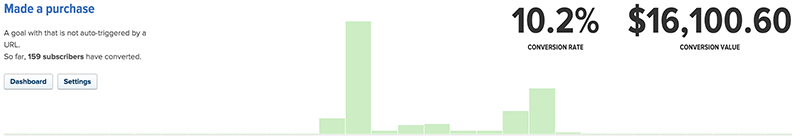
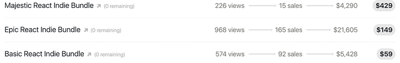

This past Cyber Monday, me and five other indie React.js authors got together and launched a bundle: 4 books, 19 hours of video, and a smattering of goodies and 1-on-1 consulting. A week later, sales closed. Here's how it went: We made 272 sales with an average value of $115 per sale. That amounts to exactly $31,323. It wasn't the runaway success we were hoping for, but at $4,250 per author (after the Facebook ad budget, the 10% donation we're making to open-source React.js projects, and Gumroad fees), it's nothing to sneeze at either. Hell, it's a cool grand more than I made from book sales in all of 2014 combined.  By the numbers: our daily average was 24 sales and $2,847; our biggest sales day was just before closing at $5,922; and on our crappiest day in the core week, we made just $1,171. On any other day of the year, I'd kill for $1,171 in book sales. The React Indie Bundle was primarily a marketing experiment. People had already paid for constituent parts of the bundle in other places, so we knew that there was a market. The problem was that we had no idea how big that market was, how much of it we could reach, and what it would take for someone to go from _"Hm, that's cool,"_ to _"SHUT UP AND TAKE MY MONEY."_ I don't know about you, but $59, $149, and $429 are not impulse buys for me… Thanks to a ton of hustle, we convinced 13,295 people to visit [www.reactindiebundle.com](http://www.reactindiebundle.com) during the week, which means each unique visitor was worth about $2.35. I don't know if that's good or bad, but it creates a strong upper bound on the cost-per-click we can afford. 

## Marketing experiments

Our primary marketing channel was email, and our primary market was people who had either already purchased something from the bundle or had expressed interest in possibly doing so at some point. This strategy worked pretty well - email was our highest revenue generator. It didn't have the best conversion rates, but it more than made up for that with volume. 

### Email strategy

We based our email marketing strategy on the idea of drip campaigns - sequences of emails that help you through the decision process. First, you get an email or two talking about general pros and cons of the technology. Ideally, you also learn something interesting. Then you get an email with a soft sell; we're still talking about benefits, but it's also urging you to make a purchase. In the end, you get an email with a hard sell. The idea is solid, but our execution was flawed. We floundered around because I ran out of time to prepare the sequence. I resorted to writing the sequence just-in-time; others resorted to email-blasting their followers. About 5,000 unique views came from the email campaigns. That's not bad, but considering we had a cumulative email list of some 40,000 people … it could have been better. We had a click-through rate of around 12%. I mean, that could be worse, right? Ok, here's the cool part:  More than half of our sales volume came directly from emails I sent through [Drip](http://getdrip.com). $16,000 from nine emails sent to 1,186 qualified subscribers. That subscriber list started at 300 on Monday, and grew to 1,186 by the following Wednesday. That's about 100 new subscribers per day. Pretty cool, huh? Look at those numbers, man. When was the last time you got $1,777 for writing an email? I'm sitting here looking at these numbers, and I'm thinking, _"Man, I need to write more emails ..."_ The real trick to those sales is what I call the "I'll buy it later" purchasing flow. I'm trademarking that. :) Nobody is going to buy your thing on impulse at these price points, so you don't ask them to. Instead, you say _"Okay, you know what? Here's a free sample. Just give me your email address."_ In exchange, you give them 4 book chapters and 42 minutes of video tutorials for free. Most people can get hella started with that, so they give you their email. They either look at the stuff, or they don't. If they do, that's awesome. The amazingness of your stuff will convince them to buy. The next day, you send them an email that teaches them something relevant or talks about an interesting fact or something else that's on-topic. The day after, they get another email. Then they get another. This builds an essential rapport. By the time that hard sell email comes, you're no longer a random guy on the internet who's trying to sell them something. You've become a trusted advisor and an expert. Maybe they've even exchanged some emails with you. Replying to your drip email has to work every time, and you have to respond **every time**. Remember: you're a person, not a marketing drone. The highest converting email was the one where I didn't say anything at all. Instead, I quoted some of the replies I got to our purchase followup email that asked customers _"Why did you buy the bundle?"_. Oh yeah. That's \\important, too. Don't just abandon people once they give you money. Follow-ups are \\important. If you ask the right questions, people will literally tell you what you need to write in your next book and how your sales copy should sound.

### Other things we tried

On top of sending a ton of emails and tweeting a bit, we tried four more things. Some worked better than others. On Saturday, two days before sales closed, we hosted a **webinar**. This created the _"Great, now we have two things to promote"_ problem, but it worked out. Nearly 500 people signed up for the Google Hangout, and more than 100 showed up. Most of them decided to stay despite the 20 minutes of technical fuckups. We learned that just because it works when you test doesn't mean it will work five minutes later. I think there were only five direct sales from the webinar, but the connection and rapport we built with the community were invaluable. Just like those drip campaigns, the webinar built relationships and showed people that we know what we're talking about. One guy even replied to the follow-up email with _"I bought the bundle because I liked your answers to questions in the webinar."_ When one person tells you something, ten others are thinking it, too. We also had some success **reaching out to specific communities**. [ReactJSNews](http://reactjsnews.com) tweeted about us, published our guest post, and put up a banner for the bundle. The [SF React Meetup](http://www.meetup.com/ReactJS-San-Francisco/) sent an email about us to all of its members and published about us on their message board. JavaScript Daily tweeted about us, and we showed up in local communities in Finland, Poland, and Slovenia by reaching out to our personal connections. **Facebook Ads** worked great for generating some pretty expensive traffic. We burned through $1,124 in four days, and only got 980 website clicks to show for it. That's about $1.10 per click, or less than half of what the average visit was worth ($2.35). With FB Ads the reminder effect was more \\important than direct conversions and website clicks. We had a group of different ads running: some shared useful information, some counted down to sales ending, and some just said _"Hey, this exists."_ If you have Facebook, and you visited [reactindiebundle.com](http://www.reactindiebundle.com), it was impossible for you to forget that this sale was happening. People literally tweeted screenshots of weird ad placements at me. We were even inside the Reddit app because Facebook is _magic_. Many people commented in their replies to the follow-up email that those Facebook ads were a significant factor in their decision to buy. It was impossible to forget that the bundle was going on. It was always top of mind. Finally, we did a shitload of **content marketing**. Most of the legwork came in the months before the bundle launched. Each author spent time building their own presence in the community by giving talks, publishing articles, and generally having a history. It's hard to pull off a bundle like this without having some legitimate history behind you. I have to say Juho was absolutely phenomenal during the week itself. Almost every day I would hear something to the note of _"Okay my article got published in that thing over there."_ It was pretty great. We didn't get a chance to fully leverage [Andrzej's unpacking video](https://www.youtube.com/watch?v=5ry0RkD84RE) or [Freddy's this-is-the-bundle video](https://vimeo.com/147565048), but they helped in convincing some people who were on the fence. Getting a bunch of free stuff is one thing, but getting _guided_ through that free stuff is something so much better.

## Pricing experiments

None of that marketing would have mattered if our prices were off. We debated several approaches and in the end went with the classic "3 packages" solution. The reasoning is simple: people have preconceived ideas about how much your product is worth. This number has more to do with their feelings than it does with your product. Instead of wasting time trying to change people's minds, you sell three different products:

- First, you sell a low-price tier that satisfies everyone who is price-sensitive. You still price it high enough to discourage the bargain hunters (because they're bad for business). In our case, this was just the books.
- Then you have a middle tier. This is the highest bang-for-buck version of your product. It's cheap considering what people get, but it's priced high enough that you're making a sweet profit. In our case this option had the books, the videos, and 30 minutes of consulting. Plus some goodies.
- Then you have a magical high-price tier. This is where you throw in everything you've got. All of it. Absolutely everything. You give the most value you can ever hope to deliver. Most people will decide that the price is ridiculous and buy the middle tier. In our case, this tier had all the books, all the videos, 60 minutes of consulting, a 40% discount on a workshop, pair programming, and code review.

This was everything we could offer, and it made the middle ground look super cheap.  As you can see, the experiment worked. The middle tier generated the bulk of our sales volume - $21,605. The top and bottom tiers generated about a quarter of that each. But a lesson lurks in that screenshot. Can you see it? You'd expect the absolute number of sales for the middle tier to be less than the absolute number of sales for the low tier. The dollar value of the middle tier would still be higher, but the volume would be less. This implies two problems with our pricing:

1. The low tier was too expensive and filtered out too many price-sensitive people.
2. The middle tier was too cheap for what people were getting.

We were leaving money on the table. Lesson learned.

## The future

It's been over a week since sales closed, and the emails to the tune of _"Omaigod! I forgot to buy this! Can I still get it?"_ have stopped coming. We sold 96 hours of consulting, which is 16 hours per author. The logistics of handling those will probably take more time and mindshare than the consulting itself, but it's good practice and a good push for me to think about getting a virtual assistant. We've started scheduling the consulting hours, and they tie perfectly into answering the age-old question _"What are people struggling with? How can I help?"_. Once Gumroad finishes sending the money, we'll figure out how to split the **$3,132 in donations** between the open-source React.js projects we rely on daily. That's going to be a fun can of worms. Maybe we should offer it up to the popular vote… There might be another 1-day experiment on Christmas. I have some ideas. We'll see… If you want to know when that^ happens, [leave us your email](https://www.getdrip.com/forms/3974738/submissions/new) and we'll ping you. **Thanks** to Juho Vepsäläinen, Freddy Rangel, and Will Fanguy for reading draft versions of this post.