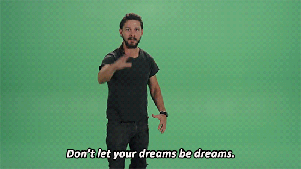

 Have you ever read a book that changes something deep inside you, but you can never go back and find out what it changed? For me, that book is [The Art of Asking](http://www.amazon.com/The-Art-Asking-Learned-Worrying/dp/1455581089). I first ~read~devoured [Amanda Palmer](http://amandapalmer.net "Amanda Palmer")'s The Art of Asking as soon as it came out in November 2014. I felt invigorated and inspired and wiser and ready to take on the world. It was a magnificent read, but I couldn't quite put my finger on what it was that I learned. I listened to the audiobook over the last two weeks. The audiobook is so much better — it's an ideal mix of song performances and Amanda's voice acting as she reads. The emotion behind every sentence comes to life like magic. No wonder it's being [considered for a Grammy](http://blog.amandapalmer.net/grammy-consideration/). Once more, I felt invigorated and inspired and wiser and ready to take on the world. I ran faster, and I boxed harder than ever. No other book or podcast has come close to making me want to listen while working out. That's my "no humans allowed" time. I discovered new details. I saw new twists and turns that had seemed irrelevant before. Sometimes I cried in front of my gym bros. It's a few days later, and the magic is gone. I still feel wiser. I still feel like I learned something important. But what the hell was it?

## Take the plunge

A big part of it was Amanda's own story. How she went from selling scoops of ice cream, to being a living statue, to becoming the Queen of the Internet and launching what is still [the biggest music Kickstarter](https://www.kickstarter.com/projects/amandapalmer/amanda-palmer-the-new-record-art-book-and-tour?ref=category_most_funded) five years later. It's one of those _Do what you love, take the plunge, and the world will catch you_ stories. I love those stories. They help me feel like I'm living one, even though I'm a habitual hedger of bets and have never fully committed to something ever in my life. It's a problem. I think that's something most of us wish we had more courage for, the whole "taking the plunge" thing. Search YouTube for inspirational videos and you'll see almost all of them carry the same message. 

## Overnight success is 20 years of hard work

Much like Amanda's inspiring story, another lesson hides between the lines: How much work it took. As much as I can discern from the book and some Wikipedia-ing, she started working as an artist sometime in the mid 1990's. Back then, she was the Eight Foot Bride – a living statue in [Harvard Square, Cambridge](<http://maps.google.com/maps?ll=42.3736111111,-71.1188888889&spn=0.01,0.01&q=42.3736111111,-71.1188888889 (Harvard%20Square)&t=h> "Harvard Square"). Through her work as a statue, she first learned about the power of predictable income through donations. She didn't make much, but she made enough to survive and still have plenty of time left for music. In 2000, she met Brian Viglione and they formed her first real band - [The Dresden Dolls](http://www.dresdendolls.com/ "The Dresden Dolls"). They printed their own CD's in Amanda's bedroom and sold them via snail-mail. All the while booking their own shows and sending hundreds of emails to various record labels hoping to get signed. Eventually somebody agreed, gave them a draconian contract, and two more albums were born. The band became famous. This is where the storyline gets fuzzy and super fast. Dresden Dolls split up, Amanda made a solo album, she thought it was good, the label thought it was a flop, she got the label to drop her, people gave money at concerts because they didn't want to pay the label, many different art projects and collaborations happened, she tested Kickstarter, she discovered Twitter, she tried out pay-what-you-want, she played many shows, and she hired her own crew to help manage it all. Then Bam! Million dollar Kickstarter with 24,000 backers. International fame. Mainstream press. TED talk. Controversy. Overnight success. Stuff. Notice:

-   it wasn't her first Kickstarter
-   it wasn't her first solo album
-   it wasn't her first indie album
-   it wasn't her first pay-what-you-want music
-   she knew what she was doing

Anyone tuning in for the first time thought she was an overnight success, that she'd burst onto the scene from out of nowhere. Success is exponential like that.

## Build your own following

The biggest part in her success is that Amanda has a following. She's got a fanbase who will fight like hell to help her. This is no random fluke of celebrity, however. She says her music has always been about building communities and about connecting with her fans and making them feel loved and part of a family. _"Do you do email?"_, she used to ask anyone she met. She invited them to shows, told them about stuff the band was up to, and asked them to come do art at her concerts. With time, the community grew. No growth hacks. No rabid expansion to please a record label. Just good music and a sense of _"Come join us, if you're weird"_. Amanda cherished the list. She didn't let the record label take it over. She didn't spam the list too much with commercial stuff. She treated it as the lifeline of the band. It was the reason the band existed at all. If somebody wrote her an email, she replied. If somebody needed to talk, she talked. If somebody asked for help, she helped. Plenty of bands build a following. Few have direct access to their fans. Every fan, reader, or consumer you can talk to directly is worth 100 only your publisher can contact.

## Don't be afraid to ask

And finally, the core lesson of the book: Ask. People want to help. Let them.
