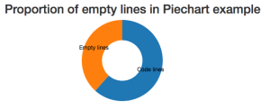
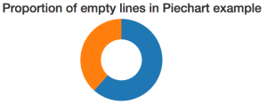

Piecharts might be the single most mocked chart in the world, but they’re great. Is there a better way to show proportions? Of course, it all breaks down when you have more than a couple data points. And yes, it’s impossible to gauge the difference between 24% and 26% on a piechart. Not to mention the accessibility issues when the charts rely on colors to distinguish slices. If you google "never use a piechart”, 597,000 results show up. That’s a bunch of hate for the poor piechart. **But** they’re easy and fun to make. They’re perfect for showing overwhelming proportions, and there’s nothing like a piechart to make an enterprise presentation more enterprisey. Especially if you make it 3D. When I say that a piechart is easy to make, I mean that with 86 lines of very beautiful and readable code, you can make one that looks great. 86 lines might sound like a lot for a piechart, but 33 of those are empty lines or closing braces. That’s 38%. Let me show you with a piechart :)  See, piecharts _work_. To build this, we’re going to:

- use a d3 layout to calculate a piechart
- use React stuff to render the piechart
- build a generic Piechart component

At the end of this tutorial, you’ll have piechart component that you can use like this:

```

```

Pretty great, huh? We’re going to build 3 components:

1. `Piechart` - the piechart itself
2. `Arc` - each of the slices
3. `LabeledArc` - a slice with some text

## Piechart

This is the piechart’s main component. It takes data and draws the arcs. That’s all it does. The component skeleton for `Piechart` looks like this:

```
// ./src/components/Piechart/index.jsx

\import React, { Component } from 'react';

\import { LabeledArc } from './Arc';

class Piechart extends Component {
    constructor() {
    }

    arcGenerator(d, i) {
    }

    render() {
    }
}

export default Piechart;
```

We start by \\importing react and the `LabeledArc` component, which we’ll use for the arcs. The `constructor` is going to initialize d3’s pie layout, the `arcGenerator` is a helper function that makes our code easier to read, and `render` takes care of rendering. Yes, this is a simple component. As such, it doesn’t _really_ need to be a class. It could be a functional stateless component, but the code looks messier to me. I’ll show you the functional version later, and you can decide for yourself. Now, the `Piechart`’s constructor looks like this:

```
// ./src/components/Piechart/index.jsx
class Piechart extends Component {
    constructor() {
        super();

        this.pie = d3.layout.pie()
                     .value((d) => d.value);
        this.colors = d3.scale.category10();
    }
```

We use `super()` to call the parent constructor, then initialize a pie layout with a basic value accessor. That tells it how to get values from our data. Of course, we could avoid this step and re-initialize a new pie layout on every render, but that seems wasteful. The layout is what turns the data into a piechart, by the way. It takes an array of values and returns an array of data in exactly the format that d3’s arc generator expects. It’s great. You’ll see. We also initialize a color scale. We’ll use it to give different colors to piechart slices. The next function we need is `arcGenerator`. This function returns a `LabeledArc` component with some props filled in. We _could_ put this code in the iterator inside `render()`, but doing it that way gets messy and makes our code harder to read.

```
// ./src/components/Piechart/index.jsx
arcGenerator(d, i) {
        return (
            
        );
    }
```

We define a `key` because React yells at us otherwise. We use the current data points `data`, pass `innerRadius` and `outerRadius` from `Piechart`’s own props, and use the color scale to get a `color`. Now for the `render` function:

```
// ./src/components/Piechart/index.jsx
    render() {
        let pie = this.pie(this.props.data),
            translate = `translate(${this.props.x}, ${this.props.y})`;

        return (
            
                {pie.map((d, i) => this.arcGenerator(d, i))}
            
        )
    }
```

We use the data to generate a piechart with `this.pie`, set up a translation to move our piechart into desired position, then return a grouping element with a bunch of arcs. That’s it. Our piechart shows up on the screen. Or, well, an error shows up because `LabeledArc` doesn’t exist yet. But once we make that, a piechart is going to show up on screen. Here’s the same code as a functional stateless component. This snippet is 12 lines shorter, but I’m not sure it’s better, per se. It reinitializes both the pie layout and the colors scale on each render, and it awkwardly embeds `LabeledArc` in the iterator.

```
const Piechart = ({x, y, innerRadius, outerRadius, data}) => {
    let pie = d3.layout.pie()
                .value((d) => d.value)(data),
        translate = `translate(${x}, ${y})`,
        colors = d3.scale.category10();

    return (
        
            {pie.map((d, i) => (
                ))}
        
    );
}; 
```

Use the approach you prefer. In this case, they both work essentially the same way.

## Arc

Ok, we’ve got the basic `Piechart`. It tries to draw arcs, but the component for them doesn’t exist yet. When you think about it, a `LabeledArc` is a type of `Arc`. It’s a component that draws a pie slice _and_ a label. So it makes sense to build an `Arc` component first, then subclass it with `LabeledArc` and add some features. With ES6 classes, we can do that without funky JavaScript magic. Sure, Babel compiles it to weird funky magic, but we don’t have to worry about it. The base `Arc` class looks like this:

```
// ./src/components/Piechart/index.jsx
\import React, { Component } from 'react';
\import d3 from 'd3';

class Arc extends Component {
    constructor() {
        super();
    }

    componentWillMount() {
        this.updateD3(this.props);
    }

    componentWillReceiveProps(newProps) {
        this.updateD3(newProps);
    }

    updateD3(newProps) {
    }

    render() {
    }
}

export default Arc;
```

We start by \\importing React and d3. Then, we define an `Arc` class which extends `Component`. In this case, we can’t use functional stateless components for two reasons:

1. We need component lifecycle functions to update the internal state of our arc generator. I’ll show you that in a bit.
2. You can’t extend a function. We _could_ play with functional composition, but in my experience, that sort of code, in JavaScript at least, is hard to read 2 months later. And it causes interesting issues when debugging.

The `Arc` component has four methods: the constructor, the lifecycle hooks to call `updateD3`, the method that updates d3 internals’ state, and the render method. All the constructor has to do is instantiate a new `d3.svg.arc` generator. That looks like this:

```
// ./src/components/Piechart/index.jsx
class Arc extends Component {
    constructor() {
        super();

        this.arc = d3.svg.arc();
    }
```

We now have an instance of the arc generator, and we’re going to update its internals in `updateD3`. If we wanted to set up some arc defaults or constants, this would be a good place. If you aren’t familiar with arc generators, they’re these funny d3.js things that create SVG path definitions. For instance, the “_Empty lines_” path definition in that screenshot you saw earlier looks like this: `M-66.73188112222397,74.47721827437816A100,100 0 0,1 -1.8369701987210297e-14,-100L-9.184850993605149e-15,-50A50,50 0 0,0 -33.365940561111984,37.23860913718908Z`. You can define any shape in the world with an SVG path definition like that. But it’s not something you ever want to write by hand. Ever. Or even think about, really. So, when you want an arc, use `d3.svg.arc()` :) The `updateD3` method looks like this:

```
// ./src/components/Piechart/index.jsx
    componentWillMount() {
        this.updateD3(this.props);
    }

    componentWillReceiveProps(newProps) {
        this.updateD3(newProps);
    }

    updateD3(newProps) {
        this.arc.innerRadius(newProps.innerRadius);
        this.arc.outerRadius(newProps.outerRadius);
    }
```

Can you guess what happens here? We update our arc’s inner and outer radius. This lets the users of our component define how big they want arcs to be. Because d3 objects have internal state, we have to make sure to update them every time our props might have changed – `componentWillMount` and `componentWillReceiveProps`. And yes, you’re right. We could reinitialize the arc on every render. And I still think that feels wasteful and unnecessary. Now for the `render` method. It looks like this:

```
// ./src/components/Piechart/index.jsx
    render() {
        return (
            
        );
    }
```

As I hinted earlier, we render an SVG path element. The shape definition – `d` – comes from `this.arc` and some data, and the color comes from `this.props.color`. You can render a piechart now. Wonderful, isn’t it? :) 

## LabeledArc

Piecharts stand on shaky ground as it is. Almost everybody who’s into dataviz hates them. Almost everybody who’s into business intelligence loves them. Both groups hate _unlabeled_ piecharts, though. Let’s take care of that. To add labels, we’re going to build a `LabeledArc` component that subclasses `Arc`. It’s what classes are for, right? Now, even though this component is a fancy render function, we _cannot_ make it a functional stateless component. We need a reference to the arc generator when calculating coordinates for the label. Let me show you. `LabeledArc` looks like this:

```
// ./src/components/Piechart/index.jsx
class LabeledArc extends Arc {
    render() {
        let [labelX, labelY] = this.arc.centroid(this.props.data),
            labelTranslate = `translate(${labelX}, ${labelY})`;

        return (
            
                {super.render()}
                
                    {this.props.data.data.label}
                
            
        );
    }
}

export { LabeledArc };
```

We calculate `labelX` and `labelY` with `this.arc.centroid(data)`. This gives us the center point of an arc. I don’t know how the math works. All I know is that it works and that I’m happy somebody made it for me. Notice how we can use `this.arc` as if it was defined inside `LabeledArc`. Subclassing is great like that. Don’t go overboard and become an [architecture astronaut](https://www.google.com/search?q=architecture+astronaut&oq=architecture+astronaut&aqs=chrome..69i57j0l5.2833j0j1&sourceid=chrome&ie=UTF-8). Next, we put these coordinates into the usual SVG `translate` transformation and render a grouping element with an arc and a label. We get the arc itself with `super.render()`, which calls the parent render function, and the label as a `text` element. I know using `this.props.data.data.label` to get the text looks weird, but that’s how it works. `this.props.data` is a single datapoint in the entire piechart, its `.data` property is where d3’s pie layout puts original data, and `.label` is how our base data defined labels. It works. Our piechart’s code profile piechart looks like this:  Wonderful.

## Voilà

You now have a generic piechart component that you can copy-pasta around your codebase whenever you want. Need a piechart? Use `<Piechart>` and give it some props. The component has you covered. To recap, here’s what we learned:

- Piecharts are okay, but not great, dataviz
- A Piechart takes **53 lines of real code** to make
- 41 lines with some boilerplate reduction
- A Piechart is made up of 3 components: Piechart, Arc, LabeledArc
- D3 makes the hard maths trivial
- ES6 classes and subclassing are great

You can learn more about using React and d3js together in my new book, React+d3js ES6, [here](http://swizec.com/reactd3js/).