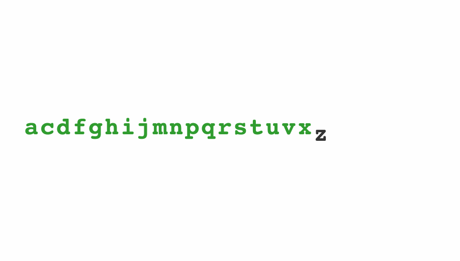

# 

One of d3’s biggest selling points is the general update pattern. Add some function calls and voila – animated visualization with transitions. You can see it in action in Mike Bostock’s [General Update Pattern 4.0](https://bl.ocks.org/mbostock/a8a5baa4c4a470cda598) where he animates an alphabet. Update the alphabet and old letters transition out, new letters transition in, updated letters transition into a new position. It works like magic. D3 always works like magic …

> .[@Swizec](https://twitter.com/Swizec) also with React you're not \*binding the data\*. you're just iterating over the data and creating SVG elements. It's not data-driven
>
> — Luca Matteis (@lmatteis) [April 16, 2016](https://twitter.com/lmatteis/status/721351646907863040)

You totally _can_ achieve the same result with React. Yes, even if you use React to render SVG. Yes, you can use d3’s powerful transitions API too. The React version is easier to understand, too. Keep reading and you’ll see why.

## Enter update exit transitions in React

We’re going to build that same animated alphabet. To keep things short, this tutorial focuses on the alphabet itself and ignores all the config and parent components. The code is based on React 15 and D3 4.0.0-alpha.29. Don’t worry, it works with the stable version of D3. I’ll explain the subtle differences. To make an animated alphabet, we need two components:

-   `Alphabet`, which creates random lists of letters every 1.5 seconds, then maps through them to render `Letter` components
-   `Letter`, which renders an SVG text element, and takes care of its enter/update/exit transitions

We’re going to use React to render SVG elements, and d3 for transitions, intervals, and some maths. You can see the full code on GitHub [here](https://github.com/Swizec/react-d3-enter-exit-transitions).

## The Alphabet component

The `Alphabet` component holds the current list of letters in state and renders a collection of `Letter` components in a loop. We start with a skeleton like this:

    // src/components/Alphabet/index.jsx

    import React, { Component } from 'react';
    import ReactTransitionGroup from 'react-addons-transition-group';
    import d3 from 'd3';

    require('./style.less');

    import Letter from './Letter';

    class Alphabet extends Component {
        static letters = "abcdefghijklmnopqrstuvwxyz".split('');
        state = {alphabet: []}

        componentWillMount() {
            // starts an interval to update alphabet
        }

        render() {
            // spits out svg elements
        }
    }

    export default Alphabet;

We import our dependencies, add some styling, and define the `Alphabet` component. It holds a list of available letters in a static `letters` property, and an empty `alphabet` in component state. We’ll need a `componentWillMount` and a `render` method as well. _Sidenote_: That `require('style.less')` isn’t key to this tutorial. I’m not a fan of inline styling, so I like to add `less` compilation to Webpack and include stylesheets like this. To showcase enter-update-exit transitions, we want to create a new alphabet every couple of seconds. The best place to do that is in `componentWillMount`:

    // src/components/Alphabet/index.jsx

        componentWillMount() {
            d3.interval(() => this.setState({
               alphabet: d3.shuffle(Alphabet.letters)
                           .slice(0, Math.floor(Math.random() * Alphabet.letters.length))
                           .sort()
            }), 1500);
        }

We use `d3.interval( //.., 1500)` to call a function every 1.5 seconds. It’s the same as `setInterval`, but friendlier to batteries and CPUs. On each period, we shuffle the available letters, slice out a random amount, sort them, then update component state with `setState`. This ensures our alphabet is both random and in alphabetical order. Starting the interval in `componentWillMount` ensures it only runs when the component is on the page, and that everything’s ready by the time our component renders. It’s good practice to explicitly stop these sorts of intervals in `componentWillUnmount`. Our declarative transitions magic starts in the `render` method.

    // src/components/Alphabet/index.jsx

        render() {
            let transform = `translate(${this.props.x}, ${this.props.y})`;

            return (
                
                    
                        {this.state.alphabet.map((d, i) => (
                            
                         ))}
                    
                
            );
        }

We start with an SVG transformation that moves our alphabet into the specified `(x, y)` position, then define a `ReactTransitionGroup` and map through `this.state.alphabet` to render a collection of `Letter` components. Each `Letter` gets its current text – `d` – and index – `i`. We _have to_ define the `key` attribute based on the letter – `d`. The `Alphabet` component assumes the parent component renders it inside an `<svg>` tag.

### The key property

The key property is how React identifies which component is which. You’re gonna have a bad time if you pick wrong. Trust me. I spent many hours debugging and contorting and writing workarounds before I realized that basing the key on the index was a Bad Move™. _Obviously_, you want the letter to stay constant in each component and the index to change. That’s how x-axis transitions work. You’re moving the letter into a specific place in the alphabet. You’ll see what I mean in a bit.

### ReactTransitionGroup

Wrapping our list of `Letter`s in `ReactTransitionGroup` lets us do our magic. This is a low-level API from React add-ons, which expands our kingdom of component lifecycle hooks. In addition to knowing when the component mounts, updates, and unmount, we get access to `componentWillEnter`, `componentWillLeave`, and a few others. Notice something familiar? `componentWillEnter` is the same as d3’s `.enter()`, `componentWillLeave` is the same as d3’s `.exit()`, and `componentWillUpdate` is the same as d3’s `.update()`. “The same” is a strong concept – they’re analogous. The key difference is that d3’s hooks operate on entire selections – groups of components – while React’s lifecycle hooks operate on each component individually. In d3, an overlord is dictating what happens; in React, each component knows what to do. That makes React code easier to understand. I think. ¯\\\_(ツ)\_/¯ `ReactTransitionGroup` gives us [even more hooks](https://facebook.github.io/react/docs/animation.html), but these are what we need. It’s nice that in both `componentWillEnter` and `componentWillLeave` we can use the callback to explicitly say _“The transition is done. React, back to you”_. My thanks to Michelle Tilley for writing about `ReactTransitionGroup` [on StackOverflow](http://stackoverflow.com/questions/29977799/how-should-i-handle-a-leave-animation-in-componentwillunmount-in-react).

## The Letter component

Now we’re ready for the real magic – a component that can transition itself into and out of a visualization… without bothering anyone else _or_ confusing React. The basic skeleton of our `Letter` component looks like this:

    // src/components/Alphabet/Letter.jsx

    import React, { Component } from 'react';
    import ReactDOM from 'react-dom';
    import d3 from 'd3';

    class Letter extends Component {
        state = {
            y: -60,
            x: 0,
            className: 'enter',
            fillOpacity: 1e-6
        }
        transition = d3.transition()
                       .duration(750)
                       .ease(d3.easeCubicInOut);

        componentWillEnter(callback) {
            // start enter transition, then callback()
        }

        componentWillLeave(callback) {
            // start exit transition, then callback()
        }

        componentWillReceiveProps(nextProps) {
            if (this.props.i != nextProps.i) {
               // start update transition
            }
        }

        render() {
           // spit out a  element
        }
    };

    export default Letter;

We start with some imports, and define a `Letter` component with a default state and a default transition. Yes, it feels weird to use `state` for coordinates, class name, and styling, but the component needs to change them sometimes. As far as I know, components can’t change their own props. Defining a default transition is a d3 v4 trick. It saves us some typing. With the stable version of d3, you’d define this duration and easing function on each transition. All of the magic values – default/final `y` coordinate, transition properties, etc. – are good candidates for props. That would make `Alphabet` more flexible, but add unnecessary complexity for this tutorial.

### componentWillEnter

We start with the enter transition in `componentWillEnter`.

    // src/components/Alphabet/Letter.jsx

        componentWillEnter(callback) {
            let node = d3.select(ReactDOM.findDOMNode(this));

            this.setState({x: this.props.i*32});

            node.transition(this.transition)
                .attr('y', 0)
                .style('fill-opacity', 1)
                .on('end', () => {
                    this.setState({y: 0, fillOpacity: 1});
                    callback()
                });
        }

We use `reactDOM.findDOMNode` to get our DOM node and use `d3.select` to turn it into a d3 selection. Now we can do any and all d3 magic. Then we update `this.state.x` the current index and letter width. The width is a value that we Just Know™. We keep our letter’s `x` coordinate in `this.state` to avoid jumpiness. The `i` prop updates on each render, but we want to transition into the new position slowly. You’ll see how that works in the `componentWillReceiveProps` section. At this point our component is invisible and 60 pixels above the baseline. That’s because of the default values for `fillOpacity` and `y` that we set earlier. To animate our component moving down and becoming visible, we use a d3 transition. We use `node.transition(this.transition)` to start a new transition using the default settings from earlier. In d3 v3, we’d have to define a duration and easing function here manually. Then we define what/how should change with `.attr` and `.style`. This operates directly on the DOM and doesn’t tell React about the changes. We can sync React’s imagination with reality in a “transition is over” callback using `.on('end'`. We use `setState` to update component state, and trigger the main `callback`. React now knows this letter is done appearing. In d3 v3, you’d use `.each('end'` to define the callback.

### componentWillLeave

The exit transition goes in `componentWillLeave` and follows the same principle, except in reverse. It looks like this:

    // src/components/Alphabet/Letter.jsx

        componentWillLeave(callback) {
            let node = d3.select(ReactDOM.findDOMNode(this));

            this.setState({className: 'exit'});

            node.transition(this.transition)
                .attr('y', 60)
                .style('fill-opacity', 1e-6)
                .on('end', () => {
                    this.setState({y: 60, fillOpacity: 1e-6});
                    callback()
                });
        }

This time, we update state to change the `className` instead of `x`. That’s because `x` doesn’t change. The exit transition itself is an inverse of the enter transition. An exiting letter moves further down and becomes invisible. Once the transition is over, we update state for consistency’s sake, and we tell React it can remove the component. On second though, we might not need to update state in this case. The component goes bye-bye anyway…

### componentWillReceiveProps

The update transition goes into `componentWillReceiveProps` like this:

    // src/components/Alphabet/Letter.jsx

        componentWillReceiveProps(nextProps) {
            if (this.props.i != nextProps.i) {
                let node = d3.select(ReactDOM.findDOMNode(this));

                this.setState({className: 'update'});

                node.transition(this.transition)
                    .attr('x', nextProps.i*32)
                    .on('end', () => this.setState({x: nextProps.i*32}));
            }
        }

You know the pattern by now, don’t you? Update state, do transition, sync state with reality after transition. In this case, we change the `className`, then we move the letter into its new horizontal position. We could have done all of this in `componentWillUpdate` as well. However, we can’t do it in `componentDidUpdate`. We need to know both the current index _and_ the new index. It helps us decide whether to transition or not. There are instances when the component updates, but its horizontal position doesn’t change. Every time we call `setState` for example.

### render

After all that transition magic, you might be thinking _“Holy shit, how do I render this!?”_. I don’t blame ya! But we did the hard work. Rendering is straightforward:

    // src/components/Alphabet/Letter.jsx

        render() {
            return (
                
                    {this.props.d}
                
            );
        }

We return an SVG `<text>` element rendered at an `(x, y)` position with a `className` and a `fillOpacity`. It shows a single letter given by the `d` prop. As mentioned, using state for `x`, `y`, `className`, and `fillOpacity` feels weird. It’s the simplest way I know of to communicate between the `render` and lifecycle methods.

## That’s it

Boom. We’re done.  We have an `Alphabet` component that declaratively renders an animated alphabet. Letters transition in and out and jump left and right. All you need now is a skeleton setup that renders an SVG element and uses the `Alphabet` component. The key take aways are:

-   use d3 for transitions
-   use React to manage SVG elements
-   use ReactTransitionGroup to get more lifecycle events
-   mimic d3’s enter/update/exit pattern

You can learn more about properly integration React and d3js from my book, [React+d3js ES6](http://swizec.com/reactd3js).
