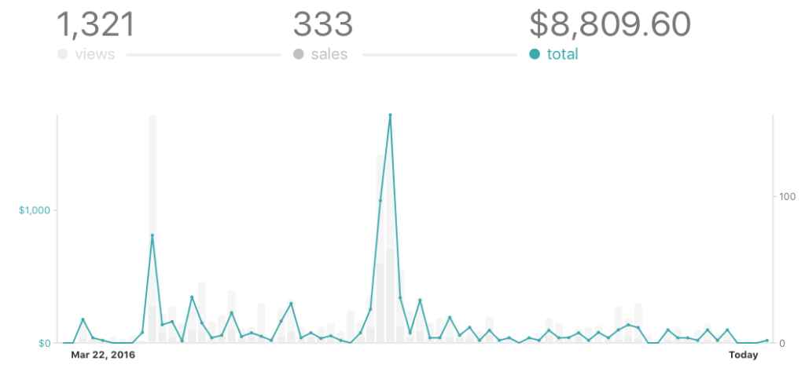
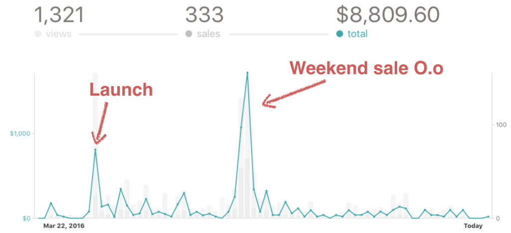

Four weeks ago, I made $3,000 while stuffing my face with my grandma’s cake.

She makes this amazing Slovenian cake called a _potica_. You can’t really get it outside Slovenia unless you bake it yourself or go to Cleveland.

Grandmas being grandmas, her cake is much better than mine. And I’ve never been to Cleveland.

Now, I don’t visit my grandma very often anymore. Once a year, twice tops. Sure, my mum makes a great cake too, but I don’t visit her any more often than I visit my grandma.

Distance and oceans can do that to a person.

The cake is definitely a big highlight of my trips back. There’s only so much a 70-year old woman from the rural lands and a 28-year old city slicker have to talk about.

She asks when she’s getting grandkids. I stuff my face with cake. It works.

Visiting gramps and grandma is great, even without the goats and the chickens and the rabbits and most of the cats and even with the old vineyard and most of the orchard gone. It’s great to visit.

I get a day without computers. What bliss. When I’m there, I’m _there_. Well, I try. There’s like 1 bar of LTE coverage…

And despite enjoying my time away from the internet, I still made $3,000 in a single weekend. The work happened days before when I scheduled two emails, one to start a sale and one to end it.

Wait. What?

Elementary, my dear Watson. …

No? Too much? Too much.

Products, man. Products are great. Just two years ago, I had a pretty stupid opinion about products. A local startup had just announced their sales figures – $80,000 in a year.

I had a real dickhead moment when I thought: _“Man, at that point, why do you even bother with products? You can make that much money solo freelancing, and it’s way less risky.”_

I could smell that I was wrong. I could tell that there was something I didn’t understand. I was also pretty sure that a team of 5 or 6 people should be making way more than that.

For the past year, I’ve been putting a lot more energy into products than into freelancing. You could say I’ve stopped freelancing, but that’s a post for another time. One I’ve been busy putting off for a year now.

Funny how those dates coincide, isn’t it?

The focus on products has been going great. Just take a look at the sales graph for my React+d3.js ES6 book.

I know. It’s not much. $8,000 dollars. It’s nowhere _near_ the $80,000 I was so critical of two years ago.

Why even bother, right? 2 to 3 hours of loose focus per day just to make $8,000. What a waste of life. I could’ve freelanced those out and made about $20,000 in the same two months.

Or maybe I could just spend that time with my girlfriend and my bird. They’d love me for it. They might even stop complaining that I work too much.

Yes, yes. Grandma gets me for a weekend, girlfriend gets to put up with me working nights and weekends. C’est la vie. ¯\_(ツ)\_/¯

But just look at that big fat spike in the middle. The $3,000 weekend. Like, holy shit, dude. How the hell did I do that?

I couldn’t _dream_ of numbers like that as a freelancer. There’s just no way I can do that by writing code. Some can, I can’t. Not yet.

To make that much money freelancing on a weekend, you’d have to bust your ass or have a sky-high rate. Probably both.

I did neither.

I spent Saturday on a hike of some sort and Sunday stuffing my face with grandma’s cake. With 1 bar of LTE, I couldn’t work even if I had wanted to.

On Friday, an automated email went out to a few thousand people. It said _“Yo! To celebrate my US visa, books are 50% off this weekend”_.

On Sunday, an automated email went out saying _"Yo! Weekend’s over. Sale ends when I get home from grandma’s house“_.

They were longer and nicer emails, but that’s the gist of it. In a nutshell, that’s how I made $3,000 in a single weekend while stuffing my face with grandma’s cake.

_That’s_ why I’m switching to products. It’s not quite passive money, but it sure beats selling your time.

Now I’ve just gotta figure out how to sell more products than time. How hard can it be?