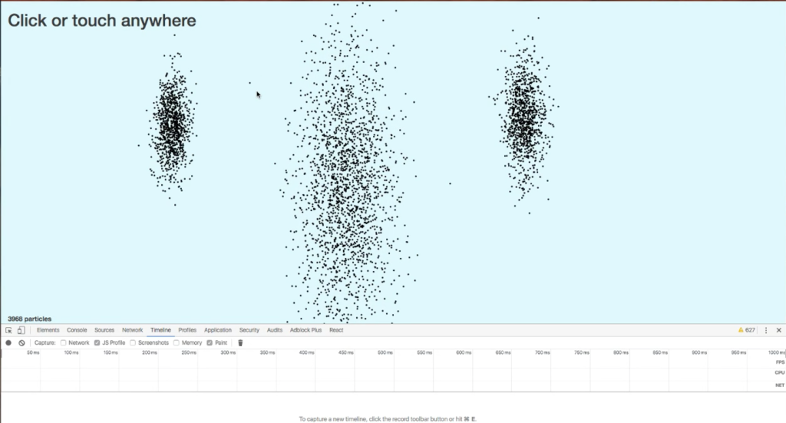
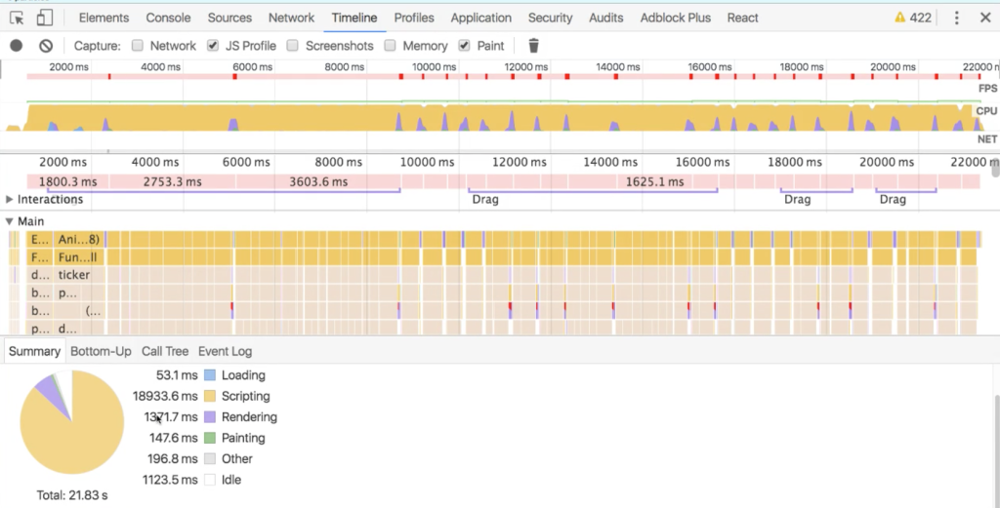
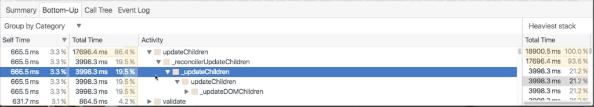

_This is a Livecoding Recap - an almost-weekly post about interesting things discovered while livecoding. It is shorter than 500 words. There are pictures. You can follow my channel, [here](https://www.livecoding.tv/swizec/). New stuff shows up almost **every Sunday at 2pm PDT**. There’s live chat ;)_

Welcome to the first Livecoding Recap. This recap is for the 12th live coding. I don’t have an excuse for not recapping before now. It just took me this long to realize _“These are fun, and I learn a lot. I should turn them into short blogposts.”_

This Sunday, I started a new quest: To find the definitive answer to _"How do you smoothly animate 10,000 elements in React?”_.

Many people have asked me about this recently, and I realized I couldn’t give them a good answer. The best I could come up with was, _“Try to render fewer nodes?”_. The issue is that sometimes you really _do_ need that many nodes because you don’t want to sacrifice fidelity.

So I took my old [particle generator experiment](http://swizec.com/blog/animating-with-react-redux-and-d3/swizec/6775) and started playing around. It doesn’t use a lot of d3, but it does rely heavily on React and Redux.

It works like this:

- React renders `<circle>` elements in a loop
- Redux holds an array of `[x, y]` positions
- Trigger a `move particles` action 60-times per second
- Add new particles if mousedown

If you change `N` particles per loop from 5 to 1,000, all hell breaks loose. Animation grinds to a halt.

To get to the bottom of _why_ this happens, we fired up the profiler. There are two suspects:

1. Creating new instances of the particles array 60-times per second
2. Rendering those DOM nodes

The profiler wasn’t happy with us:

It seems that “scripting” is the culprit, not rendering. In a 21 second experiment, 18 seconds were spent “scripting”, and less than 2 were spent rendering. Curious.

This implies that copying the array is our big timesink. If this is true, then the fix is simple – use [immutable.js](https://facebook.github.io/immutable-js/). Immutable.js promises to be smart about implementing proper immutable data structures efficiently.

We turned off rendering and kept the array copying. Things became silky smooth.

Curiouser and curiouser.

Looking deeper into the profiler reveals that the problem isn’t data management after all; it’s updating children, either in React or in the DOM.

Interesting.

The next thing to try is finding the bottleneck in updating children. Is it React, or is it the DOM? We can figure that out by replacing React rendering with raw d3 rendering.

This had funny results. Particles didn’t update properly, the animation was glitchy, and there were staleness artifacts galore.

Looks like React _does_ make our lives easier, despite how great d3 is on its own.

But it _is_ faster.

Then we looked at [react-motion](https://github.com/chenglou/react-motion) and [react-art](https://github.com/reactjs/react-art), and we decided that they don’t smell like they can solve our problem. Maybe I just need to invest more time into figuring them out.

React-motion did give us a great idea though – use css transformations! The GPU renders those; that _has got to be fast_, right?

Nope. Not fast.

Looks like we do have to get away from the DOM completely. The most promising library we could find to do that was [react-koonva](https://medium.com/@lavrton/using-react-with-html5-canvas-871d07d8d753#.lrwnvr1z6).

I’m sure that _next time_, we will crack this nut. There _will_ be 10,000 dancing dots on the screen.

It’s gonna be great.

* * *

PS: the edited and improved versions of these videos are becoming a video course. Readers of the engineer package of [React+d3js ES6](http://swizec.com/reactd3js#packages) get it for free when it’s ready.