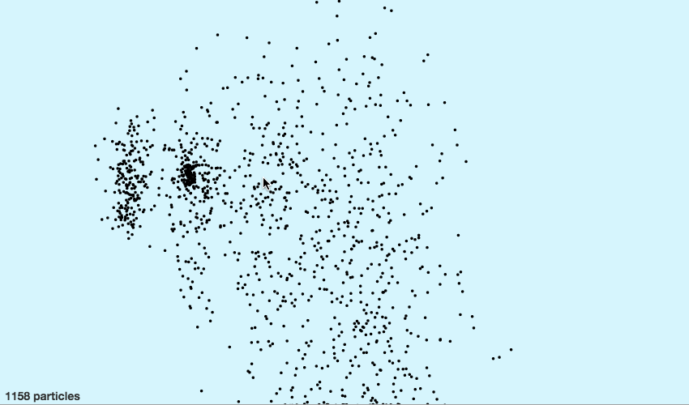
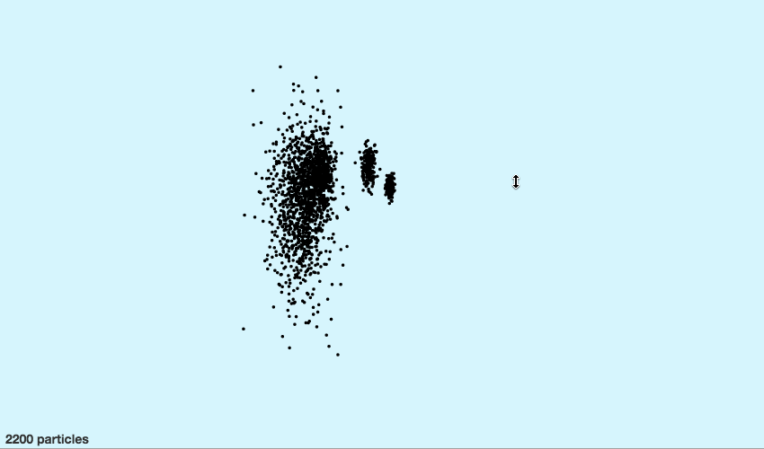
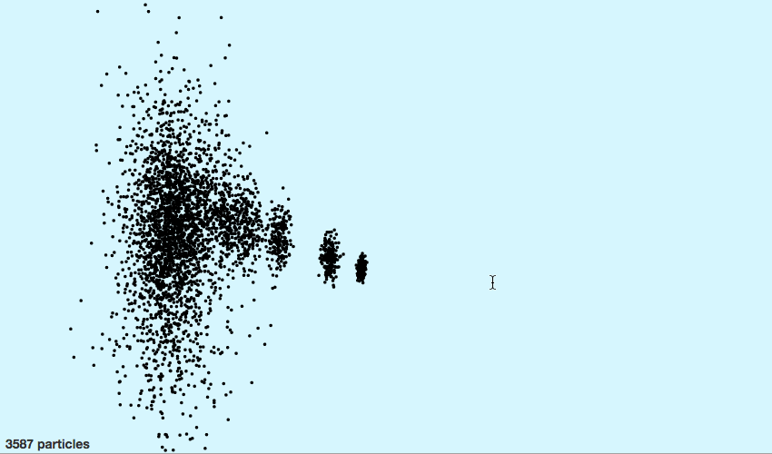

_This is a Livecoding Recap – an almost-weekly post about interesting things discovered while livecoding. Shorter than 500 words. With pictures. You can follow my channel [here](https://livecoding.tv/swizec). New content almost **every Sunday at 2pm PDT**. There’s live chat. ?_  We did it! A few thousand elements smoothly animated with React and canvas! Hooray! \\o/ It’s not perfect. We had to throw the baby away with the bath water and drop down a layer below React. The [`updateChildren` issue from last time](http://swizec.com/blog/livecoding-13-rendering-react-components-with-canvas/swizec/6784) proved too hard to solve. Too hard for _me_ to solve at least.

We moved our particle rendering logic into `componentDidUpdate` and rolled up our sleeves. Without React’s help, we were forced to manually keep track of new and old particles. The upside is that we can move existing particles instead of re-creating them. This saves cycles. The downside is that we were unable to remove irrelevant particles efficiently, so they pile up in memory. It’s a garbage collection problem in a way. Animation works well the first time you try it. But if you wait for all the particles to vanish and try again, it’s super slow. That’s because it keeps redrawing particles that are no longer there. Oops. The meat of our code looks like this:

    componentDidUpdate() {
            let layer = this.refs.the_thing,
                particles = this.props.particles,
            for (let i = 0; i < particles.length; i++) {
                let { id, x, y } = particles[i];

                if (this._particles[id]) {
                    // move particle
                    this._particles[id].position({
                        x: x,
                        y: y
                    });
                }else{
                    // create new particle
                    let c = new Circle({
                        radius: 1.8,
                        x: x,
                        y: y,
                        fill: 'black'
                    });
                    this._particles[id] = c;
                    layer.add(c);
                }
            };

            layer.batchDraw();

Lovely. `new Circle` creates a particle, `.position` updates its position. `layer.batchDraw` does drawing stuff with the [Konva](http://konvajs.github.io/) library. This is great, but it’s not perfect. When I stress-tested it later, I discovered an issue. At 4,000 particles, the animation becomes sad. At 7,000 particles, it’s disgusting.  So sad. Just for shits and giggles, I checked the original pure SVG implementation from a few weeks ago. To my surprise, _it works better_. Better! React renders and updates pure SVG faster than our hard-earned canvas code does.  It takes 7,000 elements to bog down the pure SVG implementation.  Ugh. So annoying. Back to the drawing board. There’s a sliver of hope. Take a good look at those gifs. React+SVG works well up to about 3,000 particles, then quickly bogs down, and has a hard time reaching more than 6,500 particles on screen. React+canvas+Konva works a bit worse at 3,000 particles, but looks like it’s slowing down slower. If that makes sense. It’s not much worse at 5,000 particles than at 3,000. React+SVG at 5,000 looks terrible compared to 3,000. This is promising. It implies that canvas can handle it, but we’re doing something stupid. Maybe Konva is slow, or maybe we’re misusing it. We’ll find out this Sunday :) PS: the edited and improved versions of these videos are becoming a video course. Readers of the engineer package of [React+d3js ES6](http://swizec.com/reactd3js/) get the video course for free when it’s ready.
