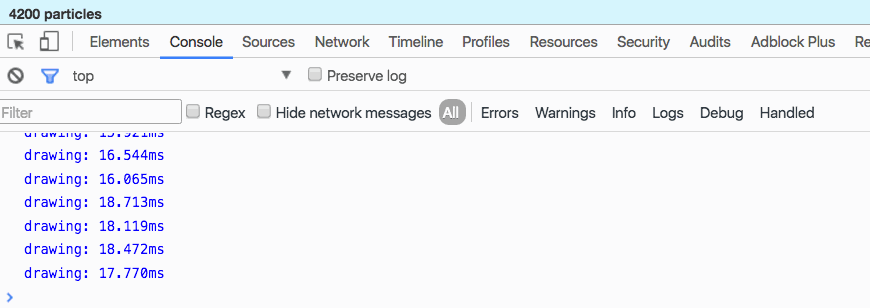
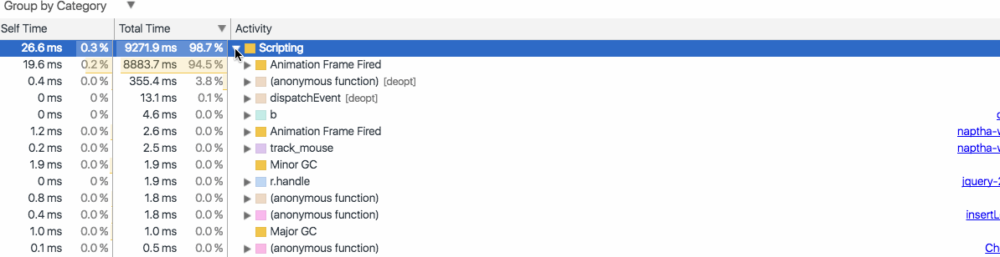

_This is a Livecoding Recap – an almost-weekly post about interesting things discovered while livecoding. Shorter than 500 words. With pictures. You can follow my channel, [here](https://livecoding.tv/swizec). New content almost **every Sunday at 2pm PDT**. There’s live chat ?_  Halp, I need an expert! It looks like we pushed the particle generator to the limits of canvas performance. But that can’t be right, can it? Surely I’m still doing something wrong.

Pure canvas frame redraw speed

We removed everything that could possibly slow us down. There’s no more React or Konva for the main drawing part. All that’s left are the raw HTML5 canvas APIs. Despite our best efforts, it still takes almost 50 milliseconds to draw 10,000 circles. A huge improvement from [last time](http://swizec.com/blog/livecoding-14-mostly-smooth-animation-up-to-4000-elements-with-react-and-canvas/swizec/6864), yes. But it’s not good enough. With a drawing time of 50ms per frame, the upper bound on my laptop is about 20 frames per second. Animated, but choppy. And there’s some 5ms of React and Redux overhead on top of that. Down to 18 frames per second. Ugh! The drawing code couldn’t be simpler:

    drawParticle(particle) {
        let { x, y } = particle;

        this.context.beginPath();
        this.context.arc(x, y, 1, 0, 2*Math.PI, false);
        this.context.stroke();
    }

    componentDidUpdate() {
        let particles = this.props.particles;

        console.time('drawing');
        this.context.clearRect(0, 0, this.canvas.width, this.canvas.height);

        this.context.lineWidth = 1;
        this.context.strokeStyle = 'black';

        for (let i = 0; i < particles.length; i++) {
            this.drawParticle(particles[i]);
        }
        console.timeEnd('drawing');
    }

Even profiling confirms that drawing has become the slow part:

Profiling shows canvas operations are the bottleneck I am at a loss. What else is there to try? There’s no lower layer of abstraction to drop to. Canvas is the bottom. It’s the last in the chain. Well … there’s always manual bitmaps and those base64-encoded strings for images. If you knew how to manipulate those directly, you could trick the browser … no, that’s a silly idea. We’re not doing that. That’s crazy talk. A friend suggested drawing a single circle in an off-screen canvas, then using `drawImage` to copy-paste it around. But we tried that with Konva, and it didn’t quite work. Maybe it was a Konva problem, and it’s going to work better if we do it ourselves. I dunno. It _does_ look like `stroke` and `arc` are the biggest bottlenecks in `drawCircle`. Sprites might help. Oh, another optimization that we made was to give Konva more context about what’s going on. Disable most transformations with `transformsEnabled = 'position'` on all shapes, and set `listening = false`. That way it knows not to try scale/rotation transformations, and not to listen for events. It helped a bit, but not as much as going to the bare metal for the key drawing part. Next time, we’ll try the `drawImage` approach, and if that doesn’t work, we’re going to start exploring WebGL. If that can’t do it, nothing can. Are you a canvas expert? Please help. What am I doing wrong?  [Try the particle generator](http://swizec.github.io/react-particles-experiment/). PS: the edited and improved versions of these videos are becoming a video course. Readers of the engineer package of [React+d3js ES6](http://swizec.com/reactd3js/) get the video course for free when it’s ready.
