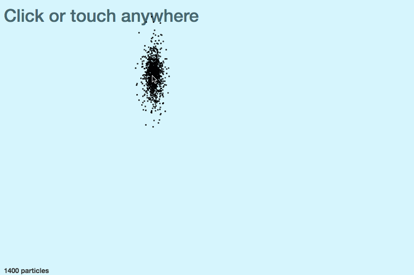
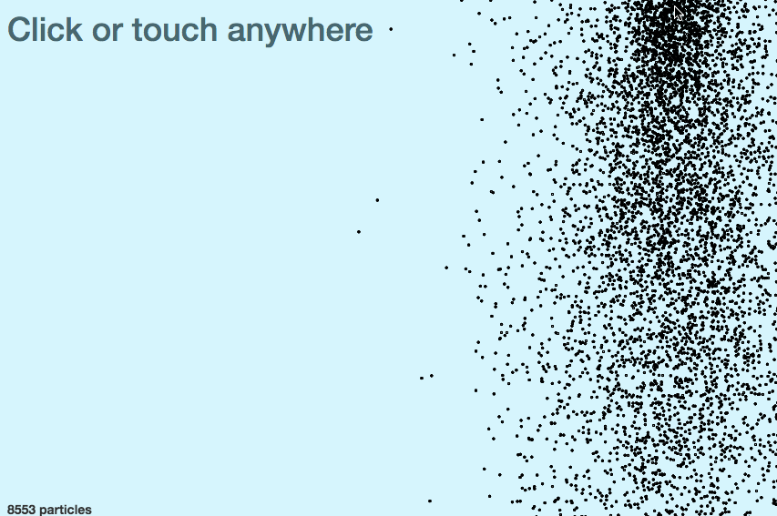

_This is a Livecoding Recap – an almost-weekly post about interesting things discovered while livecoding. Shorter than 500 words. With pictures. You can follow my channel, [here](https://livecoding.tv/swizec). New content almost **every Sunday at 2pm PDT**. There’s live chat ?_  This week, I had the charisma of a peeled potato. The livestream started with 6 people in the chat, and it ended with 2. Usually it ends with … more. So sad. BUT! We learned stuff about `canvas.drawImage`, _and_ I poked around after the stream and made this glorious bastard. 14,000 smoothly animated particles! \\o/ \[caption id="" align="aligncenter" width="853"] 14,000 animated particle minions\[/caption] Cool, huh? Such a shame it didn’t work during the stream. Then 3 people would’ve stayed! The first thing we tried was the concept of sprites. Instead of doing `.arc` and `.stroke` for every particle, you do it once, then copy-pasta that particle to other places like this:

    // draw a sprite particle in componentDidMount
    this.context.beginPath();
    this.context.arc(1.5, 1.5, 1, 0, 2*Math.PI, false);
    this.context.stroke();

    // copy pasta particle

    drawParticle(particle) {
       let { x, y } = particle;

       this.context.drawImage(this.canvas, 0, 0, 3, 3, x, y, 3, 3);
    }

Using `.drawImage` like this tells canvas to take pixels from the top left corner and copy them to a new place. A fast operation in theory, but something went wrong for us. \[caption id="" align="aligncenter" width="853"] Slow drawImage\[/caption] Terrible. Even worse than before. Copying those few pixels thousands of times grinds our animation to a halt. With a few thousand elements, each frame render takes a few seconds. But at least the `.drawImage`. approach makes it easy to render arbitrary images instead of particles. Instead of using `this.canvas` as the source, you can use an arbitrary `Image()` object, which you can fill with an image from any URL on the internet. \[caption id="" align="aligncenter" width="853"] Minion Sprites\[/caption] Strange … that feels smoother, doesn’t it? I’m not going crazy, right? Anyway, there’s only one thing left to do: decouple physics from frame rate. A big part of why the animation feels so slow is that we only calculate new particle positions once per frame, which makes sense because we’re only drawing them once per frame. Our frame rate is not up to snuff for that. We’re dropping frames, so we have to compensate for that in our calculation. The idea is that for each drawn frame, we have to pretend like multiple physics frames happened. Fixing physics happens in the reducer and looks like this:

    // reducer

    case ‘TIME_TICK’:
            let {svgWidth, svgHeight, lastFrameTime} = state,
                newFrameTime = new Date(),
                multiplier = (newFrameTime-lastFrameTime)/(1000/60); // N frames dropped

            let movedParticles = state.particles
                                      .filter((p) => {
                                          return !(p.y > svgHeight || p.x < 0 || p.x > svgWidth);
                                      })
                                      .map((p) => {
                                          let [vx, vy] = p.vector;
                                          p.x += vx*multiplier;
                                          p.y += vy*multiplier;
                                          p.vector[1] += Gravity*multiplier;
                                          return p;
                                      });

            return Object.assign({}, state, {
                particles: movedParticles,
                lastFrameTime: new Date()
            });

We start by tracking timestamps for each frame and calculating a multiplier. Then, we multiply every position and vector change with the multiplier and voilà: time-based (instead of frame-based) physics. \[caption id="" align="aligncenter" width="853"] Time-based Physics\[/caption] So smooth! I had to increase the number of particles generated on every animation tick up to 2000 just to see anything interesting going on. Insane. Mission accomplished, right? It’s smooth up to 8,000 particles, and we can’t push it to put more than that on-screen. But the minions wouldn’t stop niggling at me. I wonder what happens if we put the minion sprite and the better physics together. \[caption id="" align="aligncenter" width="853"] Physics Minions\[/caption] Ho boy! 14,000 smoothly animated minions! \\o/ With a production build and a big screen, you can reach over 20,000 minions on screen, and it still looks smooth. [Try it.](http://swizec.github.io/react-particles-experiment/) I have no idea why it’s faster to `drawImage` a complex .png than a circle. Or why it’s faster to `drawImage` an `Image()` object than a part of the canvas. It makes no sense, but here we are. Do you know? PS: the edited and improved versions of these videos are becoming a video course. Readers of the engineer package of [React+d3js ES6](http://swizec.com/reactd3js/) get the video course for free when it’s ready.
