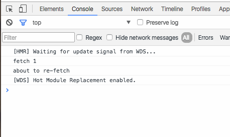
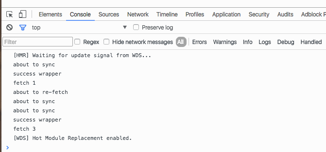
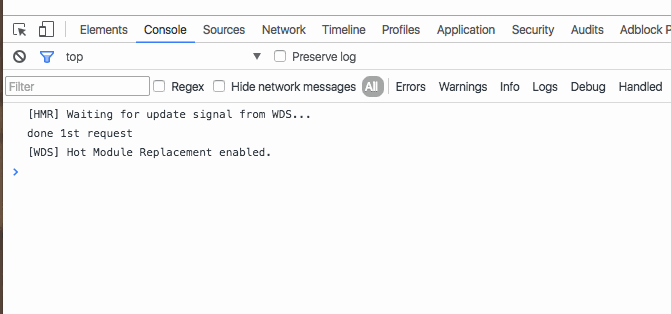
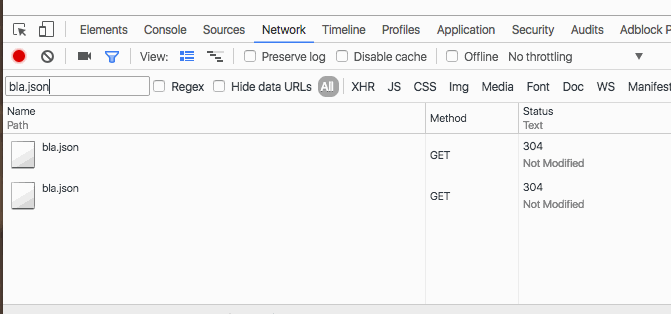
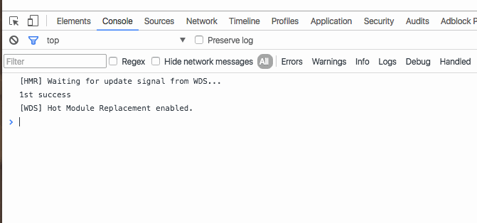

[This strange bug from yesterday](https://swizec.com/blog/js-object-optimization-bug-in-chrome-52/swizec/6908) won’t let me sleep. _Why_ does Chrome 52 sometimes behave like different instances of a class are the same object?

Backbone’s fetch method triggers the bug. But maybe that’s not the real issue? I’d hate to submit a bug report to Chrome project only to be told _“Fool, that’s a Backbone issue.”_

It’s terrifying to tell the Chrome team they made a mistake.

This is what yesterday’s repro code looks like:

    var BugModel = Backbone.Model.extend({
        url: "bla.json"
    });

    let bug = new BugModel();
    bug.fetch({
        success: () => {
            console.log('fetch 1'); // prints
            doWeirdness(bug);
        }
    });

    function doWeirdness(bug) {
        let newBug = new BugModel({id: 1});

        console.log('about to re-fetch'); // prings

        newBug.fetch({
            success: () => console.log('fetch 2', newBug), // doesn't print
            error: () => console.log('error')
        });
        newBug.fetch({
           success: () => console.log('fetch 3') // prints
           });
    }

If you press Cmd+R, the bug happens. If you press Cmd+Shift+R, it does not. That’s a new clue that points at either Chrome’s speed optimizations, or worse, the network stack. Can we call it a network stack? I guess Chrome _is_ almost an operating system at this point …

Adding `console.log(newBug == bug)` prints `false`, which implies that Chrome does _not_ think both instances are the same object. This invalidates my original hypothesis. ?

So what does Backbone’s `Model.fetch` method do?

    fetch: function(options) {
          options = _.extend({parse: true}, options);
          var model = this;
          var success = options.success;
          options.success = function(resp) {
            var serverAttrs = options.parse ? model.parse(resp, options) : resp;
            if (!model.set(serverAttrs, options)) return false;
            if (success) success.call(options.context, model, resp, options);
            model.trigger('sync', model, resp, options);
          };
          wrapError(this, options);
          return this.sync('read', this, options);
        },

A lot of this stuff is unnecessary in ES6, but Backbone is from the before times.

We start with a default value for options - `{parse: true}`, then use the `var = this` trick because we don’t have arrow functions. Then we copy the `options.success` callback to a variable and define our own. You can think of it as a wrapper.

Inside the success wrapper, we parse data returned from the server and set new values on our model. Then we trigger a `sync` event. This could be where the bug happens.

Outside the wrapper, we defer to `sync` to actually talk to the server.

If I copy this method to my own model definition, we can inspect where it fails.

The success wrapper doesn’t fire. ?

Let’s see what happens inside `sync` … ugh, it’s a long function. I’m not pasting it here. It does some setup, then defers to `$.ajax` to perform an ajax request to the server.

Can we make the same bug happen without Backbone, then?

    $.ajax({
        url: 'bla.json',
        complete: () => {
            console.log('done 1st request');
            $.ajax({
                url: 'bla.json',
                complete: () => {
                    console.log('done 2nd request');
                }
            });
        }
    });

? It worked! 8 lines of code reproduce the bug. ?

And yes, both requests happen without error.

It might be safe to say that jQuery is battle tested enough that this couldn’t be a jQuery bug. But let’s try superagent to make sure. It’s a great library for making requests and it’s implemented independently of jQuery.

Does the bug still happen?

    request.get('bla.json')
           .end(() => {
               console.log('1st success');
               request.get('bla.json')
                      .end(() => {
                          console.log('2nd success');
                      });
           });

Yeeeeep.

Now you might think: _“A-ha! Every even Ajax call to the same URL fails.”_ I tried that, too -> it doesn’t. If you make requests in a loop, they all work.

The bug only happens, if you make the same AJAX request in the callback. You can extend a chain like this forever:

    request.get('bla.json')
           .end(() => {
               console.log('1st success');
               request.get('bla.json')
                      .end(() => {
                          console.log('2nd success');
                      });

               request.get('bla.json')
                      .end(() => {
                          console.log('3rd success');

                          request.get('bla.json')
                                 .end(() => {
                                     console.log('4th success');
                                 });
                      });
           });

And it only prints the odd numbered console.logs.

Guess it’s time to submit my first bug report to a big open source project. Yay I’m helping!
