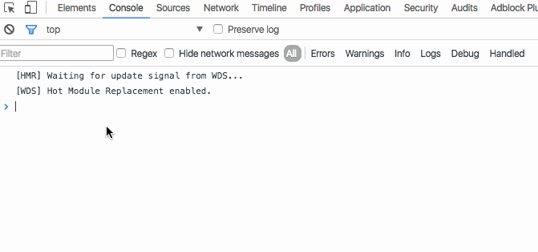

As I was researching [that Chrome 52 bug](https://swizec.com/blog/i-broke-ajax-in-chrome-52-%F0%9F%98%B1/swizec/6914) yesterday, my friend [Smotko](https://twitter.com/Smotko) showed me something cool: `fetch()`.

It’s a native JavaScript function for AJAX GET requests. I don’t know what stage it is, but Chrome, Edge, Firefox, and Opera all support it. Safari doesn’t. Nor do any default mobile browsers, only Android Chrome.

You can use this [Babel fetch polyfill](https://gist.github.com/Couto/b29676dd1ab8714a818f) to bridge the gap. I wonder if that’s good enough to convince our CTO to let me use this. ?

Then again, why? Oh yeah, that strange Chrome 52 bug doesn’t happen and all I’d have to do was change that one API wrapper function that we use for everything … and thus change our whole codebase … and wreak havoc. ?

But The Bug doesn’t happen! Let me show you.

Ugh, promises don’t work in the console. That’s a bummer … never did like promises. It’s really just weird syntax sugar for callbacks.

    fetch('bla.json')
                 .then(response => {
                     console.log(response.ok); // prints true
                     console.log(response.body); // ReadableStream O.o
                 });

`fetch()` issues an AJAX request to the server. When it’s done, it triggers the `then` part of its promise and gives it a `response` object. This object can do many useful things, one of which is to tell you if it was successful. Another is to give you a ReadableStream.

You probably don’t care about readable streams, so there are functions to parse JSON or get raw text. We’re in the brave new world of promises, so those are promises too.

They work like this:

    fetch('bla.json')
                 .then(response => {
                     response.json()
                             .then((json) => console.log(json)); // Object {id: 1, hai: "hello"}

                     response.text()
                             .then((text) => console.log(text)); // nothing
                 });

The `json().then()` combination prints a JavaScript object parsed from our data. Which feels roundabout, but the internet tells me that promises are better than The Callback Hell.

This:

    fetch(url).then(data => data.body.json().then(real_data => doStuff))

Is supposed to be better than:

    request.get('bla.json').end((err, res) => console.log(res.body));

¯\_(ツ)\_/¯

But lets get back to the story: You can’t read the fetch response body twice. See that `.text()` call? That throws an error saying that oh hey, the body has already been read, so you can’t do it again.

Maybe there’s no good reason you’d want to do that, but what if I _do_ want to?

There’s an even worse caveat, though. Let me show you what happens when your `fetch()` call returns a 404.

    fetch('nope.json')
               .catch(() => console.log('something went wrong')) // no error
               .then((res) => console.log(res.ok)); // but not okay either

With promises, `catch()` should give us a chance to catch errors. This keeps our code cleaner because `then()` can focus on the happy path.

Somebody decided a 404 error is not a good enough reason to reject the promise. You still have to put a lot of error handling into your happy path.

?

But [The Bug](https://swizec.com/blog/i-broke-ajax-in-chrome-52-%F0%9F%98%B1/swizec/6914) doesn’t happen! I tried. You can repeat the same request in the `then()` callback and its `then()` callback works just fine.

There is an official explanation for how the bug happens in the [bug report](https://bugs.chromium.org/p/chromium/issues/detail?id=633696) from 8 days ago. A [fix also exists](https://codereview.chromium.org/2210473002/), but it’s not merged yet.

This debacle makes me wish I was braver when first seeing this behavior 3 months ago. Way back when it was Chrome Canary and I thought surely someone would fix it.

What a strange ride it’s been.
