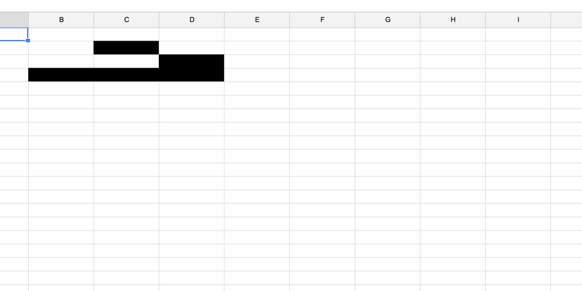
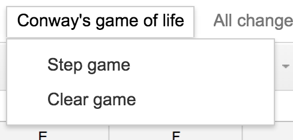

Why? Because.


Have you really never wanted to create [Conway’s game of life](https://en.wikipedia.org/wiki/Conway%27s_Game_of_Life) in a google doc spreadsheet? Really, never? Okay, it’s a pretty weird thing to do. And it’s not as fun as I hoped.


You can play with it, [here](https://docs.google.com/spreadsheets/d/1k8mT9a-Fu8x1TkvjYGtrDng8vWQAnNf01nSFCaVwqO4/edit?usp=sharing)


I’m giving a 30min presentation on “_How to JavaScript_” to our not-engineers – the operations and business development teams. But how? It’s not like you can teach somebody JavaScript from scratch in 30 minutes. The most you can do is show them enough to want to learn more.


That’s easier, but still … how? You can’t just show them a bunch of for loops and functions and hope it sticks. You have to get them _excited_.


The answer I’m trying to answer is: _“How can this make my life better?”_


They all spend a lot of time in Google Docs. They run a lot of day to day processes in there. Google Docs has scripting capabilities.


See where I’m getting at?


Conway’s Game of Life inside Google Docs, of course. It highlights the basics of reading and manipulating properties of individual cells in spreadsheets, and the game itself is easy to explain:


1. Any live cell with fewer than two live neighbours dies, as if caused by under-population.
2. Any live cell with two or three live neighbours lives on to the next generation.
3. Any live cell with more than three live neighbours dies, as if by over-population.
4. Any dead cell with exactly three live neighbours becomes a live cell, as if by reproduction.


I showed one of them some gifs and he said _“Oh dude, I’m excited! That looks so cool”_. All the confirmation I needed to go waste 3 hours of my life figuring out how to build this! ?


Scripting Google Docs is hell.


You can’t alert, there’s no console.log, everything is slow, and ES6 works only partially. You get destructuring, but no string templates. I dared not try arrow functions.


Timers also don’t exist. Which means you have to manually step through the game loop by clicking a button. ?


One silver lining is [this 3rd party logger called BetterLogger](https://github.com/peterherrmann/BetterLog), which lets you `Logger.log` things to a separate sheet in your spreadsheet. It’s not very smart, but it helps a lot.


And if you thought DOM was slow, wait ’till you try Docs access. Naively searching through 30x30 cells and counting neighbors took _many seconds_. Maybe 20 seconds per game tick.


That can be optimized, though. Just access the spreadsheet less.


The first step is to set global vars and add a menu:


```
// global vars
var maxX = 30,
    maxY = 30,
    Alive = '#000000';

// almost everything needs a reference to this
var Sheet = SpreadsheetApp.getActiveSheet();

// add menu
function onOpen() {
  var spreadsheet = SpreadsheetApp.getActiveSpreadsheet();
  var menuItems = [
    {name: 'Step game', functionName: 'stepGame'},
    {name: 'Clear game', functionName: 'clearGame'}
  ];
  spreadsheet.addMenu('Conway\'s game of life', menuItems);
}
```


Docs runs this code when you open your document. It adds a menu that looks like this:





`Step Game` runs an iteration of the game loop, `Clear Game` clears all cells. Black background means a living cell and white background means a not-living cell.


On each game step, we build a map of living cells, then run the game rules on each. Like this:


```
function stepGame() {
  var range = Sheet.getRange(1, 1, maxX, maxY);
  
  var numRows = range.getNumRows(),
      numCols = range.getNumColumns();
  
  var lifeMap = [];
  
  for (var y = 1; y <= numRows; y++) {
    lifeMap[y] = [];
    
    for (var x = 1; x <= numCols; x++) {
      lifeMap[y][x] = range.getCell(y, x).getBackground() == Alive;
    }
  }
  
  for (var y = 1; y <= numRows; y++) {
    for (var x = 1; x <= numCols; x++) {
      conwayGame(lifeMap, y, x);
    }
  }
}
```


You can think of the spreadsheet as 2-dimensional memory. First dimension is the row, second is the column. You can store styling information, the value itself, and notes. Docs lets you access directly on both dimension, but it’s slow.


Having 2D memory also means there will be a lot of these nested for loop constructs in your code. You’re limited to O(n2) algorithms at best.


Applying Conway rules to each cell looks like this:


```
function conwayGame(lifeMap, y, x) {
  var neighborPos = [y > 1 ? y-1 : 1, 
                     x > 1 ? x-1 : 1, 
                     y < maxY ? y+1 : maxY, 
                     x < maxX ? x+1: maxX]
  
  var livingNeighbors = countLife(lifeMap, neighborPos);
  
  if (lifeMap[y][x]) {
    livingNeighbors -= 1;
  }
  
  if ((livingNeighbors < 2 || livingNeighbors > 3) && lifeMap[y][x]) {
    deactivate(Sheet.getRange(y, x));
  }else if (livingNeighbors == 3) {
    activate(Sheet.getRange(y, x));
  }
}
```


We count living neighbors, discount the current cell if it’s alive, then decide whether to `deactivate` or `activate` it. Counting the neighbors literally means walking through a 3x3 array around the current cell and counting cells that have a black background.


Activating or deactivating is a call to `cell.setBackground('black')` and `cell.setBackground('white')`.


That’s kind of it … I’m embarrassed it took me 3 hours …