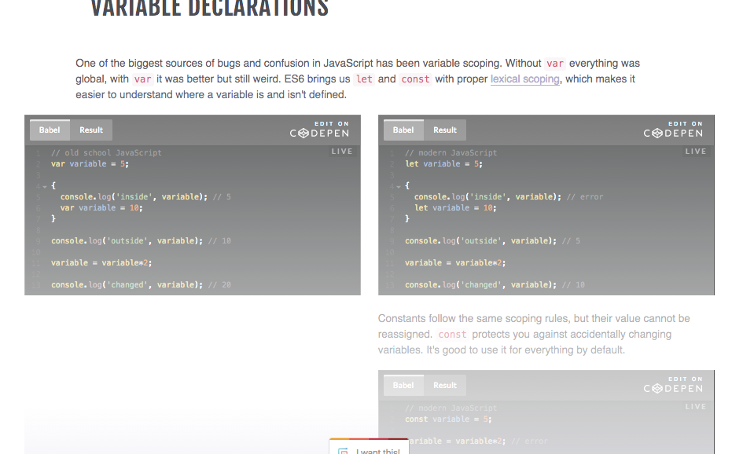
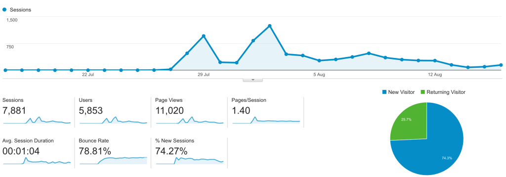
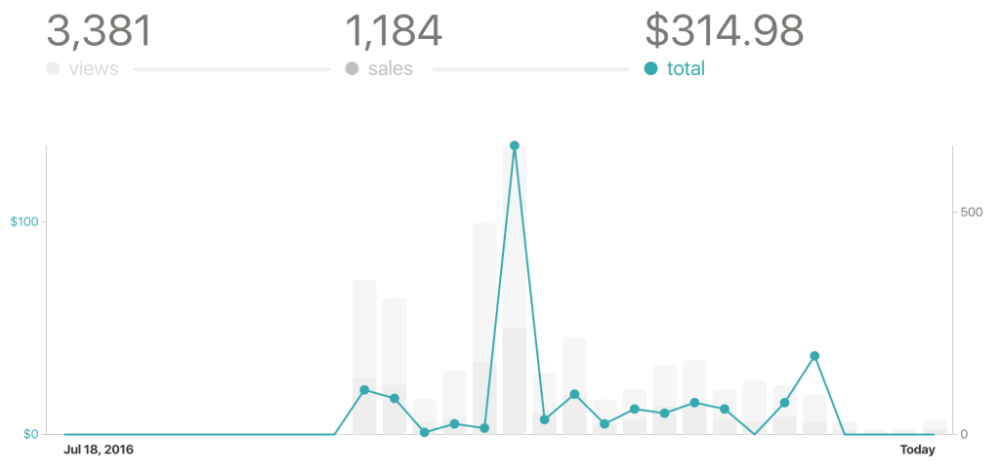

[\[caption width="545" align="alignnone"\] ES6 Cheatsheet\[/caption\]](https://es6cheatsheet.com)

On July 28th I launched a mini product – my [Interactive ES6 CheatSheet](https://es6cheatsheet.com/).

I started noodling on the initial nugget of idea on a Monday. _“Hmmm, a lot of people have been complaining that React+D3 is hard because they can’t read ES6”_. That Thursday I got an email from JavaScript Weekly reminding me that many months ago I had reserved an ad spot for July 28th.

Shit, don’t want to let a few hundred bucks go to waste. Fine, we’ll build and launch a product by then. Totally reasonable.

My noodling _“I should help with ES6”_ thought became a product idea – make a cheatsheet. But with so many ES6 cheatsheets out there, how can I stand out? Let’s make it interactive!

On Friday I bought [es6cheatsheet.com](https://es6cheatsheet.com) and spent 5 hours moving all my web properties to https. That was a massive yak shaving, but it needed to be done. Been putting it off for too long.

I had shaved another useful Yak in April – the framework of React components for landing pages. Throwing a website together and making it look nice was as simple as `<Section><Left>
bla
</Left></Section>`.

That took an evening. Building the CodePen interactive examples took two very long nights.

On Monday - July 26th - the first couple of friends got to see my cheatsheet and give feedback. I tweaked some things, ignored some other things, and spent the next night building a purchase mechanism. Nothing fancy: replace most of the cheatsheet with a fadeout and a Buy button.

Click the button, do the Gumroad flow, redirect back to page, put token in local storage, hide fadeout. Done. Every time page loads, check local storage. No token -> fadeout. Token -> show all.

Easy for anyone to hack, but that’s okay. The ease of not having a server and a database and keeping everything frontend is totally worth it.

On Wednesday night, I added [SmartBribe](http://www.smartbribe.com/) – a service to help you bribe users to share your content. If you share on Twitter, you get free stuff. If you also send an email, you get more free stuff. Easy to integrate, makes every conversion more valuable.

On Thursday morning - July 28th - the link went out to 100,000 subscribers to Javascript Weekly. 1 week after inception.

A few days later it also went out to Pony Foo Weekly. A much smaller list, but the clickthrough rate was higher. Probably because I had more time to think through the marketing blurb.

## Here’s what happened in those 19 days

5,853 people visited es6cheatsheet.com. A quarter of them came back a second time. The average visit was a bit over a minute long.

Which is low for something like this. I hope _users_ spent more time on the page. It’s hard to tell because the landing page and the actual product are the same thing.

Of those 5,853 people, 1,185 bought on Gumroad. That means at the very least they gave me their email, which I can now use to build a relationship, do market research, and maybe sell other products. Email marketing at its finest.

To put those thousand emails into context: My email list went from 3,xxx to 4,xxx. That’s a big jump and I’m really happy it happened.

Of those 1,185 users, 65 became paying customers and I made $314. Not a lot of money, but money wasn’t the point. Gumroad just makes it easy to collect $$ as well as emails. Might as well allow people to support my work.

The max price paid was $50, which is pretty crazy, and the lowest was $1, which I guess is fair. Average price paid was $4.8, which is interesting because my intuition was that this is a $5 product.

My main takeaway is that the ES6 Cheatsheet works really well as a lead magnet, not so well as a paid product. I’m going to leverage it for getting subscribers in even more places.

And it’s going to stay free.