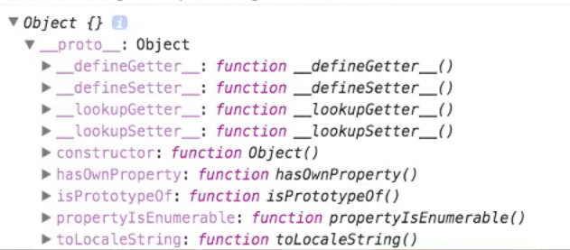

_This is a Livecoding Recap – an almost-weekly post about interesting things discovered while livecoding ?. Always under 500 words and with pictures. You can follow my channel, [here](https://livecoding.tv/swizec). New content almost **every Sunday at 2pm PDT**. There’s live chat, come say hai ?_

Today we battled with a fearsome error, an error of odd implications and no clear solutions. `Uncaught TypeError: Super expression must either be null or function`

What does that even mean!? ?

Well, it means that when you `import TransitionableComponent from 'react-transitionable-component'`, you get an object instead of a function. We confirmed the problem with some console.log calls. After importing `TransitionableComponent` is an object.

It looks just like a React component is supposed to. There’s a constructor method, a bunch of default object methods, and – I assume – all the `Component` methods as well. That’s great when you want to use a component in your `render()` function. Not so great when you want to use it as a parent class.

When you do something like `class Arc extends TransitionableComponent`, it fails. You can extend a `null` or a `function`, but not an object.

You can inherit from a class, but not from an instance of a class. I’m sure it’s like that in every language, but the reason it’s like that in JavaScript is that `class TransitionableComponent extends Component` transpiles into:

    var TransitionableComponent = function (_Component) {
            _inherits(TransitionableComponent, _Component);
        
            function TransitionableComponent(props) {
                _classCallCheck(this, TransitionableComponent);
        
                        // I think this is super(props)
                var _this = _possibleConstructorReturn(this, Object.getPrototypeOf(TransitionableComponent).call(this, props));
        
                // this is where your constructor body goes
                return _this;
            }
        
            _createClass(TransitionableComponent, [{
               // this is where your class body goes
            }])
            
            return TransitionableComponent;
        }(_react.Component);

That `_inherits` call is the crucial piece. It does a bunch of `.prototype` magic to extend the definition of a given class with the definition of a child class. Instances don’t have prototypes, functions do.

Functions have a `prototype` property because of legacy reasons, I’m sure. That’s how JavaScript has always understood the concept of classes – generator/constructor functions double as classes.

At this point `TransitionableComponent` is a function - just like we’d expect. With some `console.log`-ing we confirmed that it remains a function right until the point we import it in our sample project.

Hmmm ?

I don’t know why it becomes an object. Our guessing and prodding didn’t reveal much. This is what importing transpiles to:

    var _TransitionableComponent = __webpack_require__(16);

    var _TransitionableComponent2 = _interopRequireDefault(_TransitionableComponent);

    function _interopRequireDefault(obj) { return obj && obj.__esModule ? obj : { default: obj }; }

This code might return an object, if you’re importing something that isn’t an ES6 Module. But we know that’s not our problem because `TransitionableComponent.default` is undefined.

You’d think `__webpack_require__` was instantiating our component and returning an object instead of a function, but it works correctly when you import React’s default `Component`. Curiously, React’s compiled code looks like normal ES5 without even a hint of Webpack or Babel. Hmmm ?

I am at a loss. I have no idea what’s going on or why. But until we figure this out, `react-transitionable-component` will not be a usable library and my chance at open source glory lays trampled in the wastelands of [npmjs.com](https://www.npmjs.com/package/react-transitionable-component). ?

Ideas?

_PS: the edited and improved versions of these videos are becoming a video course. Readers of the engineer package of [React+d3js ES6](http://swizec.com/reactd3js/) get the video course for free when it’s ready._
