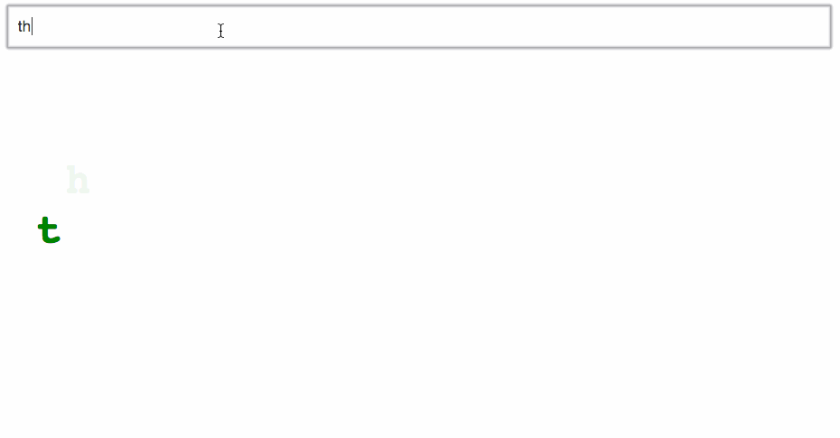
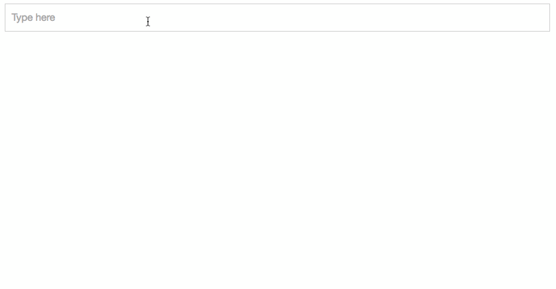
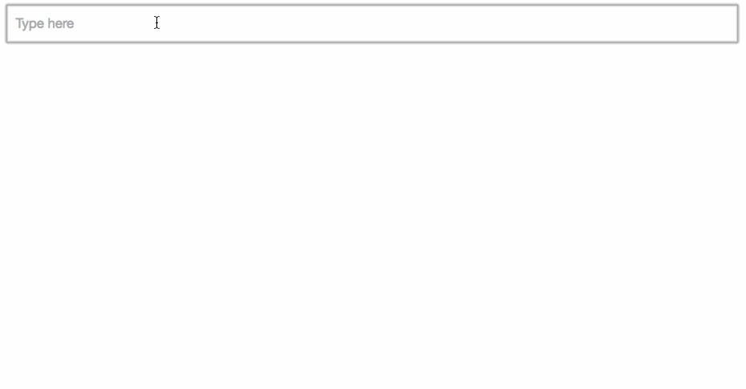
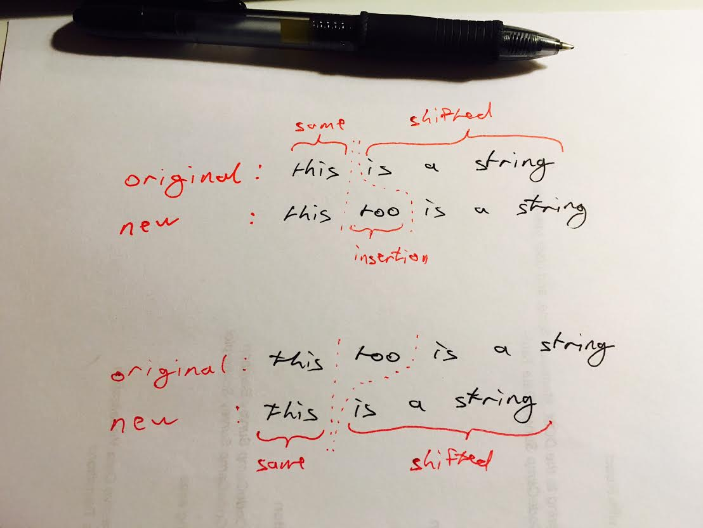

I turned [my animated alphabet example](http://swizec.com/blog/using-d3js-transitions-in-react/swizec/6797) into an animation of what you’re typing. New characters drop in from above, old characters drop down, and any white space gets squeezed out. Pretty cool, huh? Try it out:  Maybe I’m a weirdo nerd, but I could play with that for days. Well, okay, minutes. At least 30 seconds! What I like about this demo is that it’s a great example of declarative transitions built with React. Each letter handles its own animation, so all that the main component has to do is go through a list of characters in a loop and render a `Letter` component for each, like this:

        render() {
            let { x, y } = this.props,
                transition = d3.transition()
                               .duration(750)
                               .ease(d3.easeCubicInOut);

            return (
                
                    
                        {this.state.text.map((l, i) =>
                            
                         )}
                    
                
            );
        }

Declaring a root `transition` ensures individual letter transitions are synced. Rendering them in a `ReactTransitionGroup` gives us some additional lifecycle methods, and each letter needs its index so that it can calculate horizontal positioning because it lacks situational awareness. Then, each `Letter` component takes care of its own enter/update/exit transitions inside special lifecycle hooks. `componentWillEnter` for the enter animation, `componentWillReceiveProps` for update, and `componentWillLeave` for exit. [The whole component](https://github.com/Swizec/react-d3-enter-exit-transitions/blob/master/src/components/Letter.jsx) is just 59 standard lines of code. You can read my previous 2000-word article to learn the details about [using D3 transitions with React components](http://swizec.com/blog/using-d3js-transitions-in-react/swizec/6797). I’ve cleaned up the code since then, but the gist hasn’t changed. You can see the current code in my [github repository](https://github.com/Swizec/react-d3-enter-exit-transitions). The _key_ mystery was choosing the right key prop for each `Letter` component. That part was hard. It took me two whole nights!

## Choosing the key prop

The key prop is how React identifies your components. For the most part, you don’t have to worry about choosing correctly. Make it unique and you’re done. React can tell your components apart, which lets it do the fancy diffing stuff, and everything Just Works™. Sometimes, though, the type of uniqueness matters. For example: if you use the letter itself for the key prop, this example breaks down. It won’t even display input value correctly.

You only get one chance to show each character. Repeat it and React won’t care - it’s the same component as far as React is concerned. Empty spaces show up because we use character index from the original string to calculate horizontal positioning. ? Okay then, what if we use the index? Each letter has its own, so that’s good, and it’s easy to set up, so that’s great.

Waaaait a minute. That’s no good! Appending new characters to the end looks great, deleting characters from the end works too, but as soon as you mess around in the middle, all hell breaks loose. React uses indexes to identify `Letter` instances, so only the last character animates. The fancy-pants diffing algorithm can do the diffing, but it doesn’t understand the context. Ugh. We have to help React out and implement our own string diffing algorithm. If you’ve ever gone to a computer science class or three, this should be a familiar problem. It’s a variation of the much researched [longest subsequence problem](https://en.wikipedia.org/wiki/Longest_common_subsequence_problem).

## A simple string diffing algorithm

The full longest common subsequence problem is a hairy beast with decades of research behind it. Efficient solutions are used in everything from version control systems to bioinformatics. A few assumptions make it easier in our case:

-   changes only happen at the caret
-   there is only 1 caret
-   there will only ever be 1 change

A linear-complexity algorithm will do :)

Assuming there’s only one change at a time works even when you take copy/paste into account. Users can’t copy/paste disparate chunks of text at the same time. It has to be connected. So even if the change uses the same text, it acts as a big remove followed by an insert. Our game plan is thus:

-   assign a unique ID to each new character
-   maintain `(char, id)` pairs for the same portion
-   create or drop `(char, id)` pairs for the changed portion
-   shift `(char, id)` pairs to new indexes for the shifted portion

The implementation took me 55 lines of code. You can see it in its entirety at the [github repository](https://github.com/Swizec/react-d3-enter-exit-transitions/blob/master/src/components/FancyText.jsx). There are 7 steps.

### Step 1 - prep the vars

    // FancyText.jsx -> componentWillReceiveProps()
      const oldText = this.state.textWithIds;
            const newText = newProps.text.split('');
            let indexOfChange = 0,
                sizeOfChange = 0,
                newLastId = this.state.lastId;

`oldText` is the current array of `(char, id)` pairs, `newText` becomes an array of characters in the new string. We initiate `indexOfChange` and `sizeOfChange` to `0`. `this.state.lastId` is where we keep a running tally of new characters. Think of it as an auto increment ID.

### Step 2 - find the change

    // FancyText.jsx -> componentWillReceiveProps()
    // find change
    for (; newText[indexOfChange] == (oldText[indexOfChange] && oldText[indexOfChange][0]); indexOfChange++);

Looks like old school C code, doesn’t it? We keep incrementing `indexOfChange` until we find a character mismatch between the new and old text. Then we know where the insertion or deletion begins.

### Step 3 - calculating size of change

    // FancyText.jsx -> componentWillReceiveProps()

            // calculate size of change
            if (newText.length > oldText.length) {
                while (newText[indexOfChange+sizeOfChange] != (oldText[indexOfChange] && oldText[indexOfChange][0])
                        && indexOfChange+sizeOfChange < newText.length) {
                            sizeOfChange = sizeOfChange+1;
                }
            }else{
                while (newText[indexOfChange] != (oldText[indexOfChange+sizeOfChange] && oldText[indexOfChange+sizeOfChange][0])
                        && indexOfChange+sizeOfChange < oldText.length) {
                            sizeOfChange = sizeOfChange+1;
                }
            }

Here we have two different branches - one for insertion and one for deletion. They both use the same principle and have small differences based on which characters to compare. We keep increasing `sizeOfChange` until `indexOfChange+sizeOfChange` either finds a character that matches in both strings, or until it runs out of characters to check. The difference between insertion and deletion is that we’re shifting the lookup index of either `newText` or `oldText`.

### Step 4 - copying same section

    // FancyText.jsx -> componentWillReceiveProps()

    // use existing ids up to point of change
    d3.range(0, indexOfChange).forEach((i) => newText[i] = oldText[i]);

`d3.range` creates an array of indexes from `0` to `indexOfChange`. We loop through it and overwrite `newText` with existing `(char, id)` pairs from `oldText`.

### Step 5 - add new (char, id) pairs

    // FancyText.jsx -> componentWillReceiveProps()

          // use new ids for additions
            if (newText.length > oldText.length) {
                d3.range(indexOfChange, indexOfChange+sizeOfChange).forEach((i) => {
                    let letter = newText[i];
                    newText[i] = [letter, newLastId++];
                });

If the change is an insertion, we go from `indexOfChange` to `indexOfChange+sizeOfChange`, create new `(char, id)` pairs, and override `newText` at each index. To create each ID, we take `newLastId` and increment it. Just like an auto increment index. It’s a running count of new characters that never decrements.

### Step 6 - shift remaining (char, id) pairs

    // FancyText.jsx -> componentWillReceiveProps()

            if (newText.length > oldText.length) {
                // insertion …

                // use existing ids from change to end
                d3.range(indexOfChange+sizeOfChange, newText.length).forEach((i) =>
                    newText[i] = oldText[i-sizeOfChange]);
            }else{
                // use existing ids from change to end, but skip what's gone
                d3.range(indexOfChange, newText.length).forEach((i) =>
                    newText[i] = oldText[i+sizeOfChange]);
            }

Here we again have two branches: one for insertion, one for deletion. Both copy `(char, id)` pairs from `oldText` to `newText`, but the shift happens in different directions. When inserting, we have to shift the index by `sizeOfChange` to the right. When deleting, we shift the index to the left.

    // FancyText.jsx -> componentWillReceiveProps()

            this.setState({text: newProps.text,
                           textWithIds: newText,
                           lastId: newLastId});

We have an updated list of `(char, id)` pairs in `newText`. It reflects the updated text value while keeping all ID assignments stable throughout the process. Pretty neat. We use `this.setState` so that when React calls `render()` on our `FancyText` component, it will use the updated state. `componentWillReceiveProps` is the only lifecycle method where calling `setState` does not trigger a re-render. Neat, huh?

### Step 7.5 - use the (char, id) pairs

There’s one more thing. We have to update how rendering happens. Invoking the `Letter` component looks like this now:

    // FancyText.jsx -> render()

     return (
                
                    
                        {this.state.textWithIds.map(([l, id], i) =>
                            
                         )}
                    
                
            );

Instead of iterating over `this.props.text`, we iterate over `this.state.textWithIds`. For each iteration, we take the `(char, id)` pair, destructure it, and use the `id` for our key prop. And that’s it, our animated typing example looks like this:

Wasn’t that fun?
