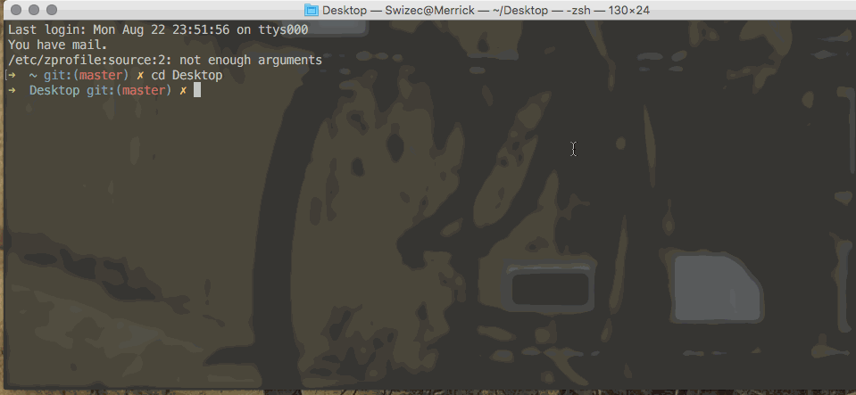

The filesystem on your shiny expensive laptop is case insensitive. Did you know? I know, but I always forget. Your code looks like it works. It compiles, the tests all pass, you can run it, and you can play with it. Then you push to production, and it breaks. Sometimes in the build step, sometimes as late as runtime, but inevitably, it breaks. This is the one situation where I envy all my friends who work on Linux, maybe even Windows. They've never had to deal with this shit. MacOS → case insensitive. Linux → case sensitive. You thought working with JavaScript would get you away from these low level concerns, didn't you? Yeah, me too. Here's why you should care. Watch this gif:  Make a file called `ALLCAPS.js`, read it as `allcaps.js`, and MacOS doesn't even bat an eye. Then you put the same code on a Linux server, and all hell breaks loose. ¯\\\_(ツ)\_/¯ This quirk shows up when you least expect it – innocent camelCAse typos. Your code works, `git status` says everything's merged, and the typo goes unnoticed until it's too late. I'm too embarrassed to say how much time I've lost to this quirk over the years. So I won't. Here's to hoping I'll stop forgetting now. ?
