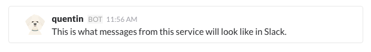
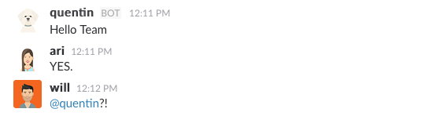
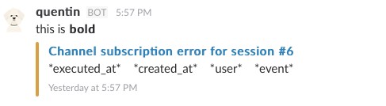

I built my first Slack bot today.

It has one job: to report a specific type of error, and to do so while impersonating the office dog. It might get more jobs in the future, but you have to start somewhere.

Adding a Slack bot to your Rails app happens in three steps:

1.  Set up [new custom integration](https://slack.com/apps/new/A0F7YS25R-bots).
2.  Add [slack-ruby-client](https://github.com/slack-ruby/slack-ruby-client) to your setup.
3.  Fiddle around until you reach the desired flexibility and feature set.

When you’re done with the first step, Slack promises that your bot’s messages will have a friendly avatar and username.



Instead, they don’t. Following the basic instructions, you get a grey bot image and default username.


And so it begins. Outdated documentation. ?

Basic API spec says that you should post messages with an `as_user: true` flag, which makes the bot use its default settings from Step 1.

```

#Setup stuff, goes in a global file somewhere. config/initializers/slack.rb for instance


Slack.configure do |config|


config.token = ENV[‘SLACK_API_TOKEN’]


end


#Instantiate client


client = Slack::Web::Client.new


#Send message to #general channel


client.chat_postMessage(channel: ‘#general’, text: ‘Hello World’, as_user: true)
```

That code throws an error `-> user not in channel`. So you dig through the documentation and find `channels_join`. But that throws an error, too `-> user is a bot`.

Bots can’t join channels.

If you remove `as_user: true`, then you can post, but you post without an avatar and without a username. Ugh.

The easiest workaround is to explicitly add a username and an avatar to your post call. It makes half of Step 1 redundant, but your bot messages look great, and your team gets excited.



If only they knew @quentin will only ever post errors.

Another way to get around the bots-cant-join-channels problem is to mention @quentin, then invite him to the channel. I’m sure that will never get difficult or annoying to manage. No chance at all.

It’s probably best to stick to the workaround.

Giving a voice to the office dog is fun and all, but the useful stuff begins when you look into attachments. Slack lets you add rich attachments to your messages. Anything from semantically color-coded styling to buttons for common actions.

I’m keeping it simple for now: report error, add contextual logs. In theory, this will help us quickly decide which errors are worth looking into and which aren’t.

Adding attachments looks like this for me:

    client.chat_postMessage(
    	channel: '#bot-test',
    	text: "this is *bold*",
    	attachments: [{
        color: 'warning',
        fallback: title,
        title: title,
        title_link: session_url,
        text: "*executed_at*\t*created_at*\t*user*\t*event*",
        ts: Time.now.to_f
    }])

It creates a message like this:



See those asterisks? Those are not supposed to be there. [Slack’s message formatting rules](https://api.slack.com/docs/message-formatting) say that strings wrapped in asterisks should render bold anywhere they appear. Messages, attachments, everywhere, **bold**.

Instead, it works for the message itself but not for the attachment. Possible reasons range from a Slack bug, to a library bug, to something strange happening in how I call the library. I haven’t figured it out, and I’m probably going to decide it’s not worth my time.

But the office dog speaks now. ?
