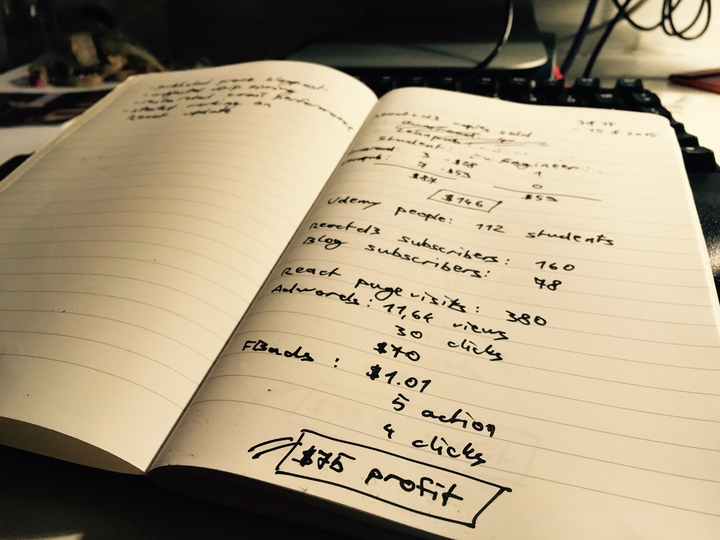

This week last year, I started a business diary. Spurred on by the success of [React+d3js](https://swizec.com/reactd3js), it was time to get serious.

Every week, I would write down some numbers, take stock of how I pushed my side-hustle forward, and brainstorm some ideas on what to do next. Here’s what that first page said:

**Sales this week** - _Aug 9th, 2015 - Aug 15th, 2015_:

10 Student packages -> $87

1 Engineer package -> $59

**Audience**:

Udemy course -> 112 students[1](#fn1-1729 "see footnote")

Reactd3 email subscribers -> 160

Blog subscribers -> 78

**Marketing**

React page views: 380

Adwords: $70, 11k views, 30 clicks

FB ads: $1, 5 actions, 4 clicks

**Things**

-   published promo blogpost, [this one](https://swizec.com/blog/using-react-in-the-real-world/swizec/6710)
-   adjusted Drip campaign timing
-   researched email performance
-   started working on React+d3js update

**Result**

$75 profit

* * *

This Sunday, I wrote the last page that would fit in this notebook. Most entries were about a week apart, but some had an entire month between them. Life gets busy, and transcribing stats from charts you find online into a notebook is never a priority.

Here’s what the last page says:

**Sales this week**

7 student packages -> $117

4 Why programmers work at night -> $0

53 ES6 cheatsheet -> $8

**Subscribers**

Reactd3 -> 4,341

Why programmers work at night -> 736

Blog -> 944

Live coding -> 194

Medium -> 427

**Marketing**

FBads: $46, 29 leads, decent reach

**Result**

$201 loss ?

**Things**

-   paid my editor
-   I should move this to a spreadsheet

I probably _should_ move my diary into a spreadsheet, but I’m on the fence about this. A spreadsheet makes it easier to look at trends and draw pretty graphs. A notebook makes it easier to appreciate life.

And yes, the last week in this diary is a $201 loss while the first week was a $75 profit. What a colossal failure! But not really. It fluctuates. Unlike a year ago, I have an editor now. I pay somebody to look at every single thing I publish.

I started looking for one right after that first week in the diary. A few weeks later, I had an editor. My side-hustle usually has a loss on the weeks that his monthly invoice comes through.

Such is life.

* * *

Here’s what happened in this year of side-hustling:

**React Indie Bundle** - 6 authors, 1 sale, $30k in a week

**React+d3js ES6** - book rewrite, relaunch, $9k in first month

**Weekly livecoding** - pure fun, excuse to do cool shit

**React+D3 workshops** - 3 iterations, about $9k

**ES6 cheatsheet** - 1,184 emails, $314

**Daily blogging experiment** - ongoing, stay tuned

$27k in my share of sales[2](#fn2-1729 "see footnote"); 4 products launched; 2 things started to encourage doing cool shit; $4k spent on advertising; $2k on consultants; and some $2k on education materials.

That’s an overall profit of about $19k.

Which means I’m not investing enough in growth.

* * *

1.  This was my Mastering d3.js video course published through Packt. It has since died a whimpering death and has gone from Udemy. I don’t know if it’s still making sales somewhere else. We never even broke through the advance amount. [↩︎](#fnr1-1729 "return to article")
2.  React Indie Bundle and the Workshops are a collaboration so I don’t get the whole pie. [↩︎](#fnr2-1729 "return to article")
