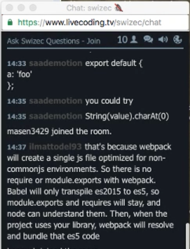

_This is a Livecoding Recap – an almost-weekly post about interesting things discovered while livecoding ?. Always under 500 words and with pictures. You can follow my channel, [here](https://livecoding.tv/swizec). New streams almost **every Sunday at 2pm PDT**. There’s live chat, come say hai ?_

It does the thing! We did it! \\o/

Sort of … it’s pretty damn buggy. Flickering, wobbling, colors switching place. It’s a really shitty animated piechart when you think about it.

But animated it is, and the flickering and the wobbling and the color changing is no fault of our `TransitionableComponent` library. The point was to get _that_ working.

[Last week](https://swizec.com/blog/livecoding-20-you-cant-extend-an-object/swizec/6948), we couldn’t even get the import to work. No matter what we tried, `TransitionableComponent` was always an object and wouldn’t let us extend. Which makes sense; you extend classes (functions), not objects.

Before today’s stream, I tried a few more things:

-   upgrade node to 4.5 LTS —> nope ??
-   upgrade node to latest 6.4 —> nope ??
-   import from script path directly —> nope ??
-   extend `TransitionableComponent.constructor` —> lol, nope ??

Nothing worked. It was hopeless. The stream was starting, and I was still stuck at the same point where we’d left off the week before. People joined, people dropped.

Desperate, I said _“Fuck it, let’s avoid Webpack”_. This was a last ditch attempt at salvaging the thing, the stream, and my honor.

Lo and behold: it worked. ?

Of course _then_ a bunch of people in the chat said, _"Oh yeah, I totally knew that would work”_.

Well then, why the fuck didn’t you say so? …

It’s okay. They helped me figure out exactly how to do the Babel step to make it work. We’re good. :)

If you’re building a library, don’t use Webpack to compile. Use Babel directly. Here’s why:

> That’s because Webpack will create a single JS file optimized for non-commonjs environments. So there is no `require` or `module.exports` with Webpack. Babel will only transpile es2015 to es5, so `module.exports` and `requires` will stay, and node can understand them.
>
>   
>
>
> Then, when the project uses your library, webpack will resolve and bundle that es5 code.

Thanks ilmattodel93! You’re the best!

I feel like I’ve learned a valuable lesson, even if it did take embarrassingly long to discover. I even found a clue three weeks ago → React source looks like pure ES5 without any Webpack crap.

Now, about that flickering and the wobbling: It happens because we’re animating the `d` attribute of a `path` element, like this:

    class Path extends TransitionableComponent {
        render() {
            return (
                
            );
        }
    }

The flickering is when `d` reaches an invalid value. This confuses both D3 and SVG. The wobbling is a result of interpolation between two values of `d`. I’d paste them here, but they’re hard to read.

This is either a bug in D3 or a fundamental issue with SVG and/or interpolation. A better approach might be to transition `startAngle` and `endAngle` attributes hidden deep inside the `pie()` layout.

We’ll try that next week. After that, I think it’s time to play with `react-native` and D3.

PS: the edited and improved versions of these videos are becoming a video course. Readers of the engineer package of [React+d3js ES6](http://swizec.com/reactd3js/) get the video course for free when it’s ready.
