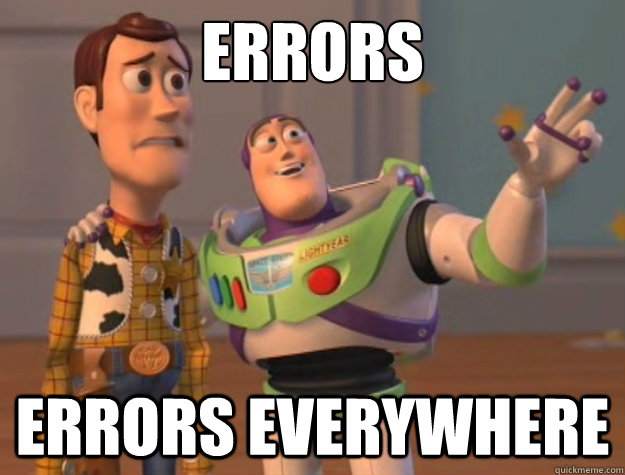
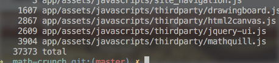
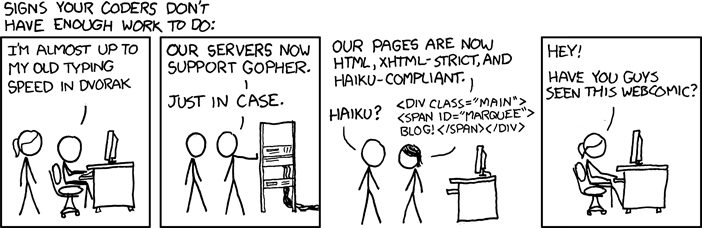

If that wasn’t your guess … can I steal your codebase? It must be amazing.

Sometimes, code reviews look like this:

“Dude, capitals for constants, not camel case.”

“Ugh, you missed a console.log.”

“Line over 80 char”

“Use curly brackets around multiline functions.”

“This looks weird.”

“Why did you bork indentation?”

“Please use consistent spacing.”

That’s my _“You missed a console.log”_ macro. A few months of that, and very few debugging statements still make it into PRs.

But that shit is exhausting, tedious, and unfun for everyone involved. They thought I was a petty asshole; I thought they were idiots who can’t even type. How can I trust your code if you can’t even type? Your whole job is typing!

Honestly, though, the JavaScript runtime doesn’t care. Most of the things we look for in code review, the compiler[1](#fn1-20407 "see footnote") removes before your code ever runs.

All this back and forth was fast becoming a waste of everybody’s time. But code that is hard to read is code that is hard to fix.

This weekend, I added a linter - an automated way to check code for superficial quality, so that engineers can focus on logic and architecture, not on `foo= bla` vs. `foo = bla`. I used [CodeClimate](https://codeclimate.com)’s default suggestions to configure linters for both Ruby and JavaScript.

CodeClimate suggests ESLint for JavaScript linting and a configuration with some 200 rules. Not all rules are enabled, so I guess it lists every option available and enables some sensible defaults.

856 errors.

Eight hundred and fifty-six errors in a code base with 37,373 lines of code. I promise I didn’t make up that number.

See? I told you I didn’t make it up.

That’s an error rate of 2% per line of code —> look at any random line and there’s a 2% chance that you’ll pick a line with a linting problem. It’s almost as bad as reading academic code or somebody’s homework.

A team of professional engineers can do better than a college kid doing homework. Probably.

…

I hope.

We now have objective proof that our codebase is bad, and we should feel bad. Code Climate gave us an overall score of 2.1 out of 4. Not atrocious, just pretty bad.

The question is: how do we fix this?

It’s going to be a 3-step process:

1. Demote all errors into warnings so that our code compiles at all. We can’t block feature work to fix all of this.
2. Decide whether it’s worth fixing at all
3. Get team buy-in

Team buy-in is going to be the hardest. Writing code that looks good as well as works good smells a lot like extra effort.

* * *

1.
2. It’s not really a compiler; it’s the V8 engine or similar. I think it’s closer in theory to an interpreter than a compiler. [↩︎](#fnr1-20407 "return to article")
3.