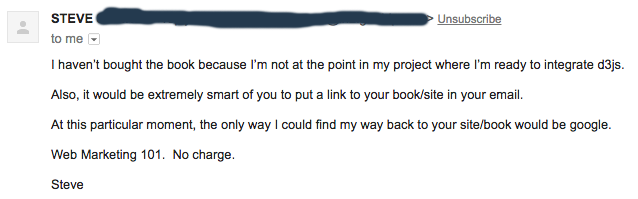
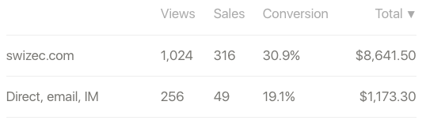
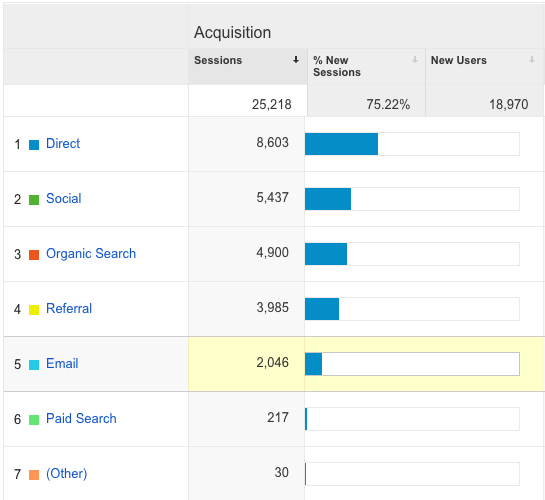
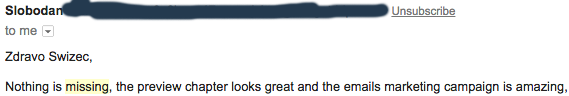

Steve’s right. He got the last email in my 10-day email sequence, and it doesn’t even link back to my site. It’s my very last chance at a sale before I shut up about [The Book](https://swizec.com/reactd3js/) and send you only the regular emails that I send.

And yet, no link. Nothing for you to do but to focus on my failings and answer the question _“Why didn’t you open your wallet? Don’t you want it?”_

1.2% of recipients who get that far unsubscribe. That’s 8 people. Of course, only 45% even open the email. That’s 294 people.

4.5% reply. That’s 29 people in the five months.

This is the only email in the whole sequence with a reply rate higher than 0.0%.

But no sales.

At least, none that I can attribute to this email. Hell, none of my sales get attributed to any of these emails. Gumroad lumps it all together with Direct, anyway.

49 sales from Direct/Email/IM vs. 316 sales from the landing page itself.

The conversion rate also looks much better without the emails. ?

And yet, a significant amount of traffic coming to the website originates in email. Just under 9%.

I have no idea where all those Direct users come from. It’s not like anyone types [swizec.com/reactd3js](https://swizec.com/reactd3js/) into their browser. That would be strange.

Well, okay. _I_ type it in all the time when I check stuff. But I’m pretty sure I’m the only person in the world who does that.

Could those 8,603 people come from email as well? If they are, that changes things. It makes the intricate email marketing setup worth it. ?

I mean, with that one FB Lead Ad that I have running, I’m paying $1.20 for each of those leads. And I just found out that I stupidly have double opt-in set up, and many people never actually sign up after already costing me a conversion on Facebook.

Not that I’m complaining about one dollar, but that shit ads up.

I have no idea what I’m doing, obviously. But sometimes I get emails like this, and that gives me hope:

PS: the email with the most unsubscribes says _“Yo, look at all these other people who liked my thing”_ and shows some testimonials –> 1.9% unsubscribes. ¯\\\_(ツ)\_/¯