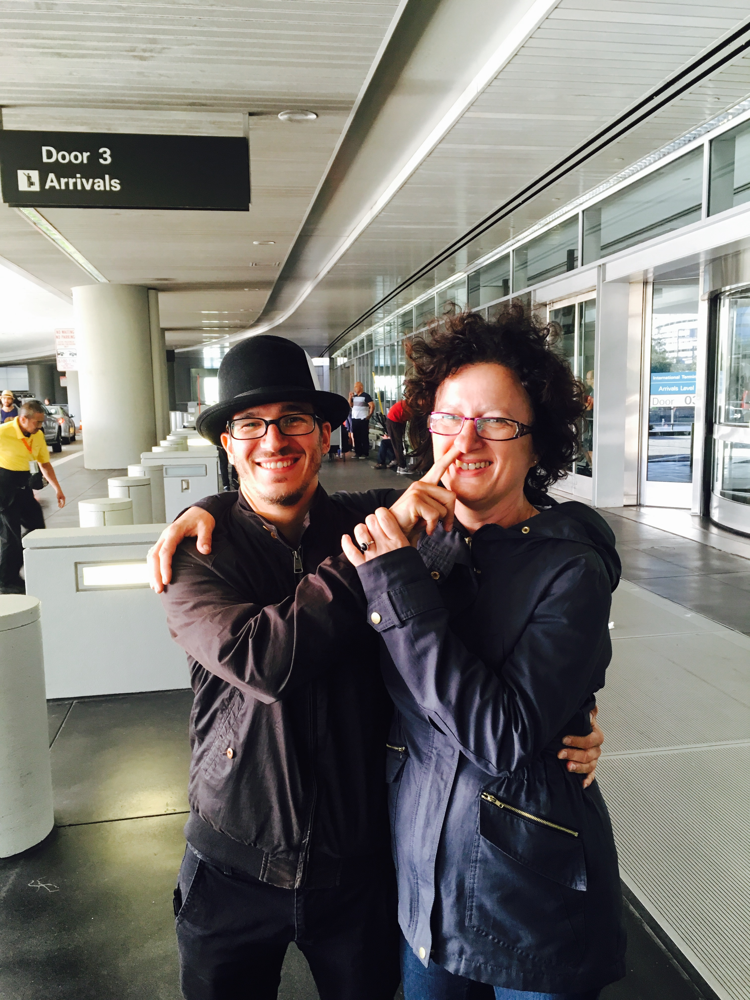

_“Hey mum, what’s your Apple ID password?"_

_“What’s an Apple ID?”_

Thus began my mum’s visit to San Francisco and the United States. First thing this morning, after stretching and breakfast and showering and coffee and cigarettes and explaining how weather works in this city and that no, we are certainly not coming back home before the evening, was to buy a new iPhone.

Her old phone makes bad photos.

I’m the one on the left

Then we had to set it up. Try three emails, try two passwords, convince Gmail that yes, this is the first time logging in from the States, but it’s definitely my mum. Thank God her phone receives SMS, even in the US.

Half an hour later, we were on our way… to the Cheesecake Factory across the street because it was lunch time by now. But yay, new phone! \\o/

Let’s hope she learns how to use this one. 5 years of Android meant nothing. I asked her if she wanted to transfer her apps, and she said, _“What’s an app?”_

And hey, it’s not like the sexy convertible I rented for our trip to Half Moon Bay had been waiting for us since 8am or anything like that. Or like I’d gotten up at 7:30am and then waited an hour and a half for everyone else to wake up then waited _again_ until 11am to leave the apartment.

Oh no, nothing like that. Why ever would I make plans like that?

It’s not like she’s here for 10 days and this is the only free day I have outside the weekend. It’s nothing like that. Of course not. _Surely_ none of us would be as frivolous with time if that were the case. Surely not!

And yet…

But hey, we hit the road by 2pm, got stuck in traffic half way to Half Moon Bay, turned around, went aaaaaaallll the way back up to San Francisco, drove across the Golden Gate Bridge, and went to Sausalito.

You’d expect Sausalito to be a magical place full of beautiful views and amazing things to see and do. Rich people flock there to build summer homes. They must be onto something!

The ice cream is good, San Francisco in the distance is gorgeous, and it’s a great excuse to drive visitors across a famous bridge, but man, that place be boring. You park. You stroll for 20 minutes. Done.

San Francisco view from Sausalito

Why do people go here? Why do _I_ keep going?

Oh yeah, the bridge …

It was smooth sailing from then on. We picked up groceries for the week, found out that fruits and veggies really _are_ expensive in the States and they look like plastic, and we went home. Then the girlfriend and I dropped off the rental while my mum and her friend put the groceries away.

I came back home to _“I don’t know how your fridge works. You do it.”_

Is she paying me back for all the shit I put her through as a teenager? That’s definitely an excuse I’d try to pull…

It is now 9pm. I’m ready to collapse into bed for a nap, my girlfriend is half asleep, and my mum goes: _“Can we get some coffee? What is this jet lag you keep warning me about? I don’t feel tired at all!”_

Yes, mother, it is 6am in your timezone. That’s when you wake up every day to go to work. You don’t say you’re not tired!

9 more days, Swiz. You can do it. Remember: you love your mum. Even when she’s not 9,000 kilometers away and she’s sleeping on your couch.

I wish she could speak English.