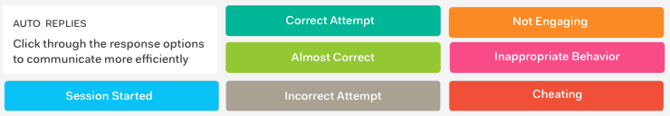
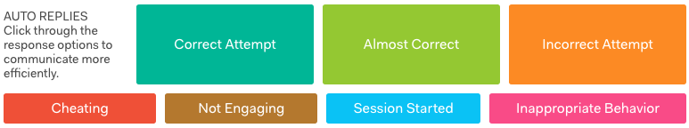

Ah yes, flexbox – that marvel of stylesheet technology that was going to absolve us, make our lives easier, and leave enough time for beers after work. How wonderful our future was to be!

Imagine it: no more floats! No more strange CSS incantations with negative margins just to get some basic layout working! All those tricks you spent the last 10 years learning? Forget them. You don’t need them.

Flexbox is here to save you!

Want to [center vertically](https://philipwalton.github.io/solved-by-flexbox/demos/vertical-centering/) in a container of unknown height? Flexbox can do it with a line of code! _And_ semantic HTML.

With flexbox, vertical centering looks like this:

    .container {
    	display: flex;
    }

    .centered {
    	flex: 1;
    }

Assuming an HTML structure that looks like this:

```

	

		This is centered
	
```

Sure beats the best hack from a few years ago: 3 divs with 50% offset positioning. [1](#fn1-11043 "see footnote") The only thing harder for pure CSS than vertical centering is a 3-column design with equal-height columns. A good hack was never found.

Until Flexbox!

Want 3-columns that stretch proportionally to your spec? Say no more.

\[codepen_embed height="265" theme_id="0" slug_hash="vXONdj" default_tab="css,result" user="swizec"]See the Pen [3-column flexbox](http://codepen.io/swizec/pen/vXONdj/) by Swizec Teller ([@swizec](http://codepen.io/swizec)) on [CodePen](http://codepen.io).\[/codepen_embed]

Simple, isn’t it? Set the container up as a flexbox, then tell each child `div` to take up an equal amount of space. Open it on Codepen, and play around with screen size. It all works.

You can even turn it into rows without changing HTML. Like this:

\[codepen_embed height="265" theme_id="0" slug_hash="gwpazQ" default_tab="css,result" user="swizec"]See the Pen [3-row flexbox](http://codepen.io/swizec/pen/gwpazQ/) by Swizec Teller ([@swizec](http://codepen.io/swizec)) on [CodePen](http://codepen.io).\[/codepen_embed]

## Row span in flexbox

But then your designer comes up with this:



It’s a grid of same-size buttons, and you are boned.

You know the buttons have to be configurable, which means your code should be agnostic to their configuration. There can be more or less of them, their labels can vary, and their colors are configurable, too.

Those buttons are data. You get an array of labels, and you have to render them as buttons.[2](#fn2-11043 "see footnote") Ideally, you could loop through them, make a list of buttons in HTML, and have CSS take care of layouting.

`flex-flow: row wrap` is your friend. It breaks elements into lines and looks like this:

\[codepen_embed height="265" theme_id="0" slug_hash="XjbrLP" default_tab="html,result" user="swizec"]See the Pen [6-grid flexbox](http://codepen.io/swizec/pen/XjbrLP/) by Swizec Teller ([@swizec](http://codepen.io/swizec)) on [CodePen](http://codepen.io).\[/codepen_embed]

That’s a grid – wasn’t hard at all. But your designer wants that first cell to span two rows.

Flexbox row span. _Now_ you’re boned. If you take the naive approach like I did, the result looks like this:



?

Maybe they won’t notice?

Seriously, though, you can’t do this. There’s no such thing as a flexbox rowspan. You’ll have to suck it up and put your things into column elements.

\[codepen_embed height="265" theme_id="0" slug_hash="NRqGLQ" default_tab="css,result" user="swizec"]See the Pen [6-grid flexbox](http://codepen.io/swizec/pen/NRqGLQ/) by Swizec Teller ([@swizec](http://codepen.io/swizec)) on [CodePen](http://codepen.io).\[/codepen_embed]

Wrap each group of elements into another `div`, set that div to `display: flex`, tell it to `flex-direction: column`, and make sure one of the elements contains only two elements. Give those elements different flex weights.

Voila, flexbox rowspan. Not painful at all. ?

* * *

1.  Many methods for vertical centering exist, but this has always been a panacea of CSS layouting. The hardest, most impossible thing to do. Google “CSS vertical centering” if you don’t believe me. [↩︎](#fnr1-11043 "return to article")
2.  The real array has more than just labels, but let’s keep it simple. [↩︎](#fnr2-11043 "return to article")
