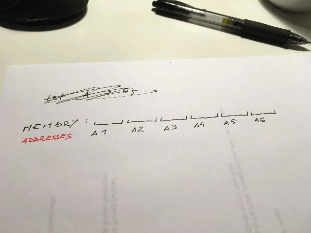

This is a puzzle you can run into if you’re not careful, and sometimes, despite your best efforts, even if you _are_ careful. It happened to me when I had a settings object that I passed into a view. The view then did things. When I made a new view from the settings object, it looked like the view I had just cleared. O.o

Here’s a contrived example:

\[codepen_embed height="265" theme_id="0" slug_hash="VKvkgj" default_tab="js,result" user="swizec"]See the Pen [Set - ES6](http://codepen.io/swizec/pen/VKvkgj/) by Swizec Teller ([@swizec](http://codepen.io/swizec)) on [CodePen](http://codepen.io).\[/codepen_embed]

You have a `Counter` class that:

-   takes initial state as an argument
-   implements the `inc()` method for `+1`-ing state
-   returns current count on every `inc()` call

This allows you to instantiate as many counters as you want, starting from any number you want. They can only count up. The implementation is straightforward. They’re the kind I’ve seen many times in the wild.

You take initial state, save it in an instance property, then proceed to use it like it was your very own. The implementation is simple to reason about, easy to extend when further properties are needed, and quick to build.

There’s just one problem: Instantiating multiple counters from settings stored in memory makes them share state.

Wat? ?

Look, here’s the example again. Pay close attention to the output.

\[codepen_embed height="265" theme_id="0" slug_hash="VKvkgj" default_tab="js,result" user="swizec"]See the Pen [Set - ES6](http://codepen.io/swizec/pen/VKvkgj/) by Swizec Teller ([@swizec](http://codepen.io/swizec)) on [CodePen](http://codepen.io).\[/codepen_embed]

`1, 2, 3`, not `1, 2, 1` as you would expect. ?

The rabbit hole goes deeper: Call `counter.state == newCounter.state`, and it prints `true`. Different objects, same state. _Literally_ the same. Not same value, the exact same memory address.

Strange behavior, but it makes sense once you remember that in JavaScript, objects are always stored as references, not as values. And that sentence is hard to understand if you’ve never had a teacher who forced you to learn C and play with pointers.

You’re about to learn something awesome and core to software engineering!

We have memory with 7 addresses - `A1` through `A7`. For simplicity, we’re giving our variables the same names.

When we set `A1` to `5`, a `5` appears at address `A1` in memory. Set `A2` to `6` and `6` appears at address `A2`. Simple values are stored at memory locations as the values.

When we set `A3` to an array - `[1, 2]`, we need two memory locations to store that value. So we set `A3` to _the address_ of our array – `A4`. At address `A4` we store the value `1`, and put `2` right next to it at `A5`.

Now JavaScript can do a memory optimization. When we set `A6` to equal `A3`, it doesn’t have to create a new array at a new memory address. That would be wasteful. Instead, it gives `A6` the same address reference - `A4`.

Both `A3` and `A6` point to the exact same memory location. Change one, and the other changes as well.

Savvy?

To avoid this problem, force JavaScript to make a copy before saving things into local object state. Use Lodash’s `_.copyDeep` if there’s a lot to copy, or explicitly set each property to build a new object from scratch.

Err on the side of explicit.
