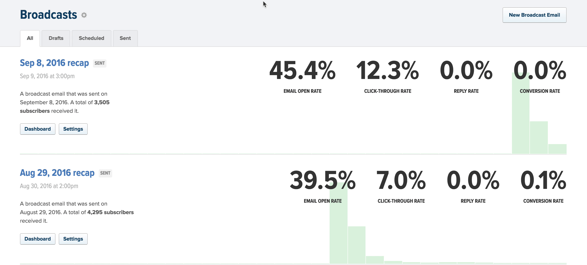
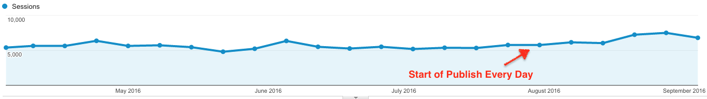

Writing is fun. That’s why you have to beat it out of yourself every day.

> If you only write when you’re inspired you may be a fairly decent poet, but you’ll never be a novelist because you’re going to have to make your word count today and those words aren’t going to wait for you whether you’re inspired or not.
>
>
>
>
>
> You have to write when you’re not inspired. And you have to write the scenes that don’t inspire you. And the weird thing is that six months later, a year later, you’ll look back at them and you can’t remember which scenes you wrote when you were inspired and which scenes you just wrote because they had to be written next.
>
>
>
>
>
> The process of writing can be magical. … Mostly it’s a process of putting one word after another.
>
>
>
> ~ Neil Gaiman

Since August 8th, I’ve published 24 things – 24 things in 36 days. Call them articles or blog posts or just 500 words on a random thing Swizec found interesting that day. But publish I did. Four times per week like clockwork.

Count back from Aug 8th, and it takes until September 2015 to find 24 things. A whole freaking year!

That was a year of constant stress. Stress about finding topics to write, of fretting over my articles being good enough to publish, a year of _"Fuck, I missed this week, too! There just wasn’t enough time and mindshare.”_ Week after week after week.

Excuses.

Deep down, I knew that to write, and to write well, you have to sit down and you have to beat it out of yourself. Because the more you write, the easier it gets.

It’s _easier_ to publish every day than to publish once a week or even once a month. Less stress, less pressure, more fun. Everything looks like a topic. Everything is more interesting. You go through your day and you say, _“Oh hey, that was curious. I could write about that today!”_

You become more present in your own life. That’s the best.

And hey, if it flops, it flops. No biggie. There’s a new one coming out tomorrow. That one’s sure to be a hit.

You’re having fun, so your readers are having fun. The fun oozes through the things that you write. Screw all the advice saying that you should publish only timeless content that is perfect and amazing every time.

Don’t believe me? Look at this guy! Casey Neistat went from 500,000 subscribers to _1,500,000_ in a year when he started publishing every day. It’s just better.

He now has over 4,000,000 subscribers and is GQ man of the year. Yeah.

I’m not as cool as he is, or as entertaining, but Publish Every Day _works_. I used to get 5 subscribers per month, now it’s 5 per week. The comment section was a wasteland for years and years, now people have started using it again. My Facebook page gets tens of likes per week, it used to get none.

Now I can send a recap email to 5,000 people and 45% open it.

The last time I had numbers like that was when I had 100 subscribers and I knew everyone’s names.

Think about it. What would you rather read? A 500 word post that’s quick, fun, and interesting, or a 3,000 word tome that tries to teach you something that you’re not learning right now?

Different reading modes, maybe even audiences.

The 500-word daily post is for people like me: browsing at work, staying informed on things in the industry, feeding curiosity. These posts can sometimes go viral.

The 3,000 word tome is for people like me _with a specific problem_: looking for a solution, seeking knowledge, trying to figure that One Specific Thing™ out. These posts are found through Google. They are rarely shared, and they work better as books or chapters in a book.

The first gives you an audience, the second gives you things to sell. It took me how long to figure that out? Ten years.

The publish every day experiment is a success.

Now I just have to keep doing it ?