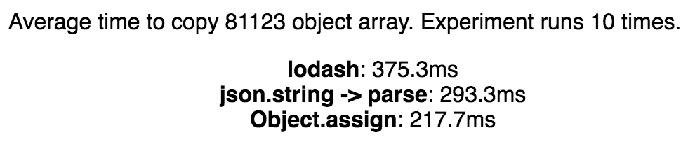

Spurred by debate on [A Puzzle in JavaScript objects](https://swizec.com/blog/a-puzzle-in-javascript-objects/swizec/7014), I wanted to find the best way to clone objects in JavaScript. In this scenario, “best” means “fastest on average”.

I’m using the dataset from [this visualization on H1B salaries](http://swizec.github.io/h1b-software-salaries/#2014-ca-engineer) as a quick way to build many objects. The dataset contains 81,123 objects with 9 keys each.

The experiment is set up like this:

- load & parse data
- run clone experiments in series
- each experiment makes 10 deep copies of the dataset
- “deep” is allowed to mean just the 2 levels required (objects in array don’t contain more objects)
- present average runtime of each clone

Each individual experiment uses this runner:

```
runner(name, method) {
        const times = d3.range(0, this.N).map(() => {
            const t1 = new Date();

            let copy = method(this.state.data);

            const t2 = new Date();
            return t2 - t1;
        });

        let results = this.state.results;
        results.push({name: name,
                      avg: d3.mean(times)});

        this.setState({results: results});
    }
```

If you spot a problem with that setup, tell me.

Preliminary results, running on my laptop in Chrome 53, are a bit strange. Iterating through the array and doing `Object.assign` is fastest, and `_.cloneDeep` is slowest.



I want to add a more context-aware Lodash approach, Immutable.js, and a few different browsers. Then make some graphs :)

What’s your favorite way to clone objects in JavaScript? I’ll add it to the test.