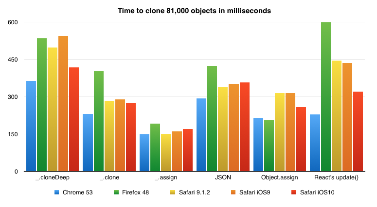
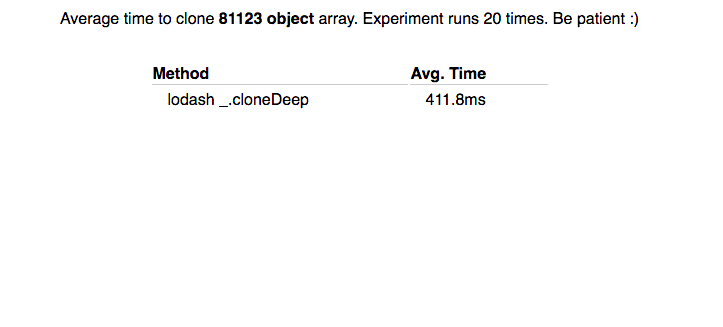

Look at those colors! Aren’t they shiny?


They’re super shiny (unless you’re color blind), but what do they mean? I’m glad you asked. That’s a speed comparison chart of 6 ways to clone JavaScript objects, run in 5 browsers, on 2 devices: my laptop and my iPhone 5SE.


You can try the benchmark yourself:


\>[Click here.](http://swizec.github.io/compare-copy-methods) &lt; I’d make an iframe, but it freezes my browser for many seconds at a time. It even freezes the CSS animation on that React logo.




Dangerous business those benchmarks.


Firefox is the only browser that decides something weird is going on and throws a warning. Everyone else happily blocks JS, CSS, and UI.


Now, is this benchmark fair? I don’t know. Running benchmarks on a computer that’s doing a bunch of other stuff is never _really_ fair. Maybe a different tab just tried to do something, or Spotify downloaded a song, or Dropbox ran a metadata update on my entire hard drive.


A bunch of things can affect these results. That’s why you can [run it yourself](http://swizec.github.io/compare-copy-methods). But I did my best to ensure fairness as much as I could.

- Each test runs alone, asynchronously
- Each test is re-run 20-times
- Each test uses the same source data
- Each test produces the same deep-ish cloned dataset

I say “deep-ish” because we’re cloning an array of some 81,000 objects. The objects are shallow, which means we can cut corners.


```
const experiments = {
            'lodash _.cloneDeep': _.cloneDeep,
            '.map + lodash _.clone': (arr) => arr.map((d) => _.clone(d)),
            '.map + lodash _.assign': (arr) => arr.map((d) => _.assign({}, d)),
            'JSON string/parse': (arr) => JSON.parse(JSON.stringify(arr)),
            '.map + Object.assign': (arr) => arr.map((d) => Object.assign({}, d)),
            '.map + React\'s update()': (arr) => arr.map((d) => update({}, {$merge: d}))
        };
```


We use `_.cloneDeep` without understanding context. This is a little bit unfair because it tries to do too much. We run `_.clone`, `_.assign`, `Object.assign`, and [React’s `update`](https://facebook.github.io/react/docs/update.html) in a loop. They benefit from not trying to work in the general case. `JSON.parse/stringify` is on the same level as `_.cloneDeep`: naïve, complete, works for anything.


I’m gobsmacked that for datasets this big, you’re better off converting to JSON and back than using Lodash’s `cloneDeep` function. I have no idea how that’s even possible. Maybe JSON benefits from an implementation detail deep in the engine?


But then why is `_.assign` faster than `Object.assign`? They both make a shallow copy of an object, but `Object.assign` is a language feature, and `_.assign` is implemented in pure JavaScript.


I think … how else? I hope [@jdalton](https://twitter.com/jdalton) can shed some light on this.


You can see the entire test runner on Github [here](https://github.com/Swizec/compare-copy-methods/blob/master/src/App.js). There are a few comments, but the interesting bit is this `runner` function. It ensure fairness by isolating timing to only the cloning method.

```
    runner(name, method) {
        let data = this.state.data;

        const times = d3.range(0, this.N).map(() => {
            const t1 = new Date();

            let copy = method(data);

            const t2 = new Date();
            return t2 - t1;
        });

        let results = this.state.results;
        results.push({name: name,
                      avg: d3.mean(times)});

        this.setState({results: results});
    }
```


The runner itself is called asynchronously via `setTimeout(foo, 0)`, and the `async` library ensures tests don’t happen in parallel. Inside `runner`, we iterate through `N = 20` indexes, take timestamp, perform clone, take another timestamp, and construct an array of time diffs. Then we use `d3.mean` to get the average and add it to `this.state.results` with `setState`.


It runs in React because I’m lazy and `create-react-app` is the quickest way to set everything up :)


Maybe there’s some unfairness in how Babel compiles this code? That’s possible ?


My conclusion is this: Use the appropriate algorithm for your use-case, and run your code in Chrome.